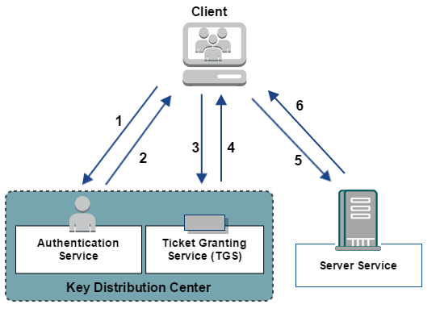
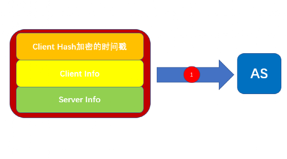
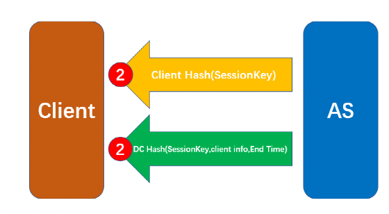
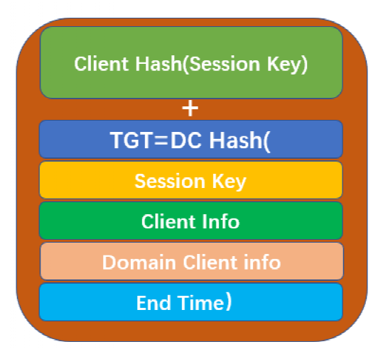
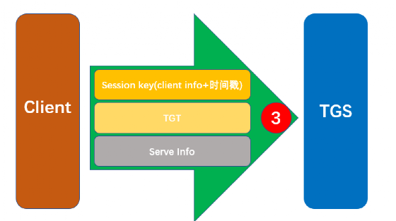
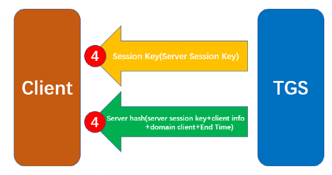
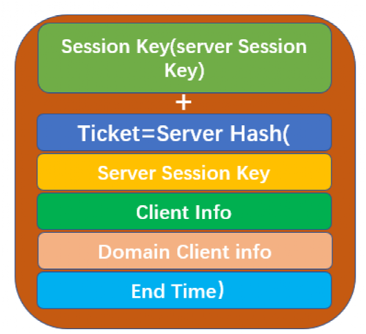

@Author：Y4tacker

@time：2021/02/21 9:40 AM

# kerberos协议

kerberos有两个基础认证模块AS_REQ & AS_REP,TGS_REQ & TGS_REP，以及微软扩展的两个认证模块S4U和PAC本篇文章学习总结的主要是协议的认证过程

## 概述

Kerberos是一种网络身份验证协议。它旨在通过使用密钥加密技术为客户端/服务器应用程序提供强身份验证。

在Kerberos协议中主要是有三个角色的存在：

- 访问服务的Client(以下表述为Client 或者用户)

- 提供服务的Server(以下表述为服务)

- KDC（Key Distribution Center）密钥分发中心

其中KDC服务默认会安装在一个域的域控中，而Client和Server为域内的用户或者是服务，如HTTP服务，SQL服务。在Kerberos中Client是否有权限访问Server端的服务由KDC发放的票据来决定。

## 名词解释

> DC（Domain Controller）：域控制器（域控）
>
> KDC（Key Distribution Center）:密钥分发中心
>
> AD（Account Database）：储存所有客户端的白名单，只有在白名单中的客户端才可以申请TGT
>
> AS（Authetication Service）：为客户端生成TGT的服务
>
> TGT（Ticket-Granting Ticket）:发放的票据，黄金票据
>
> TGS（Ticket Granting Service）：为客户端生成某个服务的ticket
>
> Ticket：白银票据

## 简要认证流程

拿别的师傅的这张图来说

1.客户端向域的kerberos服务的KDC发起请求，KDC让AS拿着请求的用户名去问AD有没有这个人

2.AD认证通过，就会让AS服务向客户端发送一个TGT票据，TGT上有客户端信息

3.当客户端想访问域内某台服务器，需要拿着TGT和客户端信息去请求KDC，KDC让TGS服务受理我们的请求，判断TGT的信息与客户端信息是否一致

4.如果结果正确，就返回用服务hash 加密的TGS票据(这一步不管用户有没有访问服务的权限，只要TGT正确，就返回TGS票据)，上面也有客户端信息

5.然后拿着Ticket和客户端信息，就可以访问指定服务器了

## **详细认证流程**

第一步：客户端认证

客户端首先向KDC发起请求，请求凭据是**Client hash**加密的时间戳、客户端信息、服务器信息等内容

之后AS去AD查客户端用户ID是否存在，然后查找域控中储存的**客户端hash**、并随机生成一个**session key**，之后会向客户端返回两条信息，其中一条信息，**AS从域控查找该客户端用户的hash**，来加密**session key**，另一条信息则是**TGT票据**(使用域控本身的hash加密session key、客户端信息、客户端地址、截止日期生成)（TGT也就是我们常用的黄金票据）

客户端收到两条信息后，用自己的**hash**将**session key**解密出来，然后**TGT票据**原封不动的保存

第二步：服务授权

客户端如果想访问域内某台服务器，就拿出**session key加密**客户端信息+时间戳

然后同TGT和服务器ID一起发给**TGS进行服务器授权**

**TGS收到请求**后，会先去AD查找客户端发来的服务ID是否存在，存在的话就用域控本身的hash(krbtgt hash)解密TGT拿到session key和TGT中存在的客户端信息。

这里TGS会检测TGT中的时间戳是否过期

TGS再用得到的session key解密另一条消息，得到客户端信息，然后与TGT解密得到的客户端信息进行对比。然后查找域控中储存的服务器hash、并随机生成一个**server session key**

TGS向客户端返回两条信息,一条信息是用session key加密的**server session key**,另外一条是TGS票据(用服务器的hash加密server session key、客户端信息、客户端地址、截止日期)

客户端拿到两条信息后，用session key解密得到server session key，Ticket直接原样保存

第三步：请求服务

客户端去找服务器进行验证，用server session key加密客户端信息和时间戳，与Ticket一起发给服务器

服务器收到后，将Ticket用服务器hash解密，得到server session key和客户端信息

(这里会判断截止时间是否有效)，然后使用解密出的server session key解密另一条消息，得到客户端信息，两个解密得到的客户端信息进行对比，相同则验证成功。

# 参考文章

https://daiker.gitbook.io/windows-protocol/kerberos

https://www.jianshu.com/p/fc2d2dbd510b

https://www.cnblogs.com/wukenaihe/p/3732141.html