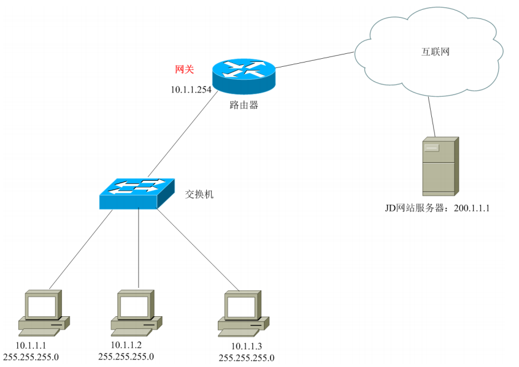
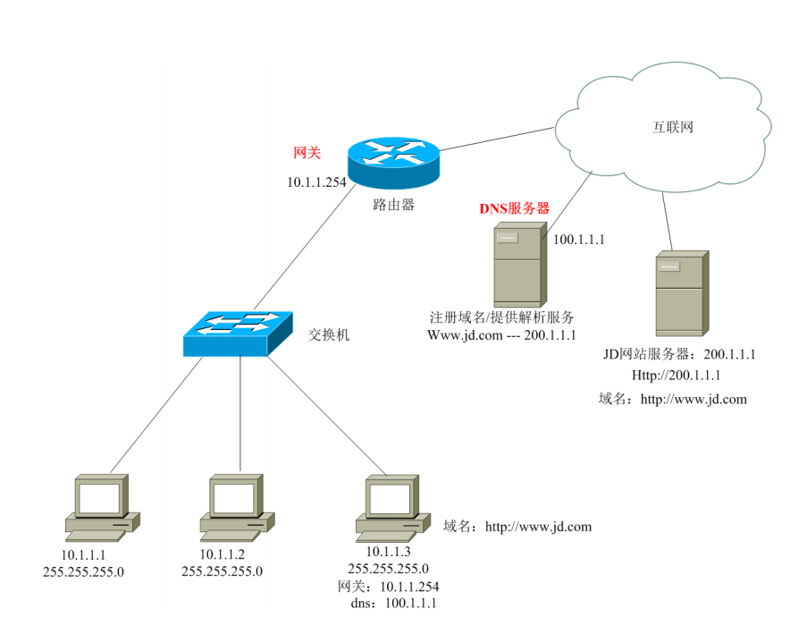

# IP地址详细学习笔记

## 简单局域网的构成

> 局域网：一般称为内网
>
> 简单局域网的组成：交换机、网线、PC
>
> 交换机：用来组建内网的局域网的设备

Vmware当中的网络适配器相当于就是一个交换机

## IP地址

IP地址就是一个唯一标识，是一段网络编码，由32位组成

IP地址形式：X.X.X.X X的范围：0-255

> 正确：10.1.1.1 、192.168.1.1 
>
> 错误：300.1.1.1 

## 普通子网掩码

1个IP地址，必须配套一个子网掩码 

局域网通信规则：在同一个局域网中，所有的IP必须在同一网段中才可以互相通信

**IP**地址构成：网络位+主机位 （网络位相同的IP地址，为同一网段）

**子网掩码**： 用来确定IP地址的网络位

**子网掩码如何确认网络位**：与255对应的数字为网络位，与0对应的数字为主机位

> 如：
>
> 10.1.1.1 255.0.0.0 
>
> 获知：10.1.1.1属于10.网段，名字叫.1.1.1 
>
> 10.1.1.1 255.255.0.0 
>
> 获知：10.1.1.1属于10.1.网段，名字叫.1.1 
>
> 10.1.1.1 255.255.255.0 
>
> 获知：10.1.1.1属于10.1.1网段，名字叫.1

## IP地址详解

国际标准组织ISO定义地址分类：五大类 （是以IP地址的第一位进行区分的）

> A类： 1-126 默认子网掩码：255.0.0.0
>
> B类： 128-191 默认子网掩码：255.255.0.0
>
> C类： 192-223 默认子网掩码：255.255.255.0
>
> D类： 224-239 组播地址  --一个地址代表一组人而ABC叫单播地址一个地址代表一个人
>
> E类： 240-254 科研使用

> 注：
>
> 1. 目前我们可以使用的只有A、B、C3类 
>
> 2. ABC3类的子网掩码可以修改！

主机位全部置0代表网段地址，主机位全部置255代表该网段的广播地址

127.0.0.1 回环地址

```
案例1：
10.1.1.1
255.255.255.0
问：10.1.1.1属于哪个网段？所在网段有多少个可用的IP地址？该网段的广播地址是什么？
答：
10.1.1.1属于10.1.1.0网段。
10.1.1.0网段可用的IP地址范围：10.1.1.1-10.1.1.254
10.1.1.0网段的广播地址：10.1.1.255
如果我们往10.1.1.255发消息，那么该网段下所有人都将收到消息
```

```
案例2：
10.1.1.1
255.255.0.0
10.1.1.1属于哪个网段？所在网段有多少个IP地址？该网段的广播地址是什么？
答：
10.1.1.1属于10.1.0.0网段。
10.1.0.0网段可用的IP地址范围：10.1.0.1-10.1.255.254（65534）256*256-2
10.1.1.0网段的广播地址：10.1.255.255
```

## **网关**

网关：一个网络的出口，Gateway=GW，一般网关是在路由器上

路由器：可用连接内外网的设备·



> PC向外发包： 
>
> 1、首先判断目标IP地址与自己是否在同一网段。 
>
> 2、如在同一网段，则直接发出去，而不找网关 
>
> 3、如不在同一网段，则直接发包给网关

## DNS

DNS：Domain Name Service 域名服务

1台PC需要连接外网，需要IP地址、子网掩码、网关、DNS四大参数，如果没有网关就无法访问外网，没有DNS可以上网，但是必须知道所有网站的IP才行



## 网络测试命令

查看IP

```
ipconfig # 查看IP地址基本信息
ipconfig /all # 查看IP地址详细信息
```

测试网络连通性

```
ping 目标IP地址 # 测试网络连通性，有去有回即为可以成功通信！
ping -t 目标IP地址 # 一直ping
ping -n 数字 目标IP地址 # 修改ping包的数量
ping -l 数字 目标IP地址 # 修改每次发包字节
注：如ping不通，可能对方不在线，或者对方开着防火墙！
```

手工解析域名

```
nslookup www.jd.com 手工解析域名的IP地址
```

