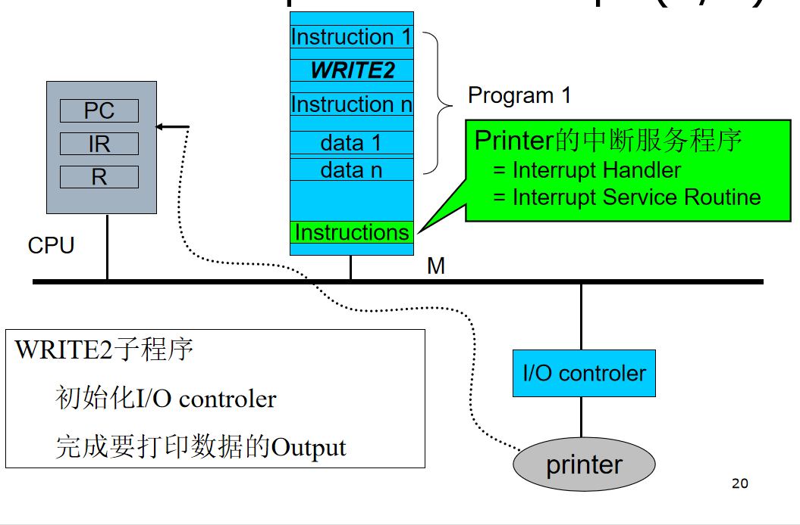

@Author：2021/3/28

# Operating System（一）

## Common Operating System Types

- Embedded Operating Systems
  Windows Embedded CE、 Windows Embedded Compact 7、Windwos 10 IoT
  μCLinux、 μC/OS-II、μC/OS -III、VxWorks、eCos、embOS、salvo
  Raspberry Pi OS
  WindRiver

## Basic Elements(基本构成)

操作系统的组成 系统资源包括CPU、内存、输入输出设备以及存储在外存中的信息

## Run Instruction(指令执行)

## interrupt(中断)

### Definition

A mechanism by which other modules (I/O, memory) may interrupt the normal sequencing of the processor.

An I/O device can stop what the CPU is operating to provide some necessary service.

### Interrupt Cycle

- Processor checks for interrupts
  - If no interrupts fetch the next instruction for the current program
  - If an interrupt is pending, suspend execution of the current program, and execute the interrupt-handler routine

### Features of Interrupt

Unpredictable (不可预测性/随机性)
can be disable (可屏蔽性)
Can be nested (可嵌套性)
….

### Classes of in Interrrupt

| Program          | Generated by some condition that occurs as a result of an instruction execution, such as arithmetic overflow, division by zero, attempt to executean illegal machine instruction, and reference outside a user's allowed memory space. |
| ---------------- | ------------------------------------------------------------ |
| Timer            | Generated by a timer within the processor.This allows the operating systemto perform certain functions on a regular basis. |
| I/O              | Generated by an I/O controller, to signal normal completion of an operationor to signal a variety of error conditions. |
| Hardware failure | Generated by a failure, such as power failure or memory parity error. |

### Why Interrupt in CS?

答案有很多只是我目前才刚开始新的学习阶段，只清楚下面这个

Most I/O devices are slower than the processor

### Examples

Without interrupting.

Now, let add Interrupt into this example. So that CPU can process other instructions, while printer can do its printing jobs and when the printer finished, it interrupts CPU.

## Multiprogramming

- Processor has more than one program to execute
- The sequence the programs are executed depend on their relative priority and whether they are waiting for I/O
- After an interrupt handler completes, control may not return to the program that was executing at the time of the interrupt
- More detail later...

## Cache Memory

- Its relationship with OS
  - It is a piece of hardware, which is invisible to OS
  - But, many of the principles used in Cache are similar to those of MM, which is a core modules of OS
- Instruction Cycle and Memory Access
  - Processor speed is faster than memory speed
  - Increase the speed of memory
- Exploit the principle of locality
  - Add something Between CPU and Memroy
  - 
- Cache Principles
  - Contains a copy of a portion of main memory
  - Processor first checks cache
    - (Hit) If  found, just use it. And do not need access to the memory
    - (Miss) If not found in cache, the block of memory containing the needed information is moved to the cache and delivered to the processor
- Cache size
  - Small caches have a significant impact on performance
- Block size
  - The unit of data exchanged between cache and main memory
    - Larger block size more hits until probability of using newly fetched data becomes less than the probability of reusing data that have to be moved out of cache
- Mapping function
  - Determines which cache location the block will occupy
- Replacement algorithm
  - Determines which block to replace
  - Least-Recently-Used (LRU) algorithm
- Write policy
  - When the memory write operation takes place
  - Two Methods
    - 1) Can occur every time block is updated
    - 2) Can occur only when block is replaced
      - Minimizes memory write operations
      - Leaves main memory in an obsolete(过时) state

