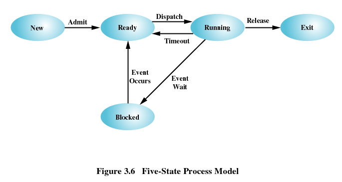
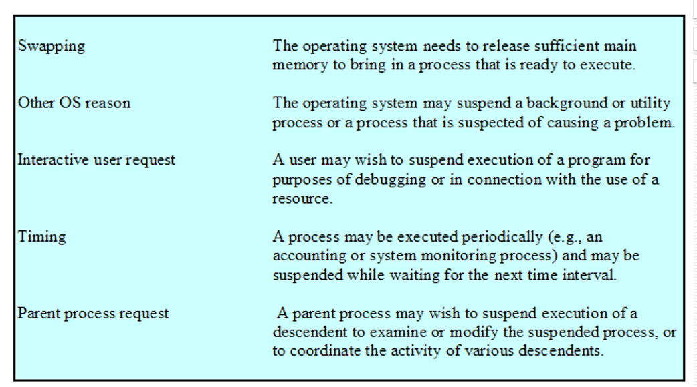

@Author：2021/3/28

# Operating System(三) -- Process

## Process Definition

Process=Programe+execution

- A program in execution
- An instance of a program running on a computer
- The entity that can be assigned to and executed on a processor
- A unit of activity characterized by：
  - the execution of a sequence of instructions
  - a current state
  - an associated set of system resources

## Process Model

## Process Control Block

- Identifier
- State
- Priority
- Program counter
- Memory pointers
- Context data
- I/O status information
- Accounting information

## Trace of Process

Sequence of instruction that execute for a process
Dispatcher(调度器/scheduler) switches the processor from one process to another

## The Creation and Termination of Processes

### Process Creation

- Assign a unique process identifier
- Initialize process control block
- Allocate space for the process
- Set up appropriate linkages
  - Ex: add new process to linked list used for scheduling queue
    Create of expand other data structures
  - Ex: maintain an accounting file
- Create of expand other data structures

### Process Termination

## Five-State Model

Ignoring other models, so record this generic model

### Five-State Model

Running(运行态)
Ready(就绪态)
Blocked(阻塞态)
New(新建态)
Exit(退出态)

## Suspended Process

- Processor is faster than I/O so all processes could be waiting for I/O
- Swap these processes to disk to free up more memory
  - Blocked state becomes suspend state when swapped to disk
- Two new states
  - Blocked/Suspend
  - Ready/Suspend

## One Suspend State

## Two Suspend States

## Reasons for Process Suspension

## Operating System Control Structures

为了管理进程和资源，操作系统必须掌握每一个进程和资源的当前状态信息。几乎所有操作系统都会用以下4类表来保存信息：内存表、I/O表、文件表和进程表 。

①内存表用来跟踪主(实)存和辅(虚拟)存。
②I/O表用来管理I/O设备和通道。 
③文件表提供当前存在文件中的信息：文件在辅存中的位置、当前状态及其他性质。
④进程表用来管理进程。 

## Process Control

为了防止操作系统及关键数据如PCB等，受到用户程序有意或者无意的破坏，通常将处理机的执行状态分为：

- 管态（系统态）
- 目态（用户态）

两种执行模式

- 系统模式（系统态）、控制模式或者内核模式：
  具有较高特权
  运行系统特定的指令，包括读/写控制寄存器的指令、基本I/O指令以及与存储器管理有关的指令，及一些特定的内存区
  内核模式下的处理机及其指令、寄存器和内存都受到完全控制和保护。
- 用户模式（用户态）
  具有较低的特权
  用户程序一般运行在用户模式

模式切换

- 用户模式——>系统模式：用户程序执行到一条系统调用，进入操作系统内核执行。
- 系统模式——>用户模式：执行完系统调用的功能，返回到用户程序。
- 特殊情况：程序执行到结束语句时，切换到系统模式，不再返回用户程序。

## Process Switching

### When to Switch a Process

进程切换 

在某时刻，一个正在运行的进程被中断，操作系统就将另一个进程置为运行状态，并对其进行控制。
当操作系统掌握控制权时，切换随时会发生。可能将控制权交给操作系统的事件有：中断 、陷阱以及系统调用 。

1.interrupt
1) Clock interrupt

- process has executed for the maximum allowable time slice

2) I/O interrupt	
3) Memory fault

- memory address is in virtual memory so it must be brought into main memory

2.Trap

- error or exception occurred
- may cause process to be moved to Exit state

3.Supervisor call (System Call)

- such as file open

进程上下文切换

上下文切换发生时，可能并不改变当前处于运行态的进程状态(如发生系统调用时)。当前运行进程的状态要改变时，操作系统将进行以下步骤完成进程切换：
① 保存处理器内容。
② 对当前运行进程的PCB进行更新。
③ 将这个进程的PCB移入适当的队列(就绪、阻塞)。
④ 挑选其他进程执行。
⑤ 对挑选进程的PCB进行更新。
⑥ 对寄存器/存储器管理数据结构进行更新。
⑦ 将被选中进程上次移出时的处理器状态进行恢复。

## other

1.进程切换

2.进程状态切换

3.操作系统状态切换(用户模式与系统模式)

1的发生一定会2的发生不一定3

2的发送一定有1，3

3不一定有12