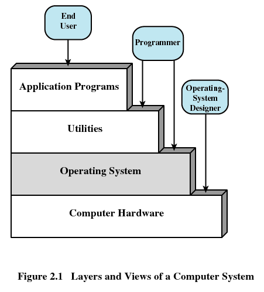

@Author：2021/3/28

# Operating System(二)

## operating System definition

A program that  controls the execution of application programs and acts as an interface between applications and hardware

### other definition

- An operating system (OS) is an interface between hardware and user, which is responsible for the management and coordination of activities and the sharing of the resources of a computer, that acts as a host for computing applications run on the machine. 

- One of the purposes of an operating system is to handle the resource allocation and access protection of the hardware. This relieves the application programmers from having to manage these details. 

## Layers of Computer System

## Services Provided by the Operating System 

- Program development
  - Editors and debuggers
- Program execution
  - loader
- Access to I/O devices
- Controlled access to files
- System access
- Error detection and response
- Accounting

## CPU mode

- User program executes in user mode(用户模式)
  - Certain instructions may not be executed
  - Some memory can not be accessed
- Monitor executes in system mode(系统模式) /Kernel mode(内核模式)
  - Privileged instructions are executed
  - Protected areas of memory may be accessed

### Kernel(内核) 

- Portion of operating system that is in main memory
- Contains most frequently used functions
- Also called the nucleus（核子）

## Ease of Evolution of an Operating System

Serial Processing->Simple Batch Systems->Multiprogrammed Batch Systems->Time-Sharing Systems

。。。。。

As the content of the latter personal feeling is not necessary to record

## Processes

### Some definition

- A program in execution
- An instance(实例) of a program running on a computer
- The entity(实体) that can be assigned to and executed on a processor
- A unit of activity(活动单位) characterized by a single sequential thread of execution(单一的顺序执行轨迹), a current state(当前状态), and an associated set of system resources(系统资源)

### Consists of three components

- An executable program /code
- Associated data needed by the program
- Execution context of the program (the core)

## Memory Management

### responsibilities

OS has five storage management responsibilities:

- Process isolation(进程隔离)
- Automatic allocation and management(自动分配和管理)
- Support of modular programming(模块化程序设计)
- Protection and access control
- Long-term storage(长期存储)

### requirements 

- Relocation/重定位
- Protection/保护
- Sharing/共享
- Logical organization /逻辑组织
- Physical organization /物理组织

## Virtual Memory / VM

Allows programmers to address memory from a logical point of view
Allows programmers to use logical memory space larger than the physical space

## Page

Allows process to be comprised of a number of fixed-size blocks, called pages
Each page may be located any where in main memory