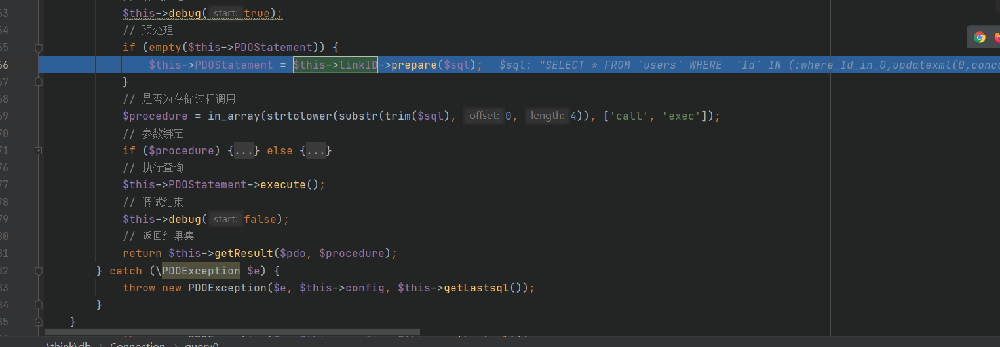
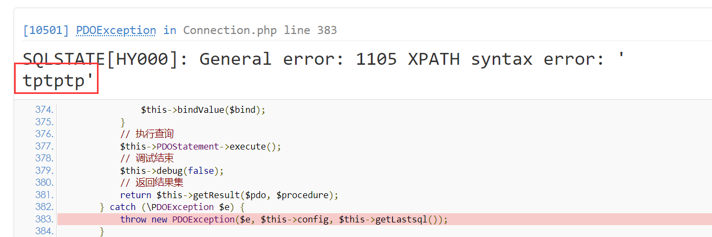
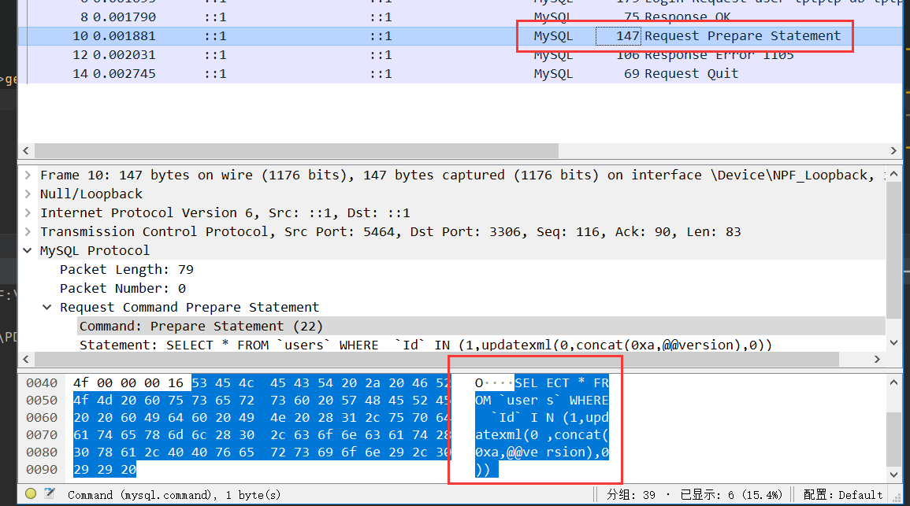
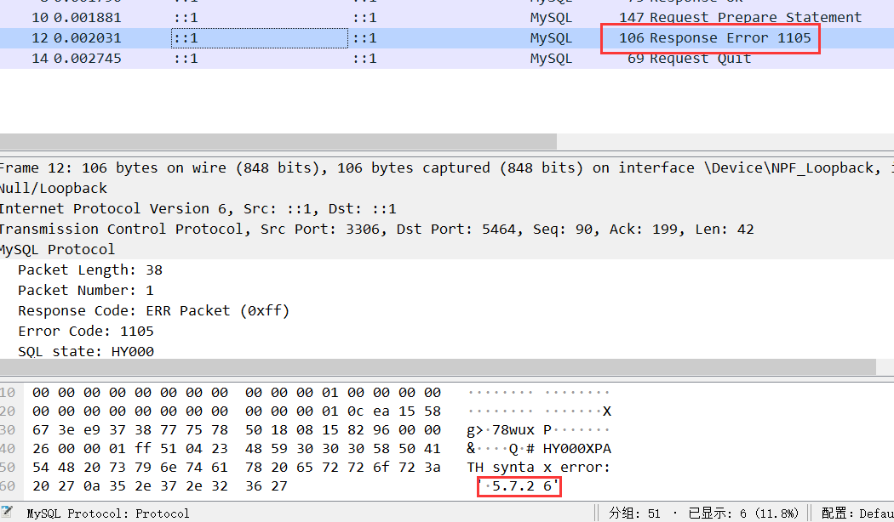

@Author：Y4tacker

@time：2021/01/27 11:10 AM.

# PDO的ATTR_EMULATE_PREPARES属性带来的安全问题

这次的思考来源于我昨天对TP5.0.9进行SQL漏洞复现的时候所引发的思考



当时在PDO的prepare编译阶段报错直接抛出异常之后，在页面居然发现sql被执行了！！！



因为我们知道PDO分为三个阶段，prepare，bindParam和execute，如下所示

```
<?php

	$dsn = 'mysql:dbname=test;host=localhost;charset=utf8';
	$user = 'root';
	$password = '123456';

	try {
	    $pdo = new PDO($dsn, $user, $password);
	} catch (PDOException $e) {
	    echo 'Connection failed: ' . $e->getMessage();
	}

	$pdo->query('set names utf8');
	$sql = "select * from user where uid>? and age>?";
	$stat = $pdo->prepare($sql);
	$stat->bindParam(4,$id);
	$stat->bindParam(10,$name);
	$stat->execute();
	$arrResult = $stat->fetchAll();php
```

我们也知道，会在execute执行后才会执行结果，可是我们如果设置了

```php
PDO::ATTR_EMULATE_PREPARES  => false,
```

我们看看官网给的描述

> `PDO::ATTR_EMULATE_PREPARES` 启用或禁用预处理语句的模拟。 有些驱动不支持或有限度地支持本地预处理。使用此设置强制PDO总是模拟预处理语句（如果为 **`true`** ），或试着使用本地预处理语句（如果为 **`false`**）。如果驱动不能成功预处理当前查询，它将总是回到模拟预处理语句上。 需要 bool 类型。

他会在抛出异常的时候同时也执行了sql语句，当然为了能抛出异常我们同时也会设置

```
PDO::ERRMODE_EXCEPTION来抛出异常
```

下面进行实验环节，我们利用报错注入抛出异常，同时我们打开WireShark进行简单分析

```php
<?php

use think\exception\PDOException;

$dsn = 'mysql:dbname=tptptp;host=localhost;port=3306;charset=utf8';
$user = 'tptptp';
$password = 'tptptp';
$params = [
    PDO::ATTR_ERRMODE           => PDO::ERRMODE_EXCEPTION,
    PDO::ATTR_EMULATE_PREPARES  => false,
];
try {
    $pdo = new PDO($dsn, $user, $password, $params);
} catch (PDOException $e) {
    echo 'Connection failed: ' . $e->getMessage();
}

$sql = "SELECT * FROM `users` WHERE  `Id` IN (1,updatexml(0,concat(0xa,@@version),0)) ";
try {
    $stat = $pdo->prepare($sql);

}catch (\PDOException $e) {
    throw new PDOException($e, $this->config, $this->getLastsql());
}
```

这里我们进入了发起了prepare的请求包



在response中居然带了我们的



因此也不难解释为什么TP抛出异常的时候显示执行了sql语句了，分析完毕

## 参考链接

https://www.php.net/manual/zh/pdo.setattribute.php