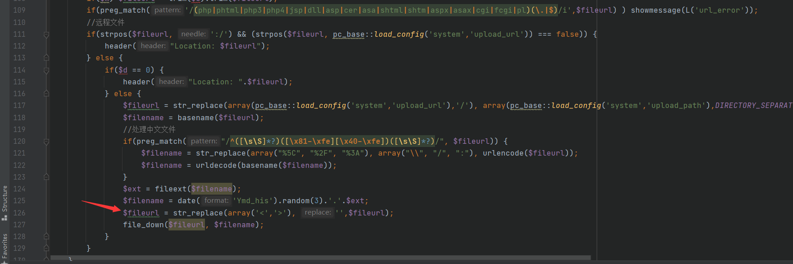
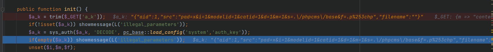
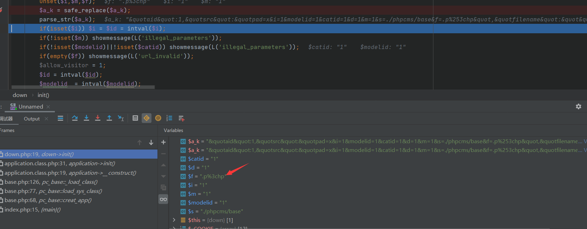
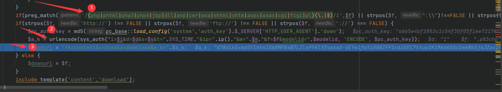
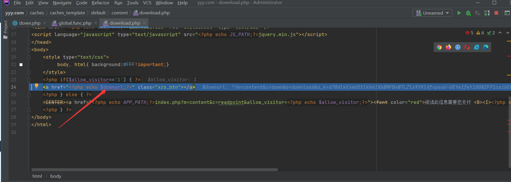
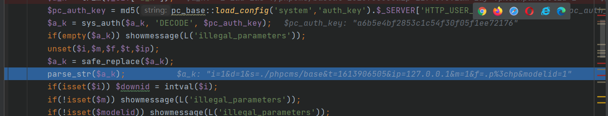
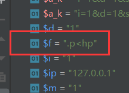
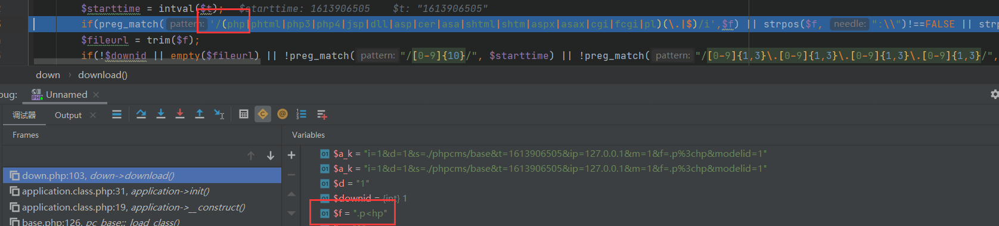
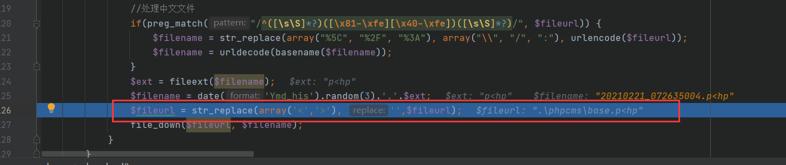

@Author：Y4tacker

@time：2021/02/21 19:29 PM

# PHPCMSv9.6.1任意文件下载漏洞

这个漏洞有点简单，但是还是有点脑洞，让我想起来了，parse_str可以解析url，造成漏洞的原因如下



由于这里对`<和>`进行了替换，再配合两次`parse_str`实现了黑名单绕过从而实现了任意文件的下载，这里我们进行详细调试分析

首先来看看我们传入的payload，

```
m=content&c=down&a=init&a_k=51b09pOSUrrh8K9AHDB9JfrJxpwUrpPN5GDIvFQ5UUdri-dwf10nDxAZblqEmv-SgOTi8k6ZeGMVzrH_8rvGtULZ0mRPobCMFwUgtOc7E3Vj4b5bY6Qlu2UVuS3bDcnt73O_RXtzpO03qGSM_WRWfe3aZaTSMbEFaa8X5WF_&XDEBUG_SESSION_START=14500
```

他会调用`phpcms/modules/content/down.php`下面的`init`方法接下来开始跟踪，函数第三行会对我们传入的`$a_k`执行一次解码操作，能看出来解码后的值，接下来进行的`safe_replace`对我们的操作没有影响，就不点开分析了



接下来能看到执行parse_str后，对我们的内容进行了一次url解码，之前的`%253c`成了`%3c `



也因此完美绕过了正则匹配的过滤



之后把这个东西继续加密，并把url发到`download.php`



之后我们回到页面点击下载按钮继续分析调试，download函数前部分与init基本上差不多，我们就跳过分析，唯一需要注意的就是parse_str



再次解码



因为是黑名单，所以我们也绕过了过滤



跳过不关键的分析，这里我们对<置空，从而实现任意文件的读取，分析完毕



至于$a_k怎么来的，再V9.6.0部分 我们已经分析过了就不再赘述，忘记的可以翻之前的