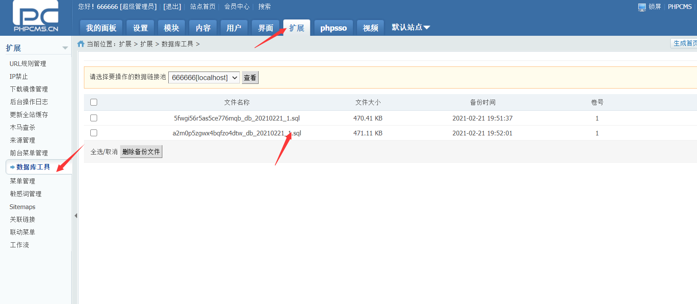
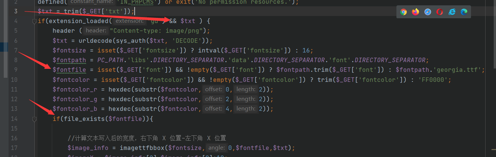
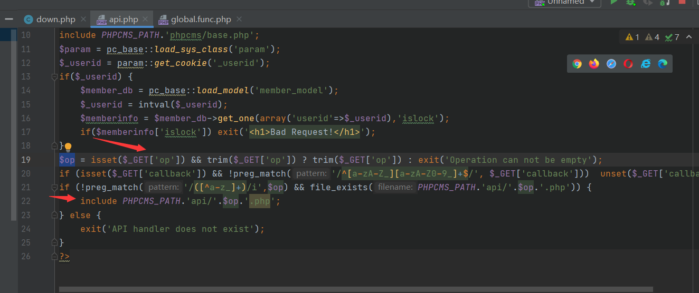

# phpcmsv9暴力猜解备份数据库文件

## 前置知识

windows的FindFirstFile（API)有个特性就是可以把<<当成通配符来用而PHP的opendir(win32readdir.c)就使用了该API。PHP的文件操作函数均调用了opendir，因此我们可以通过文件操作函数来实现猜解

## 分析

首先打开缓存

在`caches\bakup\default`目录下么即有了我们的缓存文件通过访问，因为没有严格权限控制我们可以直接访问`http://url/caches/bakup/default/5fwgi56r5as5ce776mqb_db_20210221_1.sql`，实现 下载，那接下来下一个问题来了，如何知道这个文件呢，我们上面说了有个文件操作，

之后我们发现`api/creatimg.php`下的`file_exists`函数比较好利用，看到如果需要进入`if`分支，那么必须有txt参数的传入，之后就可以通过`font`的值去控制`file_exists($fontfile)`

下一个问题来了，这不在网站目录，如何直接访问到呢，之后我们发现`api.php`,里面可以通过传入无过滤的`$op`的值，从而实现任意文件包含实现对任意文件的利用

因此我们可以构造url`/api.php?op=creatimg&txt=1&font=/../../../../caches/bakup/default/s<<.sql`，之后写个python脚本就行，我本地不知道为什么没有复现成功，单独去环境var_dump却成功了，猜测是php环境的问题