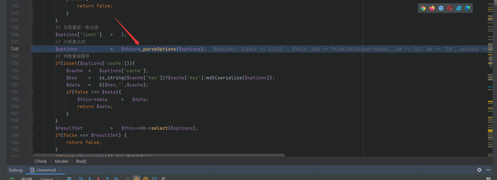
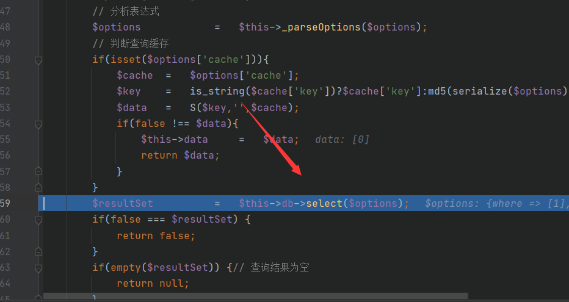
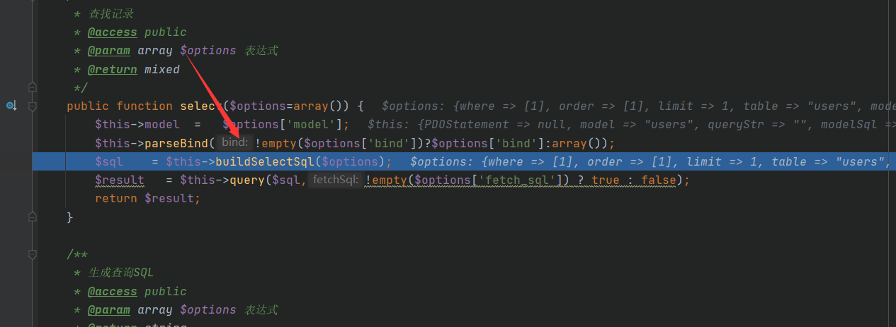
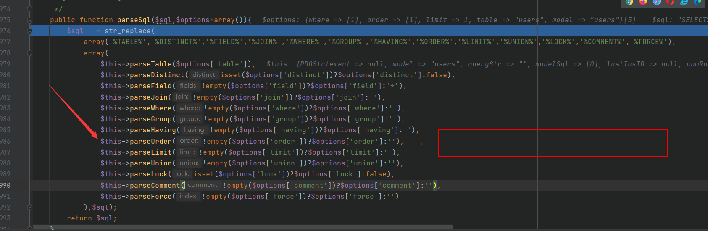
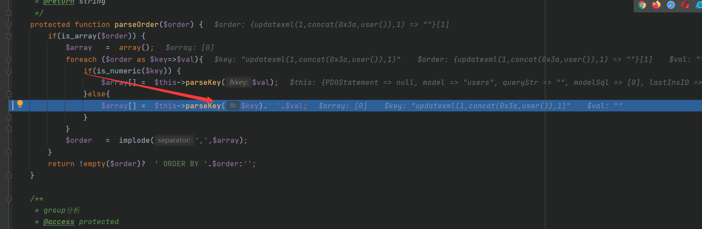
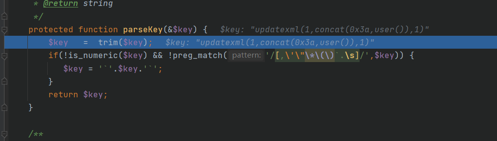
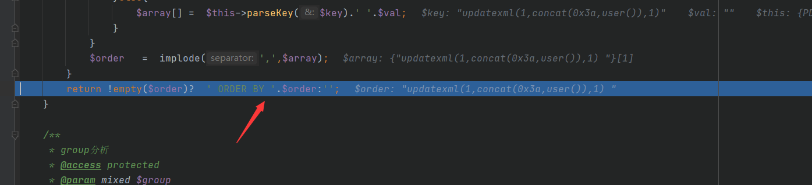
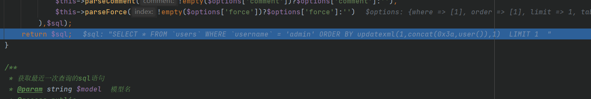

# ThinkPHP3.2orderBy注入分析

本篇是ThinkPHP3.2系列的最后一篇了，终于告一段落了

我首先还是放payload吧`?username=admin&order[updatexml(1,concat(0x3a,user()),1)]`，当然为了复现简单写个控制器吧，这个漏洞利用点就是最后拼接sql语句的时候的parseOrder方法没有进行过滤造成的

```php
<?php
namespace Home\Controller;
use Think\Controller;
class IndexController extends Controller {
    public function index(){
        $username = I("username");
        $order = I("order");
        $data = M("users")->where(array("username"=>$username))->order($order)->find();
        dump($data);
    }
}
```

接下来开始调试分析，老规矩M只是实例化users对象，不管了，where也不是我们的利用点，我们也没对其进行操作，因此也跳过，主要是分析烂了不想看了哈哈哈，进入我们的主题，跟进find函数

先是`_parseOptions`,返回我们的处理拼接结果，没啥关键的



继续跟进select



再跟进`buildSelectSql`



走你，跟进`parseSql`


进入我们的`parseOrder`重点来了，注入点，走你



我们跟进`parseKey`看看干了啥



简单来说就相当于是select * from users 给users两边加上反引号我们这里没做处理



这里进行参数的拼接



最终拼接成我们的恶意构造好的注入语句，起飞，分析完毕

