# ThinkPHP3.2Update注入分析之bind

首先先给出payload吧`http://yyy.com/?u[0]=bind&u[1]=0%23&p=123456`

开始分析M函数不多说了返回一个users的模型对象，where也很简单，上篇文章已经做了分析了这里简单回顾下，因为是数组，所以执行下面赋值返回

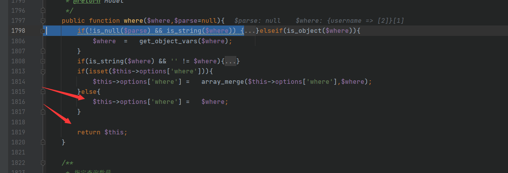

接下里进入`save`函数，绕过一堆没用的进入

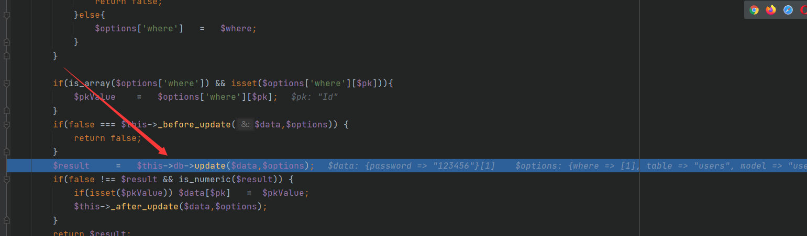

我们继续跟进

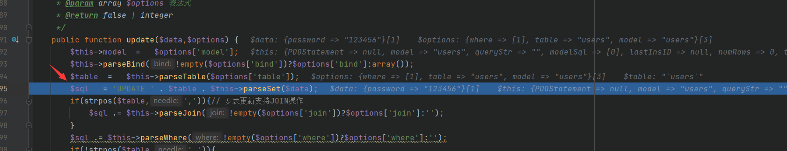

快到利用点了，我们看下这个$name=0

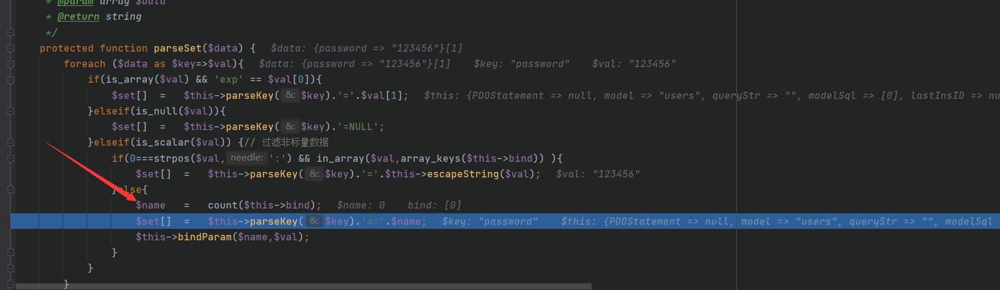

parsekey没用

```php
protected function parseKey(&$key) {
        return $key;
    }
```

$set = array(0=>`password=:0`);

我们继续跟进`bindParam`，很明显这也不难

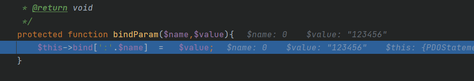

设置

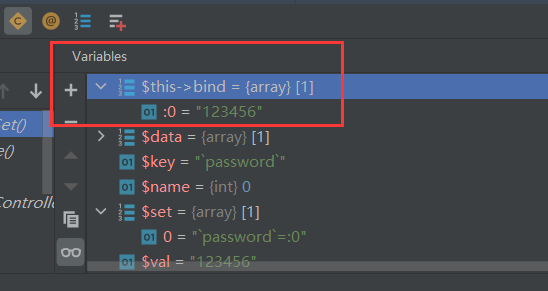

返回后的结果

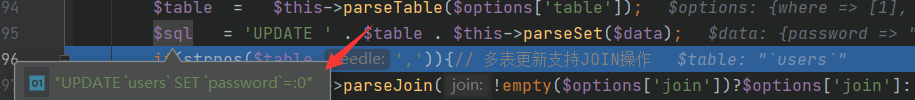

我们跟进

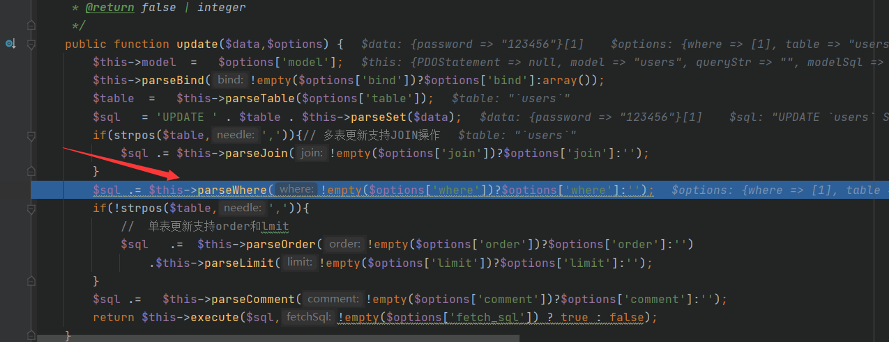

继续跟进

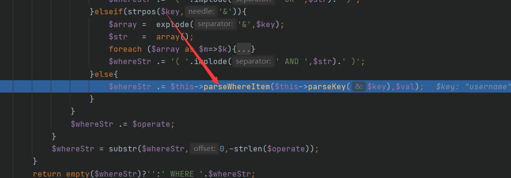

接下来是字符拼接，结果为`username = :0#`

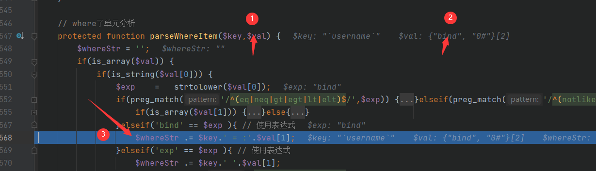

接下来我们跟进execute

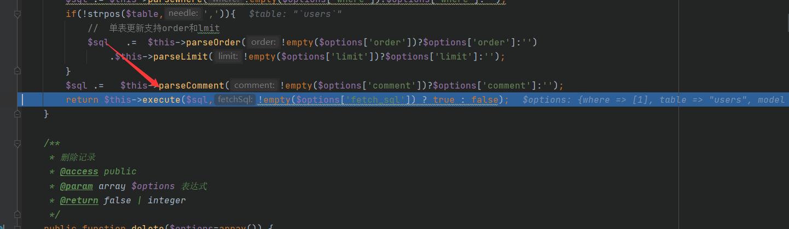

这是重点，它会把:0替换为123456，这也就是为什么我们user[1]为什么非得传个0了

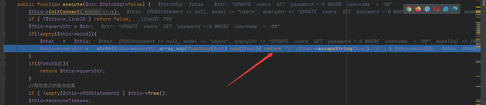

之后便返回结果UPDATE `users` SET `password`='12345678' WHERE `username` = '12345678'#

因此我们也可以配合报错注入获取信息，甚至写马，分析完毕

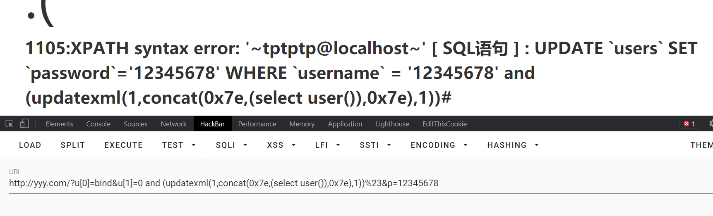