# ThinkPHP3.2不规范接收参数导致的SQL注入分析之exp

本篇文章首先是讲解利用，之后会讲解I函数为什么能绕过过滤

前提是tp没有用I函数去接收参数，具体原因会在分析之后给出

先给出测试的payload，`u[0]=exp&u[1]==%27admin%27`接下来我们去分析

首先看看我们index页面，看看我们的语句

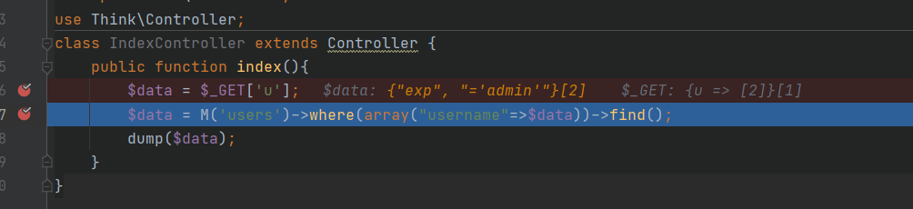

M就不必多说上一篇已经讲过了，返回一个users模型的对象，我们直接跟进`where`函数，看看接收的参数username为数组

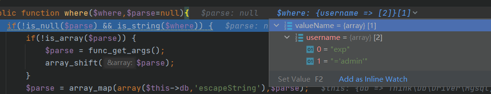

因为是数组原因所以只执行这一句赋值返回`$this`

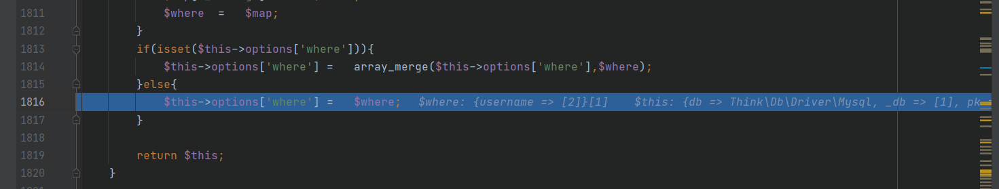

接下来进入`find()`也就是我们的关键，继续跟进

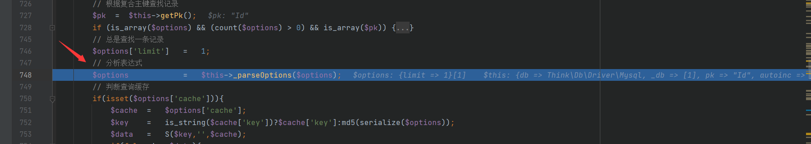

首先merge参数合并这不是我们关心的地方

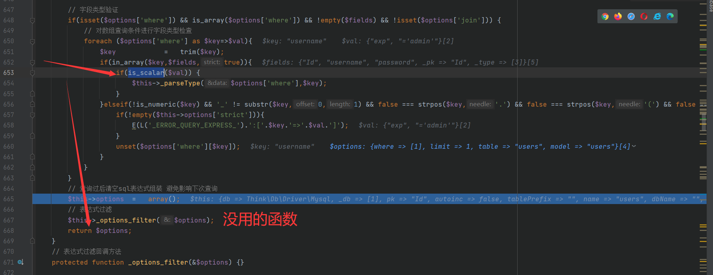

`标量变量是指 int、float、string 或 bool 类型的变量。 array、object 和 resource 类型不是标量。`我们的`username`是一个数组因此直接到下面，回到find，到最关键的地方了，准备生成sql语句了，继续跟进

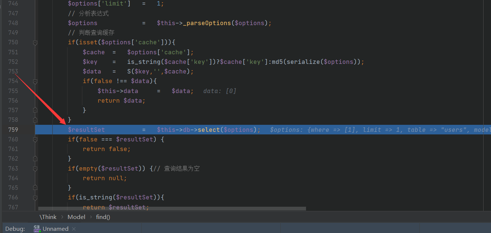

跟进

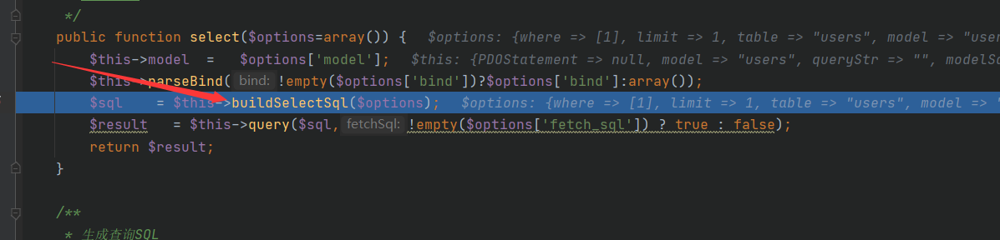

继续跟进

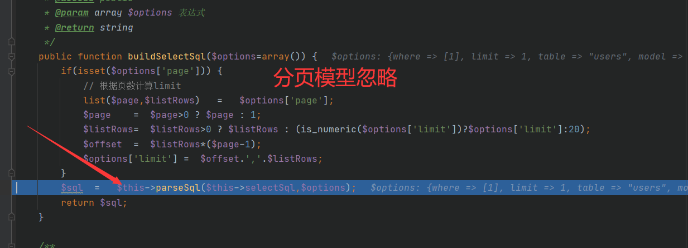

这里会返回最终sql语句，因为只有where，我们直接跟进`parseWhere`

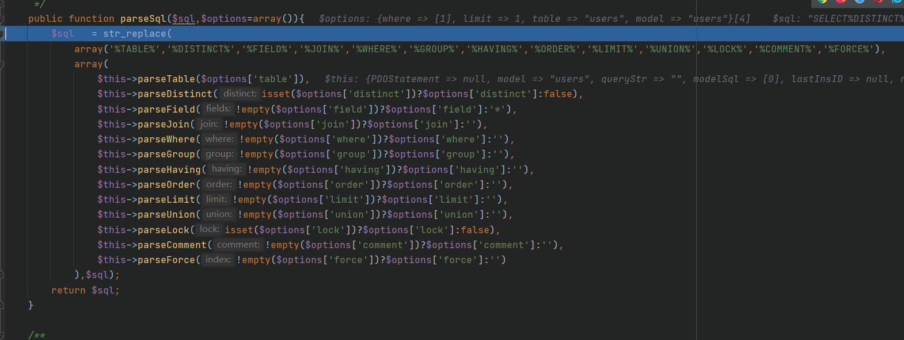

别忘了我们传入的参数

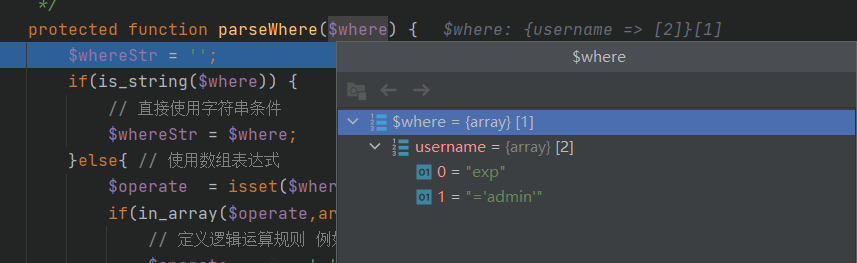

之后的一些非关键处理我们略过，继续跟进

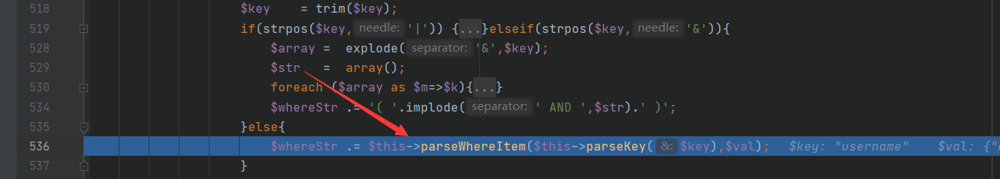

这里进行拼接`$whereStr .= $key.' '.$val[1];`看到没没过滤，直接绕过了

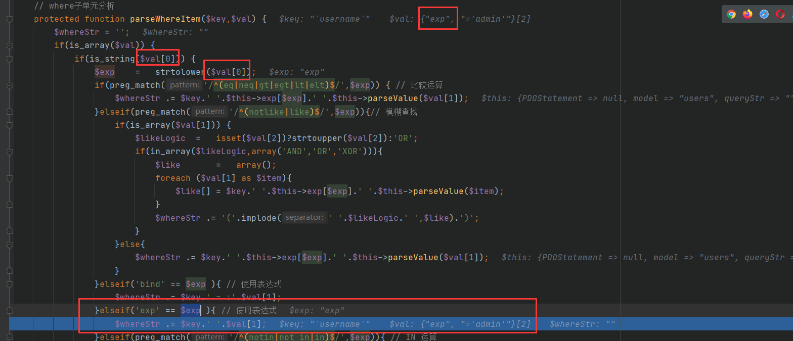

最终`$whereStr `为`username ='admin'`，也得到了最终的payload

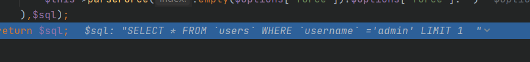

因此，我们便可以有其他姿势了，盲注什么随便来，我们这里测试一下报错注入，没毛病的

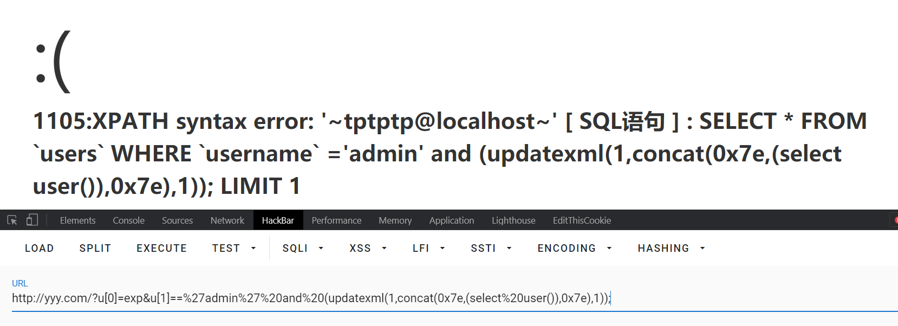

接下来我们把接收参数改成I函数，他会对里面参数做处理，会在前面加一个空格，` exp`!=`exp`

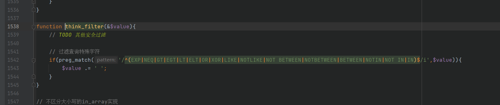

这里也就进不去了，分析完毕

