# ThinkPHP5.0.9SQL注入分析

虽然有点鸡肋但是思路还是值得学习，首先写个控制器，这个Id一定要大写I

```php
<?php
namespace app\index\controller;

class Index
{
    public function index()
    {
        $id = input("id/a");
        $data = db("users")->where("Id","in",$id)->select();
        dump($data);
    }
}
```

给出payload`?id[0,updatexml(0,concat(0xa,user()),0)]=1`之后开始调试分析

我们首先进入where函数，跟进parseWhereExp，发现是参数绑定的不是重点

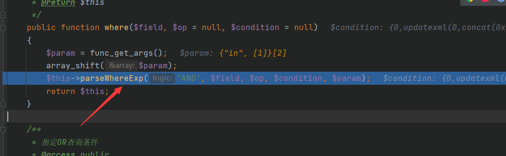

之后我们进入select函数，跟进发现也是参数绑定的部分

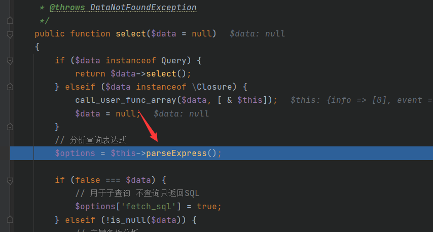

接下来我们跟进

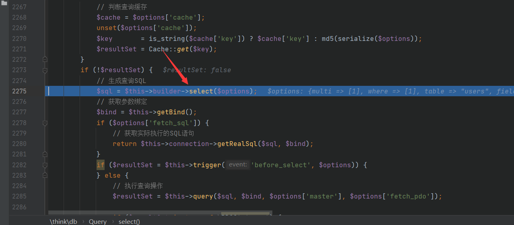

只有这两个是有效函数

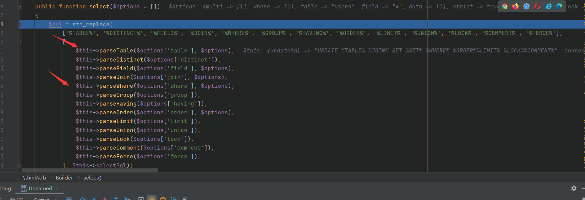

继续跟进

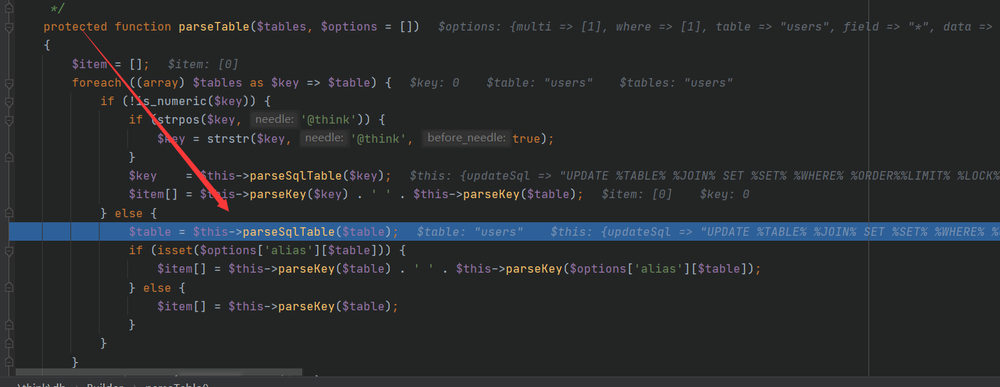

直接跳过了

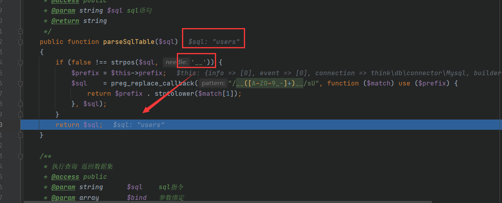

到我们的parseWhere了

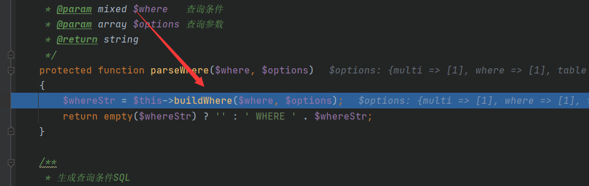

这个主要是获取数据库当中字段类型

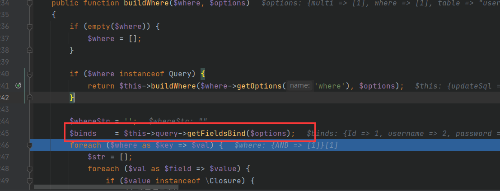

接下来我们继续跟进parseKey

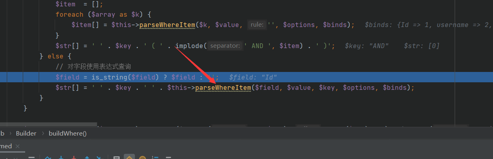

我们继续跟进

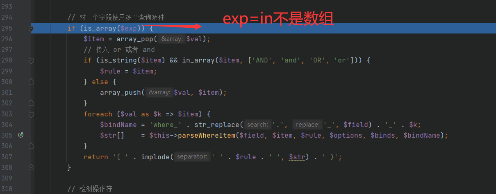

华点TP函数用错了，无关紧要

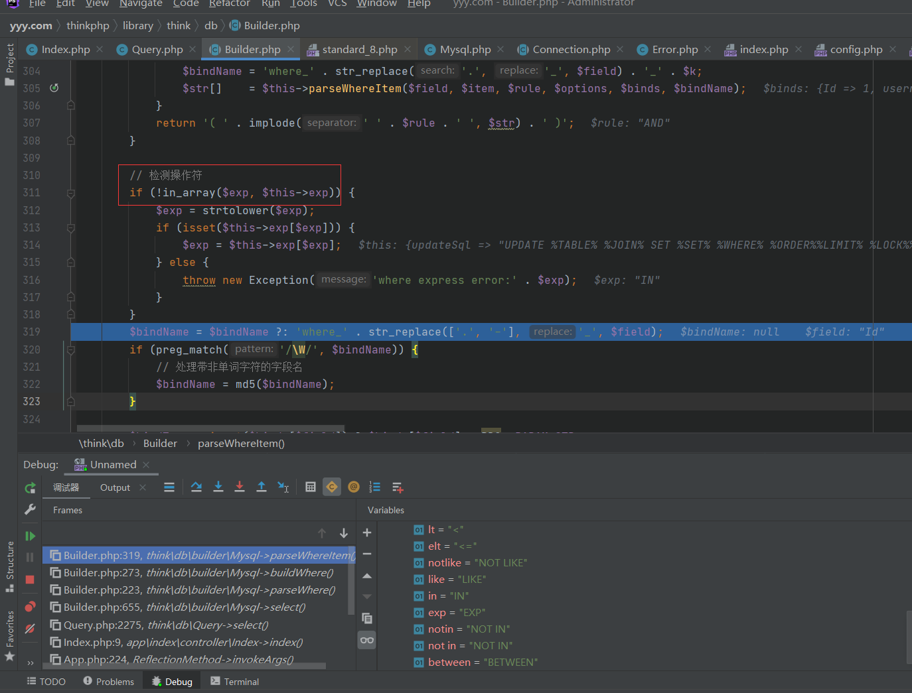

注意这里的参数拼接，就是我们的利用点，完全没有过滤

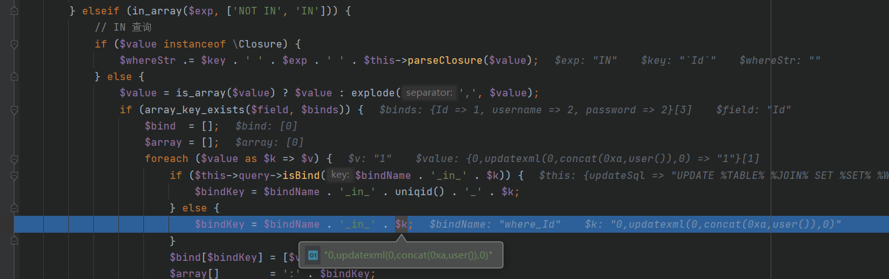

继续往下

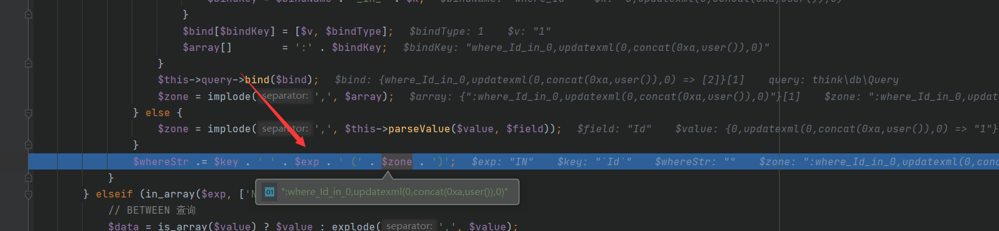

最终返回

```
`Id` IN (:where_Id_in_0,updatexml(0,concat(0xa,user()),0))
```

之后返回

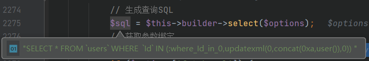

我们接着跟进

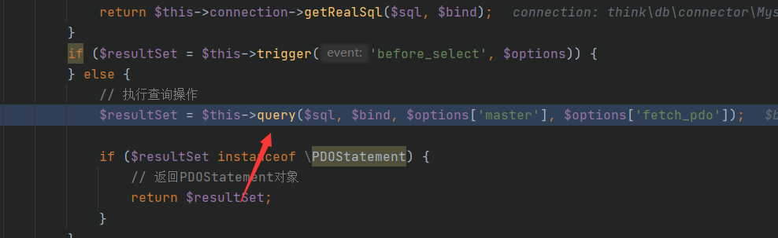

我很懵逼，没有执行过程啊！！！却执行了，复现分析完毕

